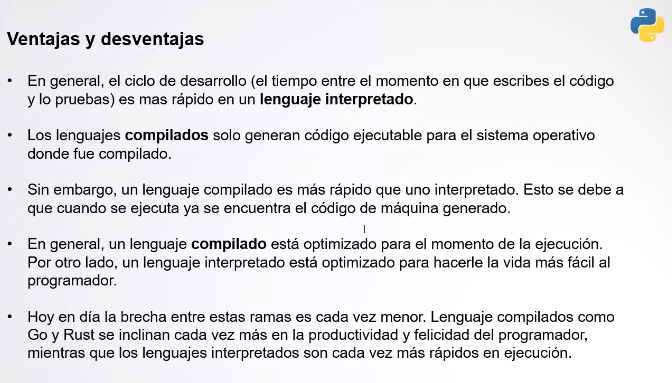
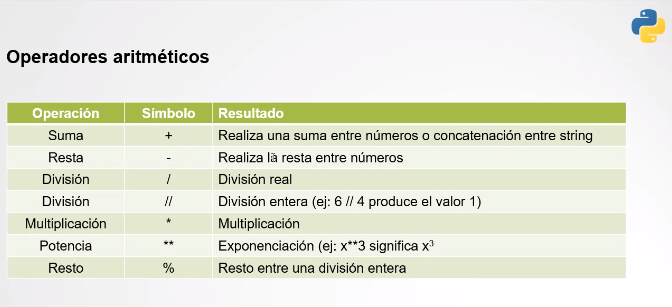

# Intro a Python
## Instalación y configuración
Opciones para nuestro entorno:

- Anaconda
- Replit.com
- Vscode
- etc

## Programación
Un programa es un conjunto de instrucciones paso a paso que le indican a una computadora cómo realizar una tarea dada. Se deben enscribir en un lenguaje que nuestra computadora entienda.

Hay lenguajes interpretados (JS, Python, Ruby) y lenguajes compilados (C, C++, Java, etc)


El compilador va a chequear que el código esté bien escrito.

El intérprete traduce y ejecuta línea por línea en tiempo real.



### Variables
Espacio reservado de memoria que almacena un dato y que puede cambiar en tiempo de ejecución.

`age = 42`

// Crear variables con nombres intuitivos 

### Tipos de datos
- String
- Boolean
- Numbers
- Array
- Tuplas
- Diccionario



Vimos en clase: 

- imprimir en pantalla
- guardar variables
- imprimir con formato
- input de datos (es una función bloqueante)

```
print('hola mundo!')

print('hola de nuevo')

nombre = "lexi"

edad = 42

print("hola {}, tu edad es {}".format(nombre, edad))

print(f"hola {nombre} tu edad actualmente es {edad}")

edadNueva = input("ingrese su nueva edad ")

print("su nueva edad es " + edadNueva)
```

