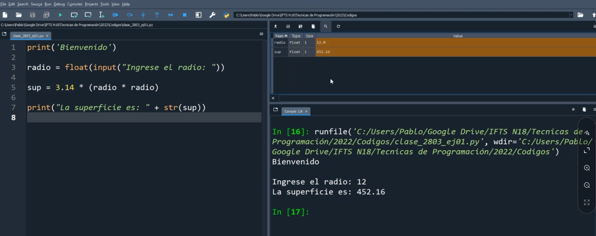
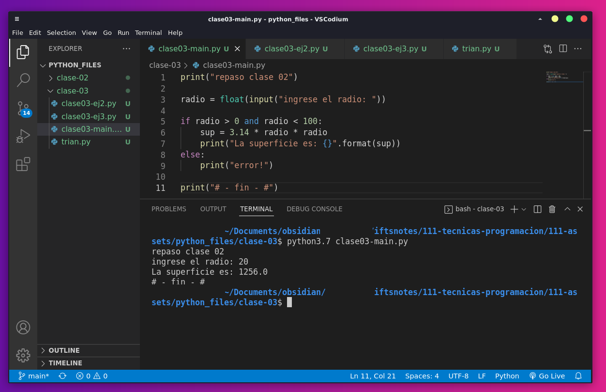
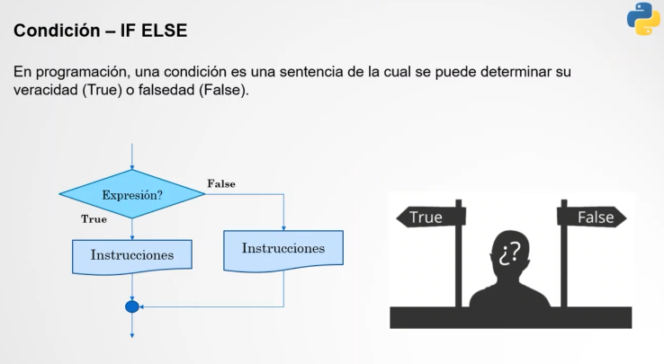
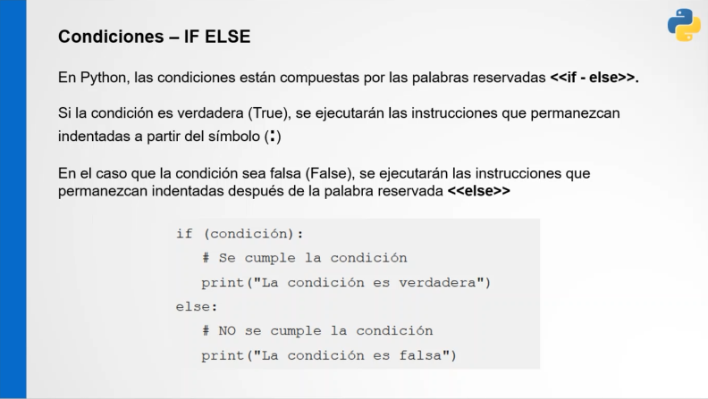
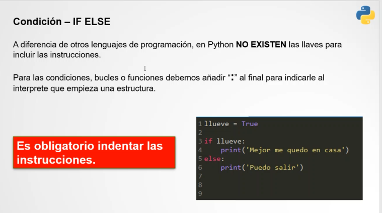
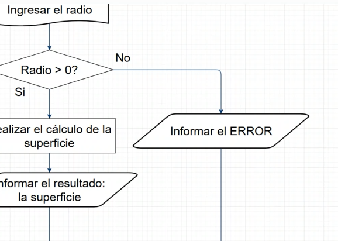
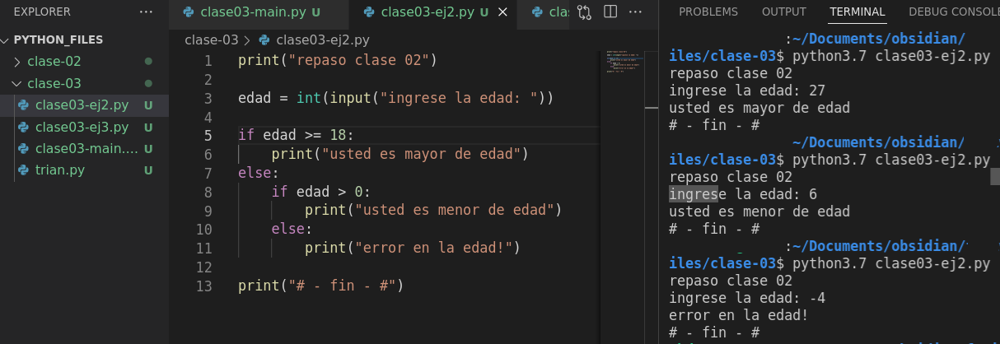
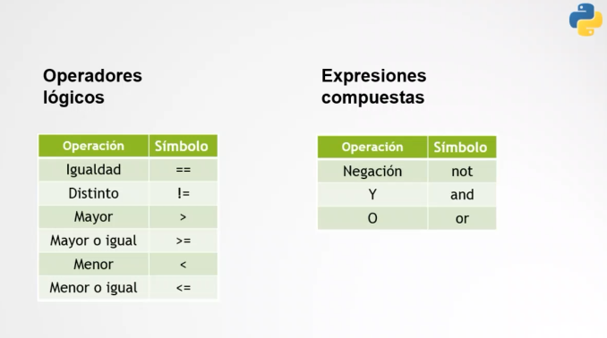
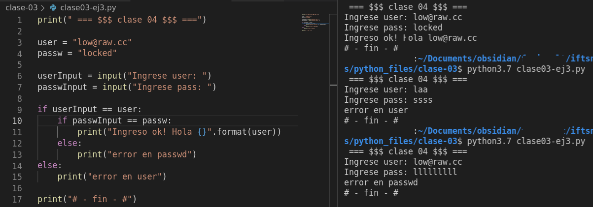

# clase 04
### repaso de clase 03:
Primero bajamos los pasos en un diagrama simple de ejemplo




práctica en IDE











```
print("repaso clase 02")

radio = float(input("ingrese el radio: "))

if radio > 0:

	sup = 3.14 * radio * radio

	print("La superficie es: {}".format(sup))

else:

	print("error!")

print("# - fin - #")

```

#### ejemplo edad





- mención: python naming convention -> pep8

ejemplo if else



- Para próxima clase: 

Realizar un programa que, ingresando los 3 lados de un triángulo,
determine qué tipo de triángulo es. 

update 5-04: subo resultado del ejercicio en /111-assets/python_files