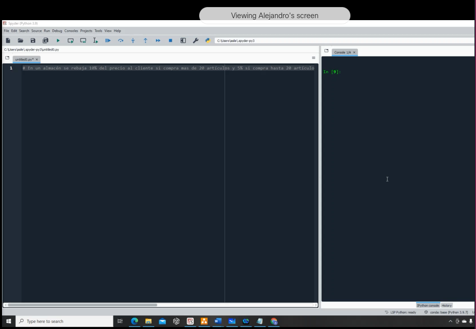

## Repaso

En un almacén se rebaja 10% del precio al cliente si compra más de 20 artículos y 5% si se compra hasta 20 artículos

variable no existe fuera del if principal

Voy pusheando resultados a la carpeta /111-assets/python_files/