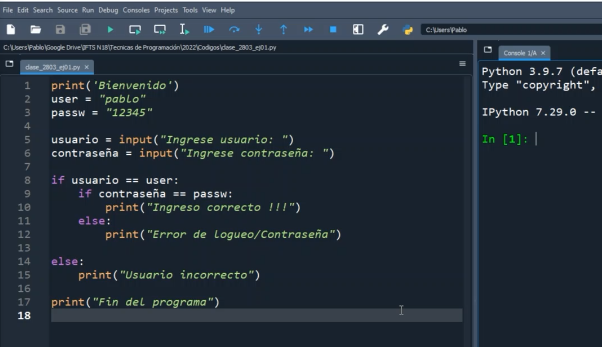
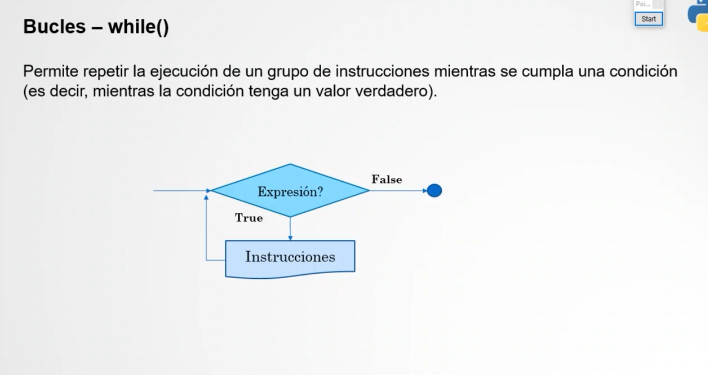
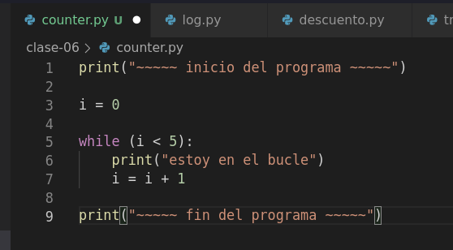
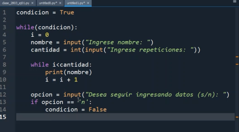
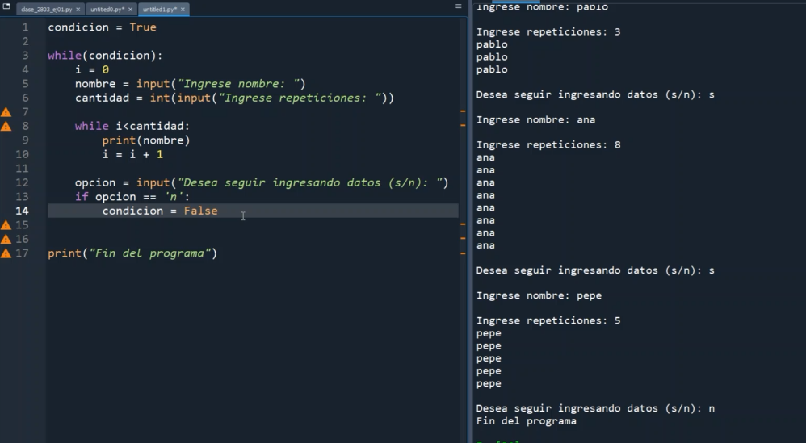

## clase 06
Repaso hasta ahora

- Repaso if / else
- Revisión ejercicio triángulo

### inicio clase 06
#### while loop

Nos permite repetir la ejecución de un grupo de instrucciones mientras se cumpla una condición.

podemos utilizar while de varias maneras distintas

- Ejercicio userInt
- Graficamos el código en flowchart
- Hacemos ejercicio ingresar notas
- Usamos loops adentro de los otros loops

notas:

- Subo algunos ejercicios más en /111-assets/python_fliles/ 
- Nos deja más ejercicios para seguir practicando con la guía