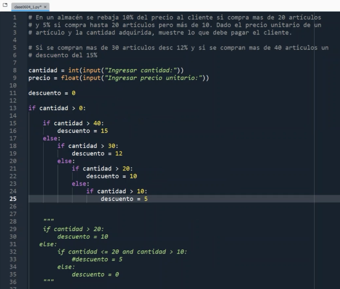
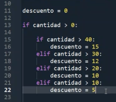
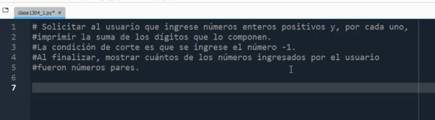
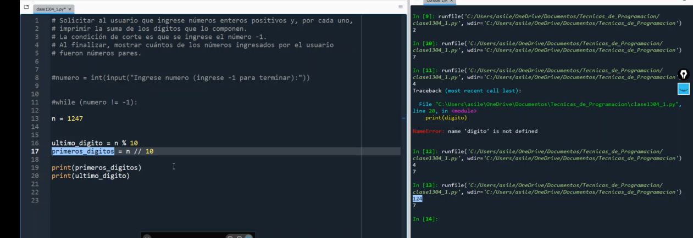
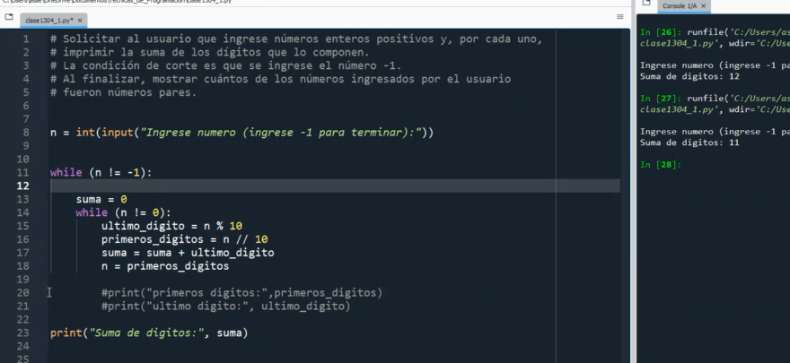
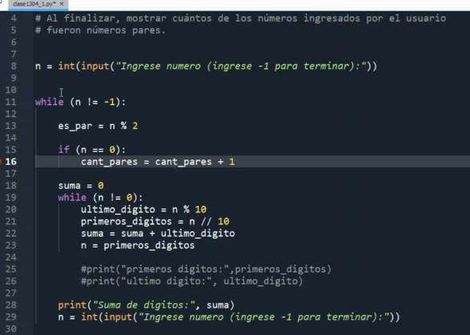
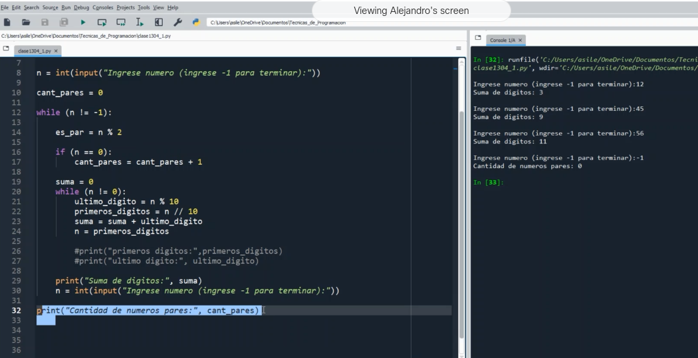
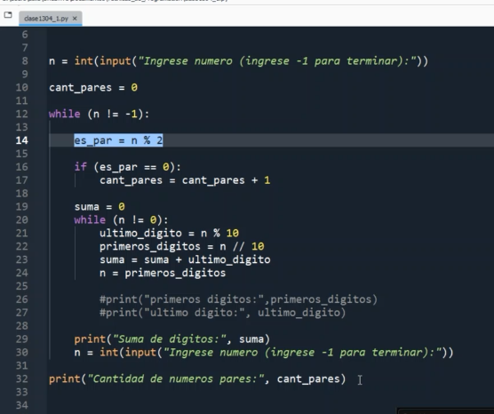
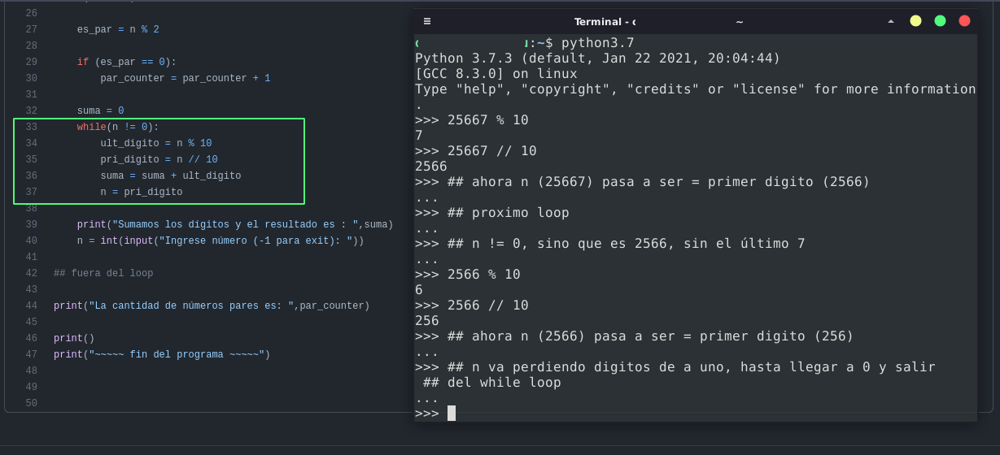

### Clase 07 - virtual
profe Alejandro

#### Ejercicio descuento
Agregamos 2 condiciones más al primer ejercicio (ver original en /111-assets/python_files):



(también lo muestra con `elif` )



Segunda consigna:





```
ej input: 5223
la suma debería ser = 5 + 2 + 2 + 3
```



Obtener pares con resto --->  `n % 2 = 0`



Para saber cuántos pares son, los guardamos en un contador, fuera del ciclo while siguiente, cada vez que es ingresado suma 1

```
es_par = n % 2

if(es_par == 0):
	cant_pares = cant_pares + 1
	
```





el error estaba en igualar n con 0 en lugar de `es_par == 0`

Acá bajo en detalle el segundo while, que suma los dígitos obteniendo la primera parte del número y el último dígito. A la derecha ejemplifico con la consola de python ejecutando los valores de % y // de un número de 5 dígitos. En cada iteración del loop hay un dígito menos porque 'n' deja de ser el número completo y pasa a ser igual a la primera parte del número (línea 37):



A su vez, en la línea 36, sumamos uno a uno los últimos dígitos únicamente, que es la parte individual que podemos obtener con `ult_digito = n % 10` y así obtendríamos 2 + 5 + 6 + 6 + 7 sumándose de a uno en la variable **suma**