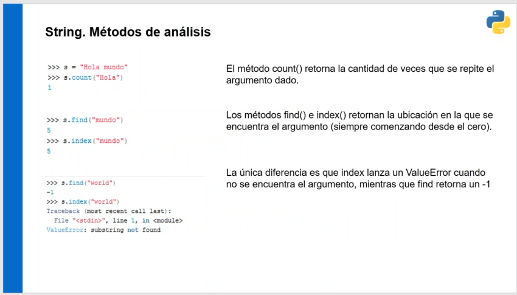
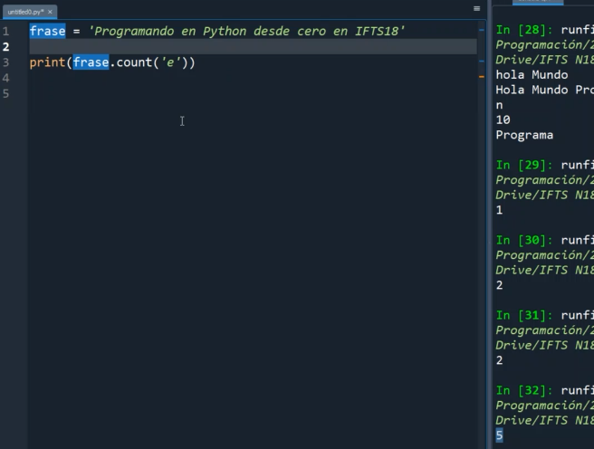
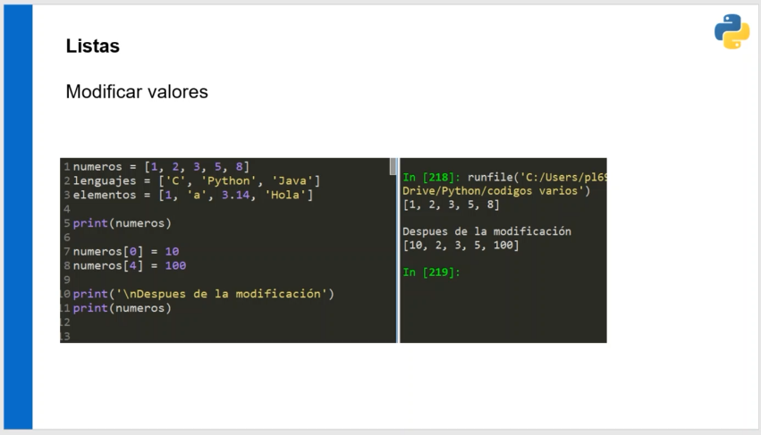
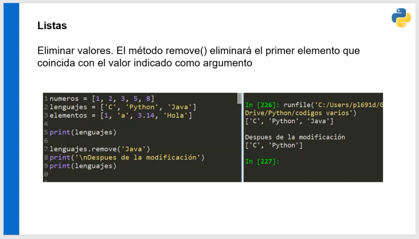

### Clase 08
Virtual con profe Pablo

En esta clase:

- Strings
- Listas
- Métodos
- Tuplas


Le asigno a la variable 'palabra' el valor del tipo string.

Concatenación de strings


Una cadena de carecteres es una lista de caracteres. Podemos usar los operadores [0] para acceder al sub índice de esa lista (uno de los caracteres).

indice negativo. Empiezan de atrás para adalente.

#### función len()
Devuelve el largo del string, la cantidad de caracteres.

```
frase = "bases de python"
palabra = "hola mundo"
print(palabra + frase)

largo = len(frase)

```

#### Slicing
Recortamos una subcadena. Quedarme con una porción de ese String.


```
frase[0:5]
bases

frase[1:3]
ase
```

#### Inmutabilidad


#### métodos


count()

cuenta cuántas veces hay una ocurrencia.



find()
index()

retornan el índice del string

find devuelve -1 si no hay resultado.


```
.isdigit()
.isanum()
.isalpha()
.islower()
.isupper()

```

#### Transformación de strings:

```
.capitalize()
.lower()
.upper()
.strip()
.replace()

```


El método split separa palabra a palabra en una lista


Listas y tuplas

Una lista es un conjunto ordenado de elementos.

```
numeros = [1, 2, 3, 4]
lenguajes = ['C', 'Python', 'php']
elementos = [1, 'a', 3.14, 'hola']


mi_lista = [1, 4, 5, 6]
print(mi_lista)
print(mi_lista[0])

```


`error list index out of range`


A diferencia de los strings, las listas sí están pensadas para mutar su valor.



método `.append()` agrega el elemento al final de la lista.


```
print(mi_lista)
mi_lista.append(90)

print(mi_lista)
mi_lista.append(500)

print(mi_lista)
mi_lista.append('Pablo')

print(mi_lista)
```

Otro ejemplo, el programa de notas que obtiene su promedio.

El problema con el ej anterior era que perdíamos registro de las notas. Con las listas se almacenan los datos.

```
nota = []


```


Agrega los elementos a la lista en tiempo de ejecución

Otra forma de agregar elementos en un lugar específico, es el método `insert()`


método `remove()` para eliminar



Para elegir el elemento en un espacio indicado usamos del
borra de acuerdo al índice


Uno de los más usados para eliminar valor es `pop()` que elimina el último elemento de la lista.


Para ordenar una lista:

- Metodo `sort()`
- Método `reverse()`


con el método `sort()` ordeno la lista de menor a mayor

#### Tuplas
Su sintaxis es distinta. Es una lista de elementos que se acceden a través de un subíndice. A diferencia de las listas, estas no se modifican.

`tupla = ('Pablo', 37, True, 'Gral. Rodriguez')

Se usa mucho en BD. Al leer la info viene en formato tupla, no se tiene que alterar.


`in` y `not in` para buscar en listas o tuplas

```

datos = ('pablo', 'analia', 'pepe')

print(datos)
datos.sort()
print(datos)

if 'maria' in datos:
	print('valor encontrado')
else:
	print('valor no encontrado')

```

Otro ejemplo

```
i = 0

while i > 5:
	notas = int(inptu("Ingrese nota: "))
	notas.append(nota)
	i = i + 1
print(notas)

```

#### For loop

```
notas = [5, 7, 2, 8, 4]

## muestro las notas una por una 
## vimos ejemplo con ingreso de notas

for dato in notas:
	print(dato)

## luego si quiero sacar promedio
## uso acumulador y divido en cant de elementos

for dato in notas:
	sumatotal = sumatotal + dato

promedio = sumatotal / 5

print("el promedio de notas es: ", promedio)

```

