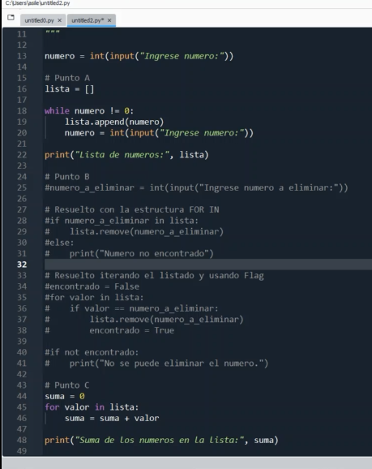

### Clase 09
Profe Alejandro

práctica ejercicios


```
numero = int(input("Ingrese num: "))

# punto a
lista = []

while numero != 0:
	lista.append(numero)
	numero = int(input("Ingrese num: "))

print("lista de nums: ", lista)

# punto b
numero_a_eliminar = int(input("ingrese num a eliminar: "))

lista.remove(numero_a_eliminar)

print(lista)

```



propuesto en clase por un compañero usamos:

```
if numero_a_eliminar in lista:
	lista.remove(numero_a_eliminar)
else:
	print("num no encontrado")
```

Punto c

sumamos con un acumulador dentro del for loop:

```
suma = 0
for valor in lista:
	suma = suma + valor
	
```

En el punto d buscamos un valor en la lista, agregamos lo elementos a una nueva lista de valores menores.

```
numero = int(input("ingrese num: "))

lista_men = []
for valor in lista:
	if valor < numero:
	lista_men.append(valor)

print("lista con valores menores: ", lista_men)

```

