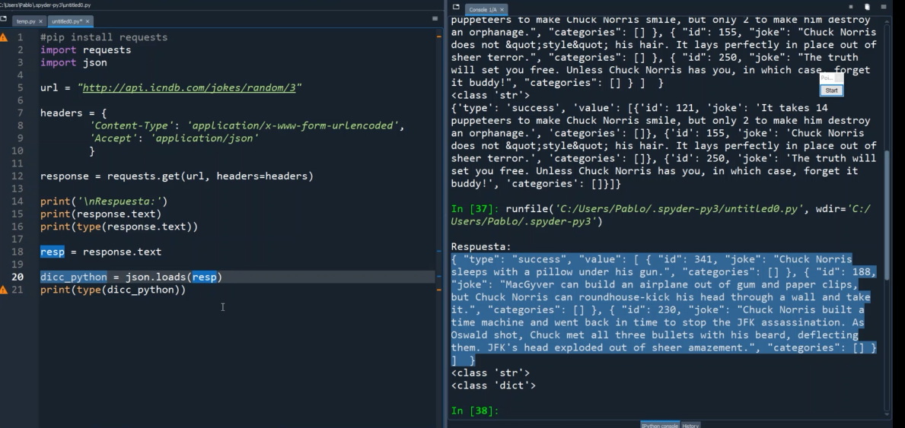

### Clase 13 - post parcial
Tema a ver: Diccionarios

Es el último tipo de estructura de datos que nos faltaba revisar (vimos listas y tuplas)

En diccionarios tomamos los valores a través de su key:

Vimos como:

- Agregar elementos
- Modificar elementos
- Borrar elementos

Cómo iterar un diccionario:

Imprimimos los items y los guardamos en dos variables (key + value):

#### request Json

Hace un desvío para explicar por encima tema APIs. Luego seguimos con una request desde python.

Pasamos el JSON a formato diccionario con la libreria.
Lo hacemos con:

`json.loads(resp)`

y pasa a ser una variable del tipo diccionario.

