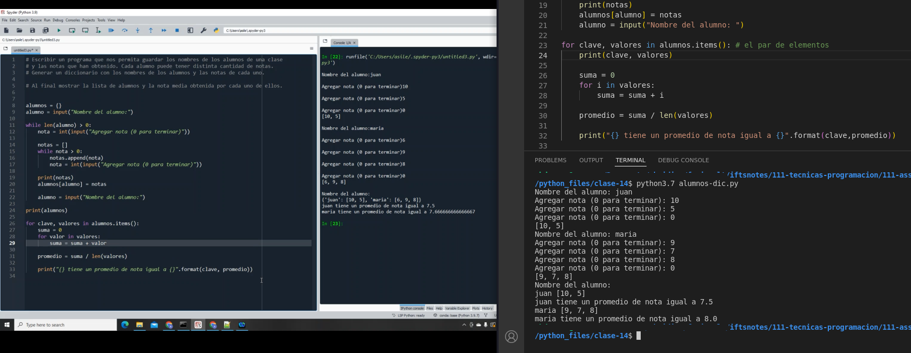

### Clase 14
Prof. Alejandro

Demo diccionarios en base a la clase anterior


Iteramos el diccionario de la misma forma que lo hacemos con el `array[]`, usando `for`

```
for clave, valor in alumnos.items(): # el par de elementos
print(clave, valor)

```




```
for clave, valores in alumnos.items(): # el par de elementos

	print(clave, valores)
	
	suma = 0
	
	for i in valores:
	
		suma = suma + i
		
		promedio = suma / len(valores)  
	
	print("{} tiene un promedio de nota igual a {}".format(clave,promedio))

```


- queda pendiente: hacer la última parte del ejercicio (informar todo lo comprado y total a pagar)