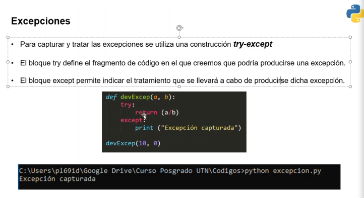
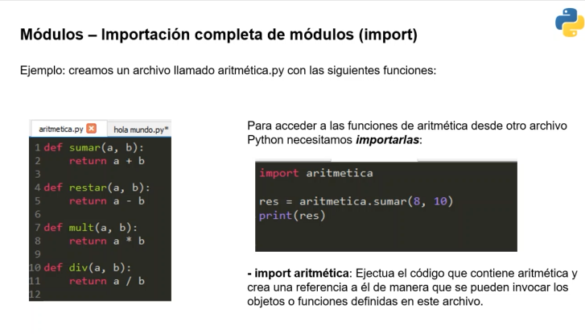

### Clase 15
Excepciones, módulos y paquetes

#### Excepciones
Nos permiten controlar eventualidades en nuestro código. Se 

Ejemplo de error (intentando dividir por 0):

Para capturar la excepción usamos try-except

try-except captura todos los errores, pero podemos capturar el error particularmente:

#### Módulos
Una forma de organizar nuestro código. Cada archivo de python es un módulo para nuestro programa.

Importar módulos:

Ejemplo aritmetica en clase:

` __name__ `

Un módulo para python es todo nuestro archivo donde escribimos el código. Empezamos a separar de nuestro programa principal en distintos archivos .py que realizan tareas independientes.

Para importar un módulo

` from miModulo import miFuncion `

#### Módulos más usados

#### Paquetes
Si un módulo es un archivo, un paquete es un directorio, que tiene muchos módulos.

con el archivo ` __init__ ` python sabe que ese directorio es un paquete (y se puede importar con ` import ` )

Ordenar el proyecto con paquetes y módulos.

