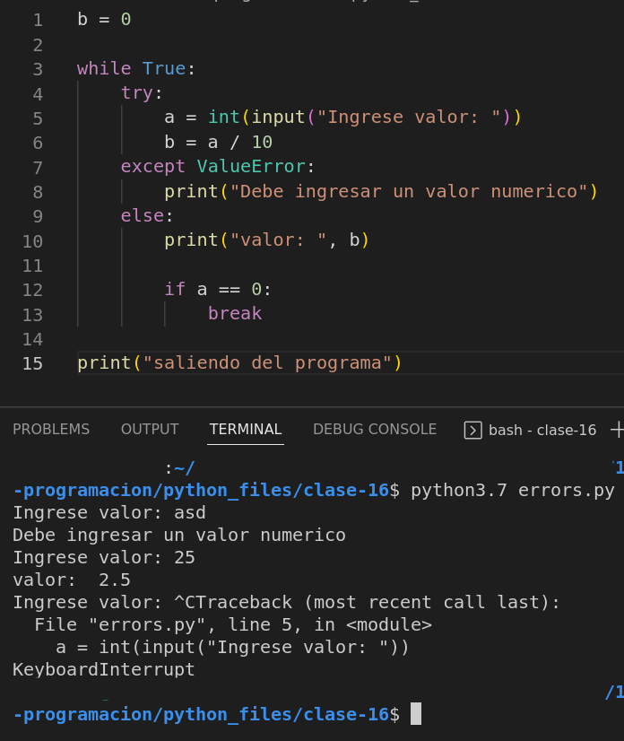

### Clase 16
Prof. Alejandro

Repaso tema anterior (errores try, except)

```
b = 0

while True:
	try:
		a = int(input("Ingrese valor: "))
		b = a / 10
	except:
		print("Debe ingresar un valor numerico")
	else:
		print("valor: ", b)

		if a == 0:
			break

print("saliendo del programa")

```


```
b = 0

while True:
	try:
		a = int(input("Ingrese valor: "))
		b = a / 10
	except ValueError:
		print("Debe ingresar un valor numerico")
	else:
		print("valor: ", b)

		if a == 0:
			break

print("saliendo del programa")

```



#### modulos y paquetes
Repasamos módulos y paquetes en un ejercicio práctico.


creamos la carpeta `/matematica/` con los archivos `aritmetica.py` y `funciones.py` adentro. Con el archivo ` __init__.py ` python sabe que se trata de un paquete.


Corriendo en local con importando desde el paquete `matematicas.py`:


Ver en:

`111-tecnicas-programacion/python_files/16-clase-111/main.py`

`111-tecnicas-programacion/python_files/16-clase-111/matematicas/aritmetica.py`

`111-tecnicas-programacion/python_files/16-clase-111/matematicas/funciones.py`