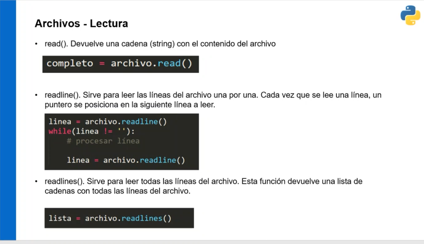
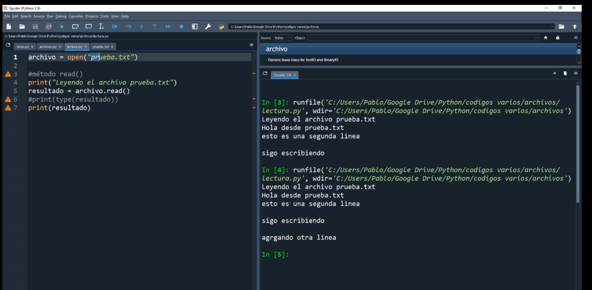
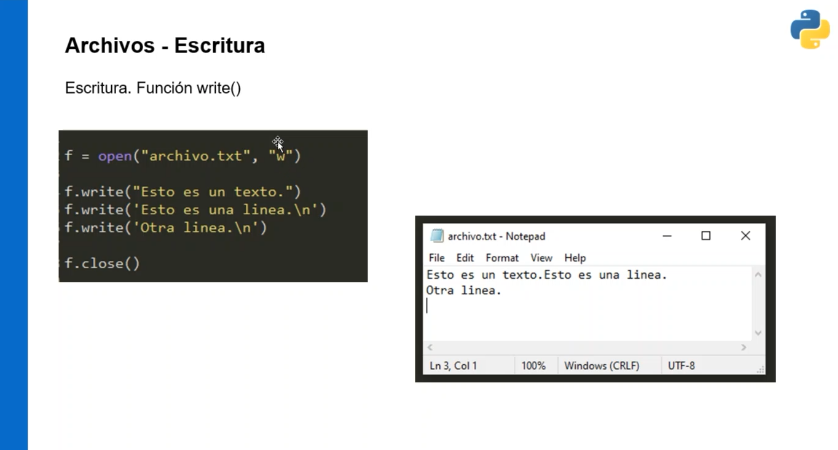
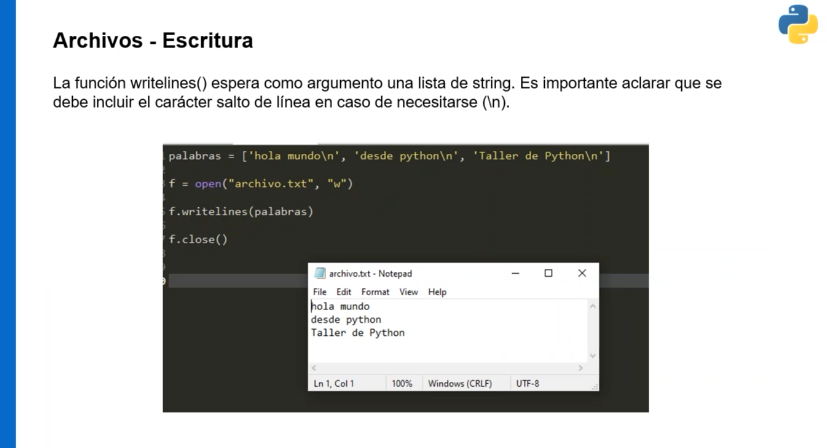
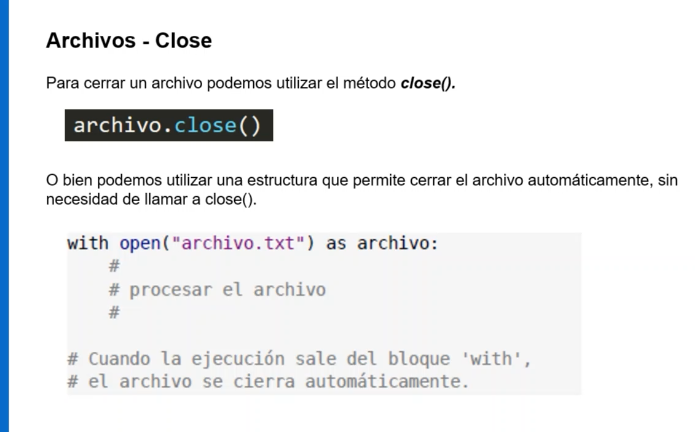
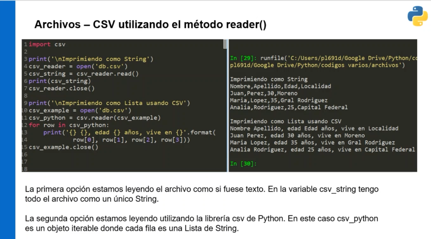
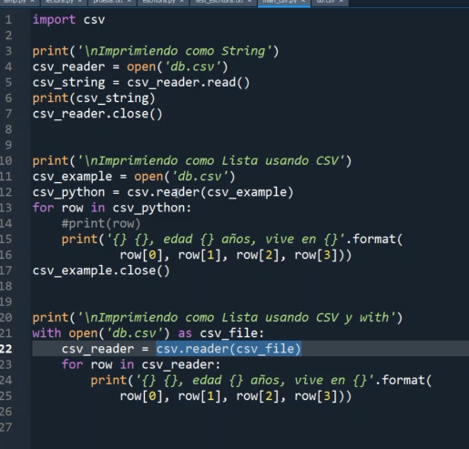
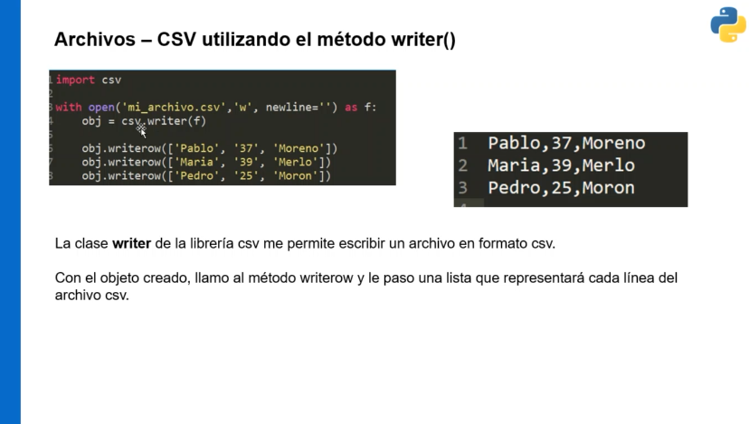

### Clase 17

Leer archivos con `open()` , `readline()` y `readlines()`

`open()` --> lee todo el archivo

`readline()` --> lee línea por línea

`readlines()` --> lee línea por línea y guarda el resultado en una Lista

### escritura

Para abrir el archivo para escritura debo agregar el parámetro "w" (write)

`writelines()` --> espera una lista como parámetro y va escribiendo su contenido en un archivo.

(!) importante cerrar el archivo después de escribir

Algunos archivos comunes:

- archivos CSV

usamos el paquete 'csv'

en el último ejemplo con 'with' no necesitamos cerrar el archivo

- DictReader

Leemos un archivo y lo guardamos como una lista de diccionarios. También podemos pasarle como parámetro los campos de la lista con 'fieldnames'

De la misma forma tenemos el método writerow(). También podemos usar `DictWriter()`

#### bonus track
openpyxl para manipular archivos de spreadsheet (xls)

