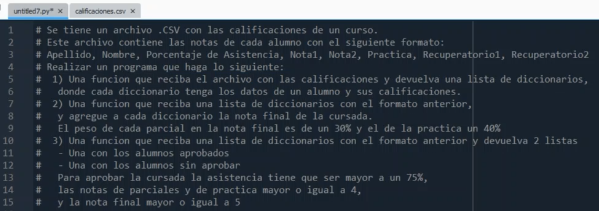

### Clase 18
Ejercicio resuelto en clase por Alejandro



primero recordamos la sintaxis para abrir archivos:

```
def obt_calif(archivo):
	archivo_calif = open(archivo, 'r')
```

Luego agregamos los arrays `calificaciones[]` y `fieldnames[]`


Definimos las funciones `obtener_calificaciones(archivo)`


Temas vistos:

- Definición de funciones
- Diccionarios
(En el medio se debuggeo en vivo, usando print de las variables y su typo de valor)
- Agregar notas a diccionarios
- Cálculo de nota final
- Return de dos objetos

ejemplo de ejercicio corriendo ok:


