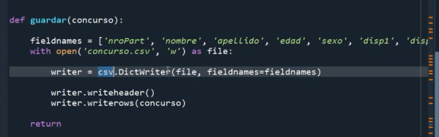

### Clase 20
Con Pablo -> Agregamos la funcionalidad de exportar a .csv el ejercicio de la clase pasada (tipo parcial):



Sigue clase  de Alejandro:

Vemos módulo OS

```
# module OS 

import os  

# listar directorio  

print(os.listdir("./"))  

# mostrar directorio actual  

print(os.getcwd())  

# mostrar sistema operativo  

print(os.name)  

# crear directorio  

# os.makedirs("./newDir")  

try:

	os.makedirs("./newDir")

except FileExistsError:

	print('El archivo ya existe')  

# borrar directorio  

# os.rmdir("./newDir")  

# lista archivos  

lista_archivos = os.listdir("./")  

for archivo in lista_archivos:

	# ver si es un archivo  

	if os.path.isfile("./" + archivo):

	print("es un archivo")

	# chequear tipo de archivo por su extensión

	if(archivo.endswith(".jpg")):

	print("es un archivo de imagen - jpg")  

	if os.path.isdir("./" + archivo):

	print("es un directorio")

```

