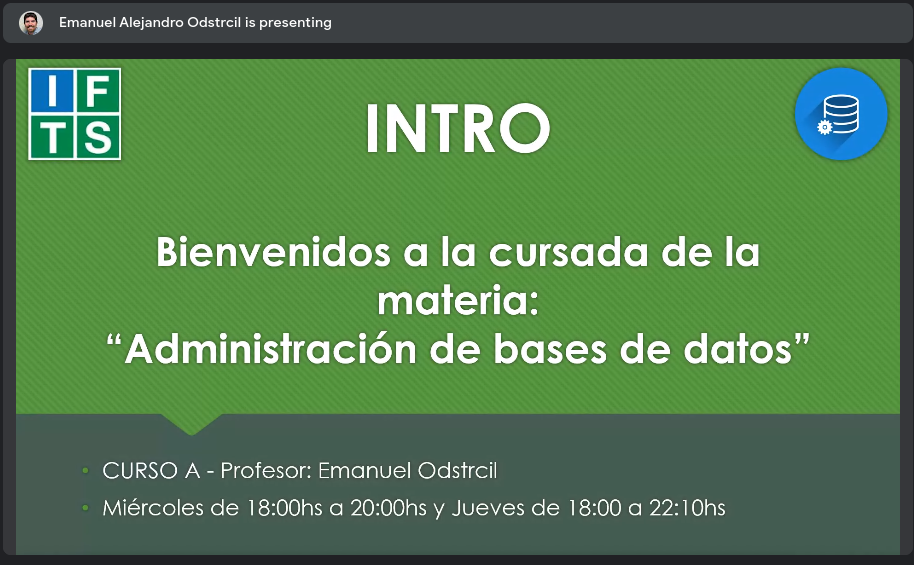

# intro a la materia
Modalidad de la cursada: online + presencial

Profesor Emanuel Odstrcil 
- email: emanuel.odstrcil@bue.edu.ar
- código classroom: e7kruk5

Presentación via meet:

## Vias de comunicación:
- Classroom
- Youtube
- Telegram
- web IFTS

## Condiciones de aprobación
Asistencia 70%
Aprobación con 4+
Promoción con 7+

## Temario general
- Qué es una BD?
- Repaso histórico
- Tipos de BD y gestores existentes
- Aplicaciones prácticas
- Diccionario de datos
- Instalación SGBD MySQL y su funcionamiento
- Lucid Chart

## Temario particular
- Diseño conceptual (1era parte)
	- Modelo de datos
	- Modelo de entidad relación
	- Cardinalidad y dependencias
	- Claves primarias y foraneas
	- Diseño de esquema ER
	- Utilización de Lucid Charts
- Diseño conceptual (2da parte)
	- Dificultades en el diseño de bd. Errores frecuentes
	- Normalización bd
	- Formas normales 1ra, 2da y 3er
	- Ejercitación
	- Primer parcial
- Control de acceso, integridad y confidencialidad de la info

[ Junio repaso general, imprevistos, ejercitación y recuperatorio ]

