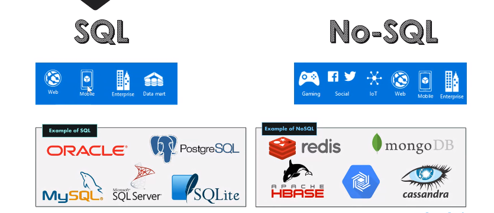
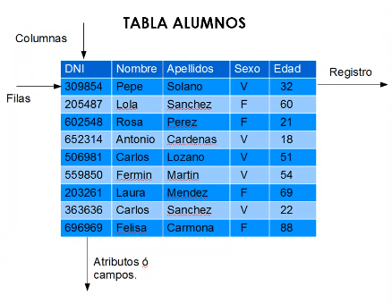
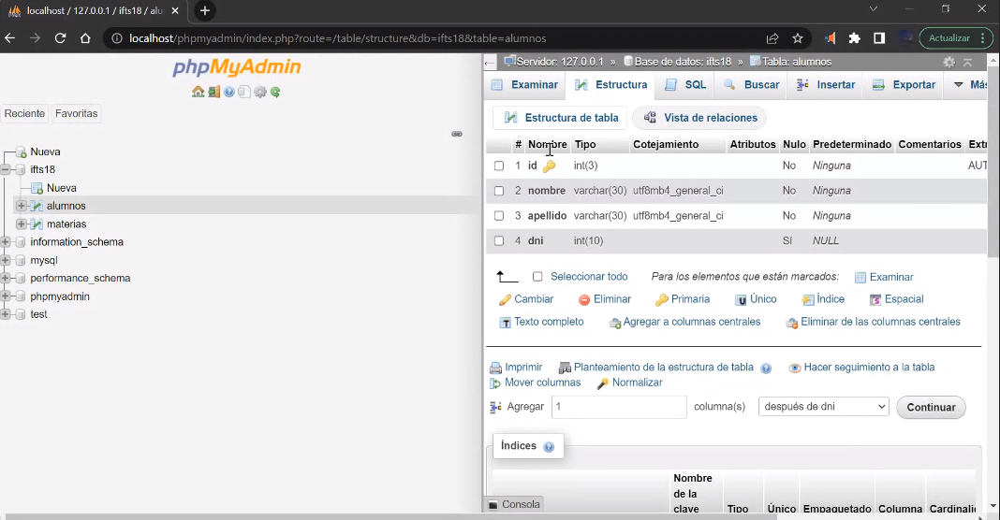

## SQL / noSQL


Relacional:
- basado en tablas
- mantiene una estructura definida
- menor redundancia
- datos consistentes
- escalable verticalmente

no-relacional:
- basada en documentos
- su estructura puede ser dinámica
- permite redundancia de datos
- requieren grandes cantidades de datos a consultar
- escalable horizontalmente



### Estructura de una tabla de BD
Una BD puede tener muchas tablas (entidades)

Filas = registro
Columna = campos
Estructura de la tabla = Schema



### Transacciones A.C.I.D

Una transacción es un set de operaciones que debe ser completada totalmente

- Atomicity (Atomicidad): la transacción es indivisible
- Consistency (Consistencia): Todo lo comenzado debe terminarse
- Isolation (Aislamiento): Mientras se realiza la transacción, los datos implicados son inaccesibles
- Durability (Durabilidad): Cuando la transacción termina, los cambios son permanentes

### Parte práctica de la clase
- Instalamos XAMP
- Creamos una BD mySQL desde phpmyadmin
- Creamos una tabla alumnos
- Creamos registros de alumnos
- Creamos una tabla materias
- Creamos registros de materias
- Usamos las queries SELECT y DELETE



- Exportamos la BD para backupear (en modo texto)

```

-- phpMyAdmin SQL Dump
-- version 5.1.3
-- https://www.phpmyadmin.net/
--
-- Host: localhost
-- Generation Time: Apr 02, 2022 at 04:42 AM
-- Server version: 10.4.24-MariaDB
-- PHP Version: 8.1.4

SET SQL_MODE = "NO_AUTO_VALUE_ON_ZERO";
START TRANSACTION;
SET time_zone = "+00:00";

--
-- Database: `ifts18`
--

-- --------------------------------------------------------

--
-- Table structure for table `alumnos`
--

CREATE TABLE `alumnos` (
  `id` int(3) NOT NULL,
  `nombre` varchar(30) NOT NULL,
  `apellido` varchar(30) NOT NULL,
  `dni` int(10) DEFAULT NULL
) ENGINE=InnoDB DEFAULT CHARSET=utf8mb4;

--
-- Dumping data for table `alumnos`
--

INSERT INTO `alumnos` (`id`, `nombre`, `apellido`, `dni`) VALUES
(1, 'Nicolas', 'Kotsenski', 3492015),
(2, 'Laureen', 'Michels', 29567241);

-- --------------------------------------------------------

--
-- Table structure for table `materias`
--

CREATE TABLE `materias` (
  `id` int(3) NOT NULL,
  `nombre` varchar(30) NOT NULL,
  `cargaHoraria` tinyint(9) NOT NULL,
  `docente` varchar(60) DEFAULT NULL
) ENGINE=InnoDB DEFAULT CHARSET=utf8mb4;

--
-- Dumping data for table `materias`
--

INSERT INTO `materias` (`id`, `nombre`, `cargaHoraria`, `docente`) VALUES
(1, 'admBaseDatos', 9, NULL),
(2, 'logica', 6, NULL);

--
-- Indexes for dumped tables
--

--
-- Indexes for table `alumnos`
--
ALTER TABLE `alumnos`
  ADD PRIMARY KEY (`id`);

--
-- Indexes for table `materias`
--
ALTER TABLE `materias`
  ADD PRIMARY KEY (`id`);

--
-- AUTO_INCREMENT for dumped tables
--

--
-- AUTO_INCREMENT for table `alumnos`
--
ALTER TABLE `alumnos`
  MODIFY `id` int(3) NOT NULL AUTO_INCREMENT, AUTO_INCREMENT=5;

--
-- AUTO_INCREMENT for table `materias`
--
ALTER TABLE `materias`
  MODIFY `id` int(3) NOT NULL AUTO_INCREMENT, AUTO_INCREMENT=3;
COMMIT;

```
