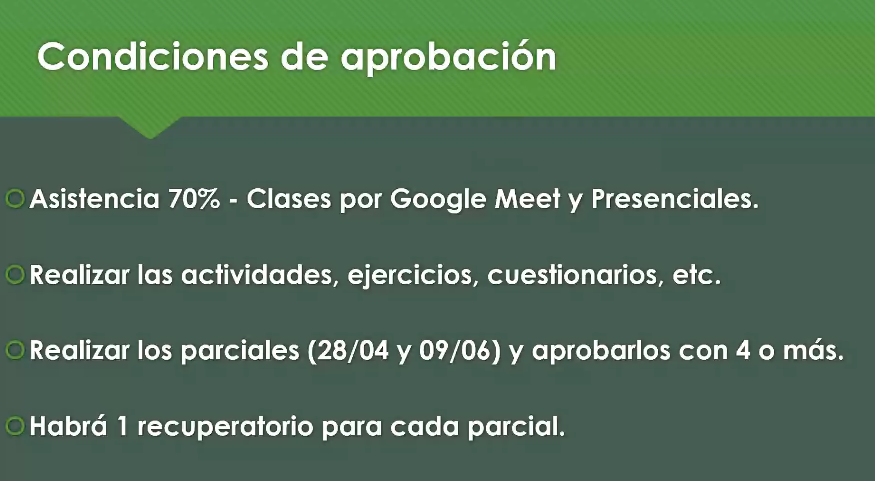
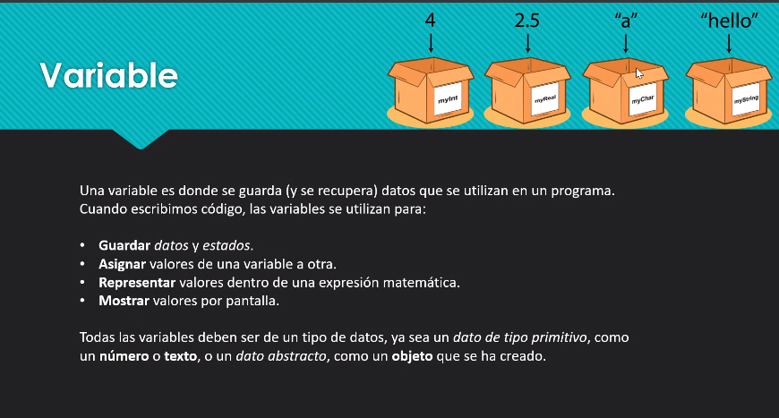
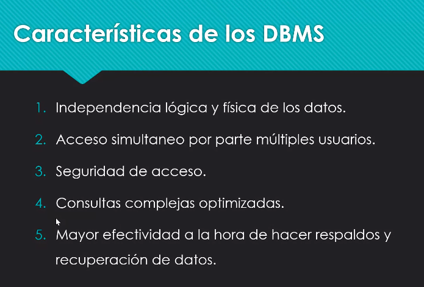
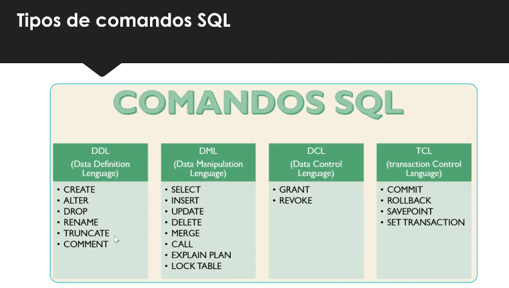
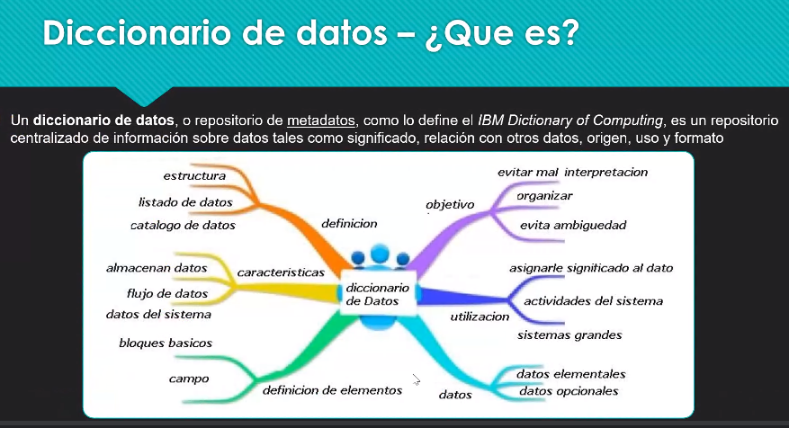
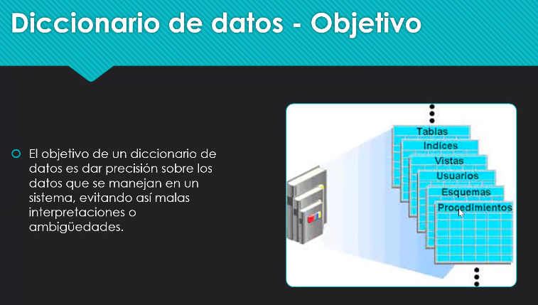
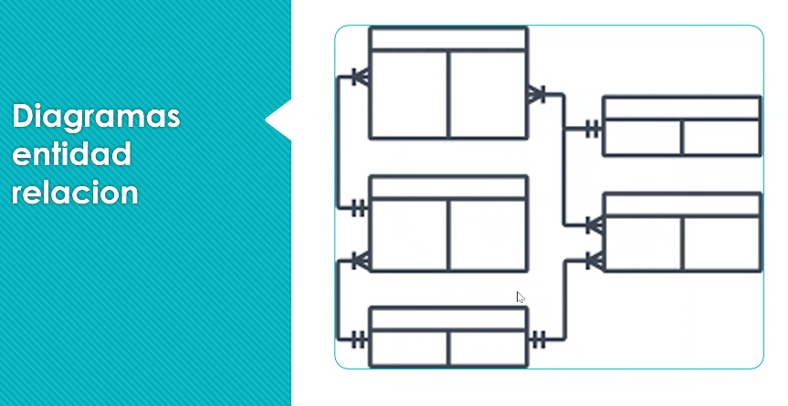
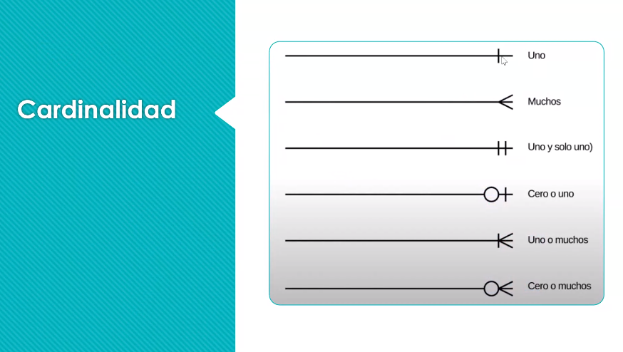

## Clase 04
### repaso clases anteriores:

Repasamos definiciones elementales de datos, información y conocimiento.

Concepto de variable.

Data Base Managment System

- Tabla representada por filas y columnas
Cada tabla debe tener su clave primaria.

- Transacciones ACID (para lograr una transacción correcta)

- Instalación de xampp

### clase 04 inicia
Docker: explicación básica de dockerización.

¿Qué permite hacer el SQL con la base de datos?

### Diccionario de datos:
es un repo centralizado de información sobre datos tales como significado, relación con otros datos, origen, uso y formato

Tener en un documento todo el alcance de la base de datos. Se usa para evitar malas interpretaciones.

### Normalización de BD
Detectar redundancias, generar tablas derivadas de esas tablas

Para eso vamos a usar diagramas de entidad de relación

Tipo de relación que tiene la tabla:

