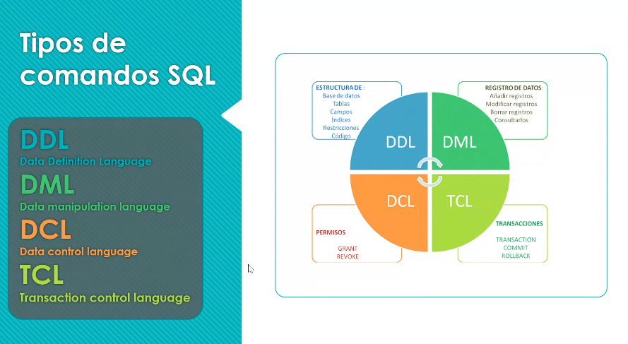

### Clase 05 - presencial
#### Resumen clase anterior

- Listas
- Stored procedure

Tipos de comandos (DDL, DML, DCL, TCL)



Diccionarios (datos de los datos). Nos sirven para conocer los metadatos de nuestras bases de datos, son una guía y documentación para futuras iteraciones de desarrollo.

#### Otros temas tocados:
- Diagrama de relación
- Cardinalidad
- Primary key
- Foreing key
- Entidad referencial (no puedo borrar datos que tengan referencias a otras tablas, se pierde la entidad referencial)

#### Rol del DBA. Data Base Administrator
Persona que administra las BD, se encarga de diseñar e implementar la estructura y velar por el cuidado de las mismas, entre otras cosas otorgando permisos específicos solo en la medida que sean necesarios.

#### Modelo relacional (MER)
Es un diagrama de flujo que describe cómo debemos diseñar la BD.

```
Un modelo de base de datos muestra la estructura lógica de la base, incluidas las relaciones y limitaciones que determinan cómo se almacenan los datos y cómo se accede a ellos. Los modelos de bases de datos individuales se diseñan en base a las reglas y los conceptos de cualquier modelo de datos más amplio que los diseñadores adopten. La mayoría de los modelos de datos se pueden representar por medio de un diagrama de base de datos acompañante

```

[ver más de MER](https://www.lucidchart.com/pages/es/que-es-un-modelo-de-base-de-datos)

- Atributos
- Relaciones
- Tipo de relaciones

**Tarea:** hacer trello en equipos