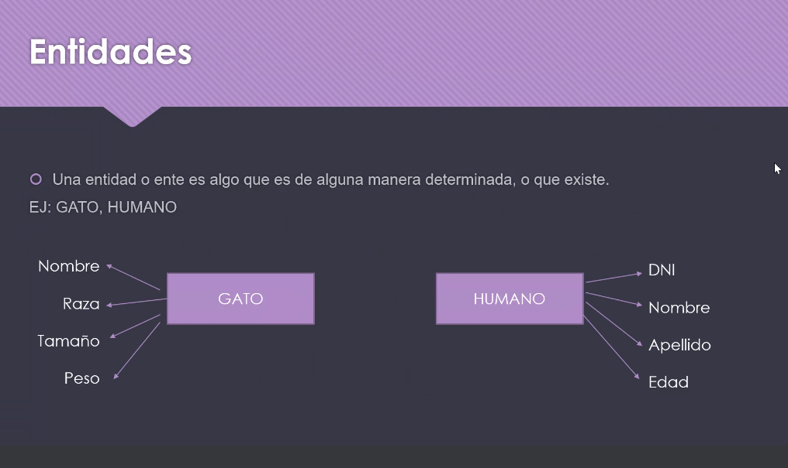

#### Clase 07
Repaso temas clase anterior

Unidad 2 Modelo Relacional

repaso inner join

Una entidad es una representación lógica de un objeto físico en la vida real.

Definimos una entidad de relación en un diagrama:

Otros repasos:

- entidades y tipo de relación
- existencia física / existencia conceptual
- asignación de relaciones y tipos (1:1 1:M, etc)
