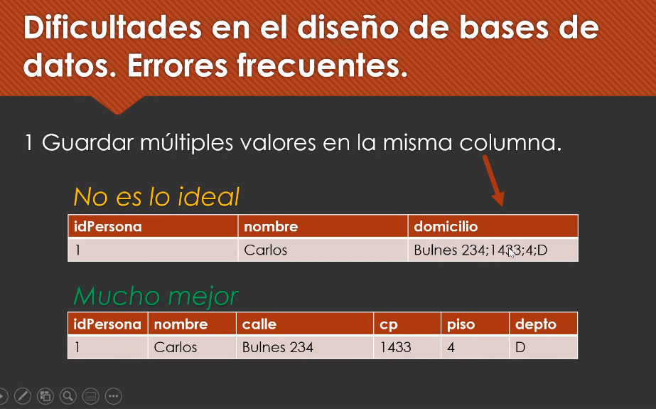
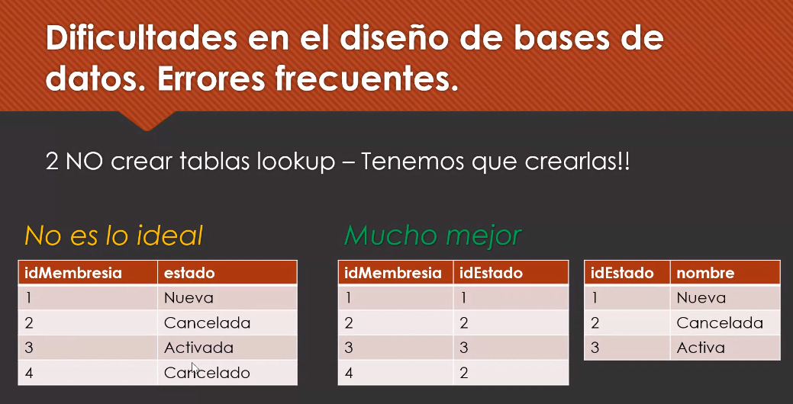
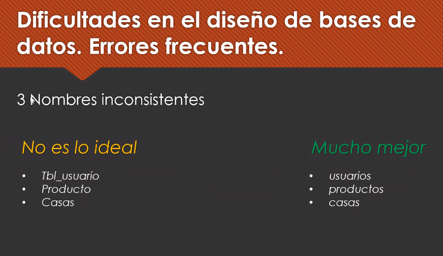
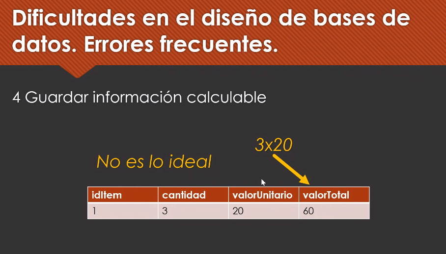
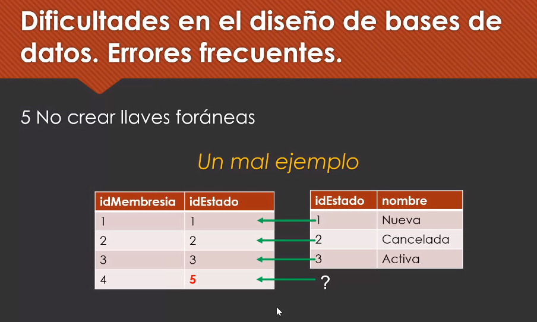
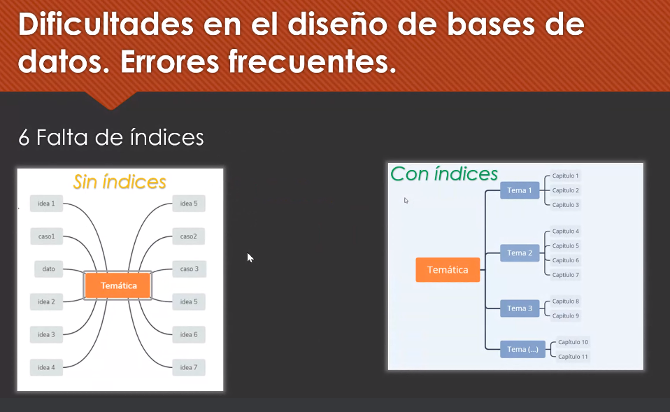
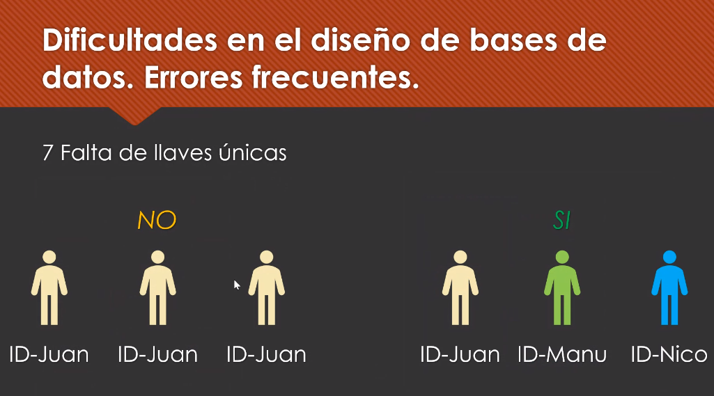
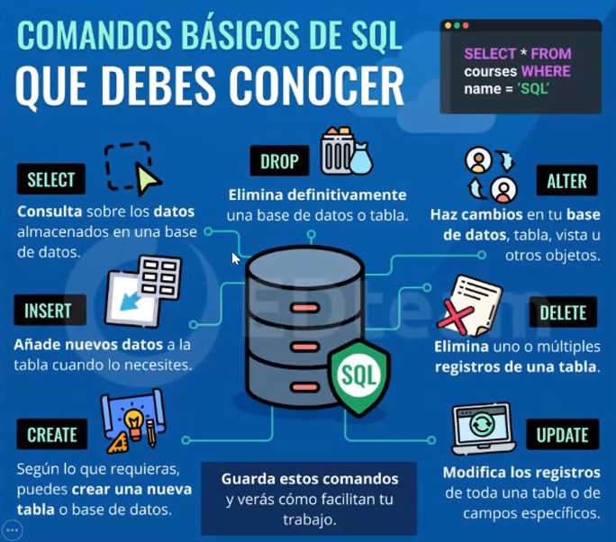
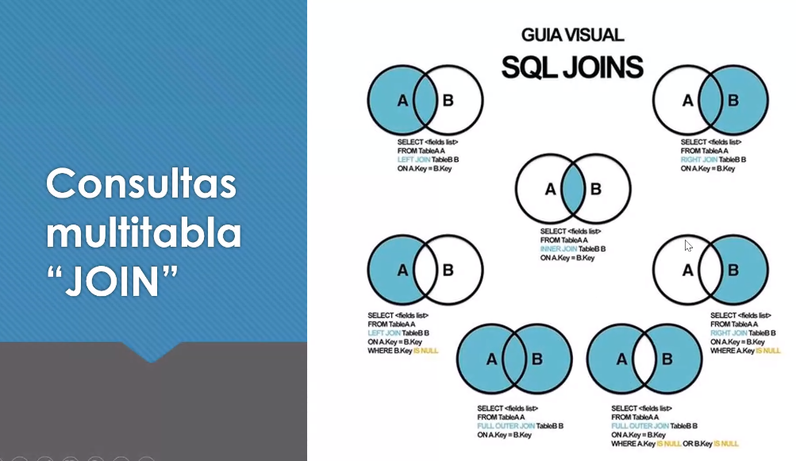
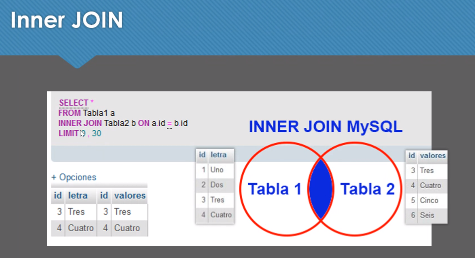

### Clase 08
Repasamos de todos los temas antes del parcial:

Temas vistos para parcial:

- Clase 01
	- Datos
	- Información
	- Conocimiento
	- Variables
		- Características
		- Tipos de datos
	- Qué es una BD
		- Concepto
		- Ejemplos
		- SGBD / DBMS
			- Características
			- Definición (es la BD + SGBD)
			- Timeline de las BD (historia)
		- SQL & NoSQL
			- Diferencias
			- Escalamiento vertical vs horizontal
	- ACID
		- Definición
- Clase 02
	- Qué es SQL
	- Qué puede hacer SQL
	- Tipos de comandos (DDL, DML, DCL, TCL)
		- Comandos SQL
	- Diccionario de datos
	- Diagrama de entidad de relación
	- Tipos de cardinalidad
	- Claves primarias y foraneas
	- Entidad referencial
	- Rol del DBA

#### Unidad 2
- Teoría de conjuntos
	- Inner Join
	- Left Join
	- ++
- Lógica de predicados
- Entidades
	- Entidad y atributos
- Diagrama Entidad Relacional

### Nueva clase
Nuevas filminas, esto también entra en primer parcial.

#### Errores frecuentes en el diseño de BD:

- Múltiples valores en la columna
- No crear lookup
- Nombres inconsistentes
- Guardar información calculable
- No usar claves foraneas
- Falta de índices
- No usar claves únicas

#### Consultas SQL básicas 
Lo siguiente no entra en el primer parcial pero es importante saberlo:

Distintas consultas JOIN

