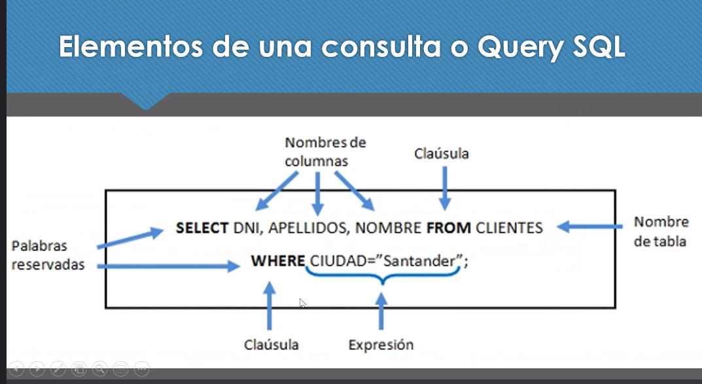
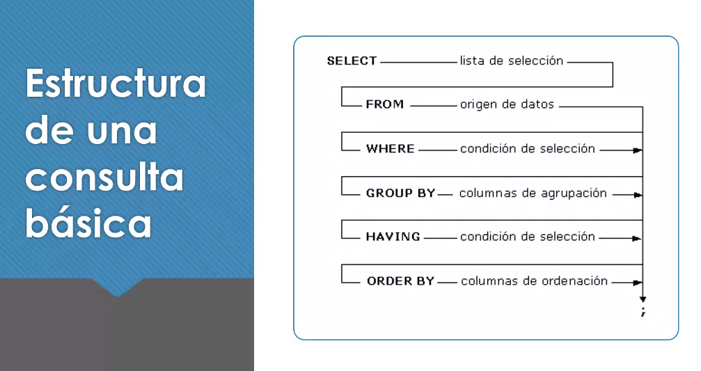
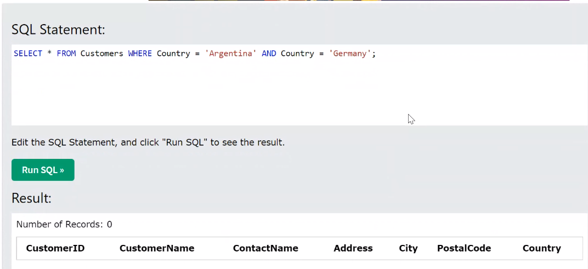
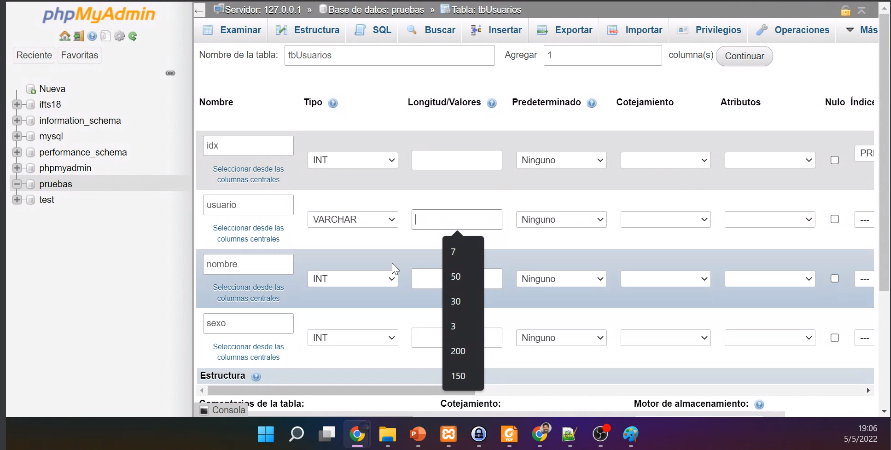
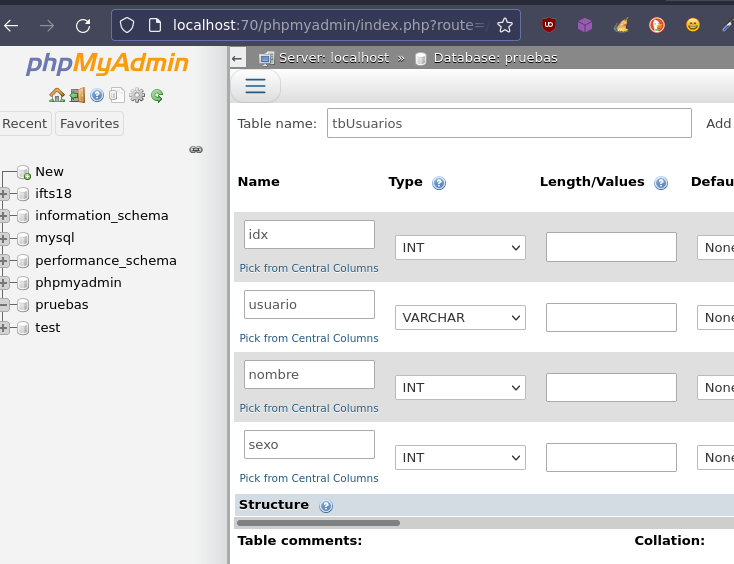
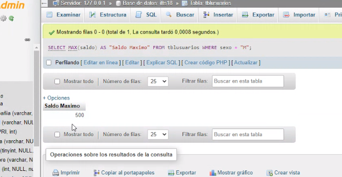
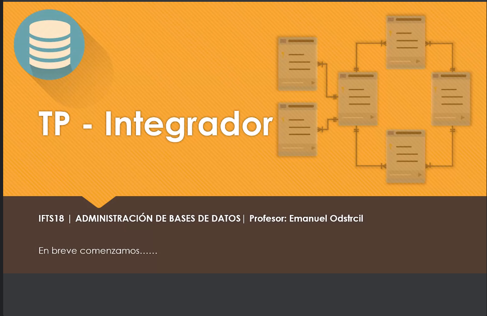
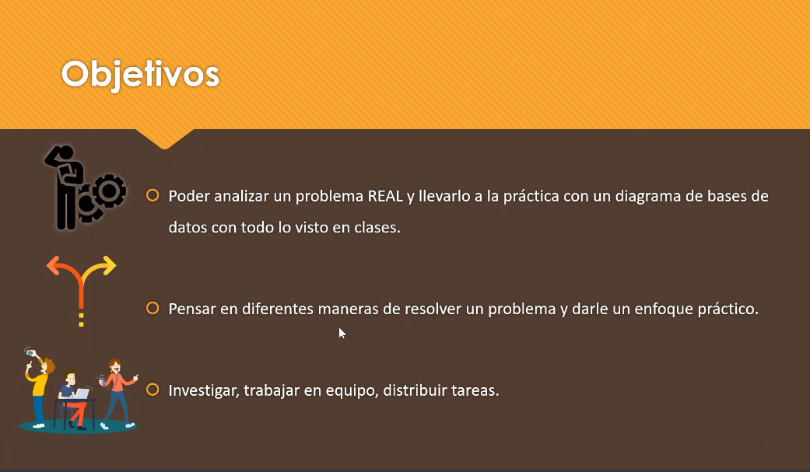

### Clase 11

Repasamos syntaxis y empezamos a hacer consultas reales en la bd





Hacemos algunos ejercicios en w3school



(error por usar AND y no OR)

#### Practicando con phpmyadmin

- SELECT
- DELETE
- UPDATE
- DROP
- TRUNCATE
- IN()
- Operaciones ` <, >, MAX(), MIN() `



en mi localhost



```

`INSERT INTO tbUsuarios (idx,nombre,sexo,usuario) VALUES (null,'Adrian','R','Adri');`

`UPDATE `tbusuarios` SET `usuario` = 'El popa' WHERE `tbusuarios`.`idx` = 2;

```

Lean compartiendo patalla:







Fecha: fin de cuatrimestre

