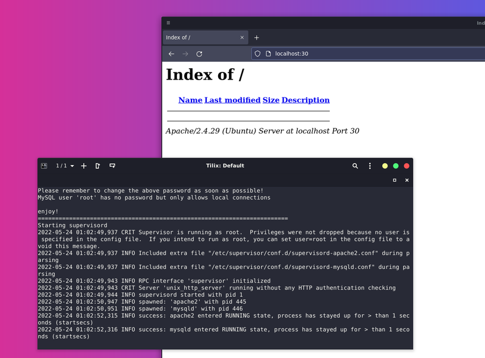
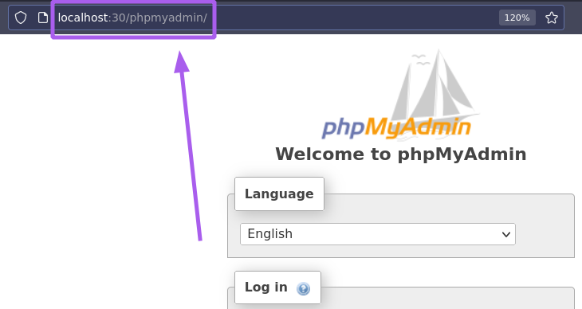

### Docker env

Para emular un ambiente de desarrollo identico en todo el equipo usamos un Docker Container para LAMP (Linux, Apache, MySQL y PHP). La documentación del mismo puede encontrarse en el repositorio de [Matt Rayner](https://github.com/mattrayner), específicamente en su página de [docker hub](https://hub.docker.com/r/mattrayner/lamp)

#### Launch a 18.04 based image
`docker run -p "80:80" -v ${PWD}/app:/app mattrayner/lamp:latest-1804`

Lo que nos permite tener el entorno LAMP corriendo en el puerto de localhost que elijamos (en mi caso el puerto :30).

De esta forma podemos ingresar a `localhost:30/phpmyadmin/`

