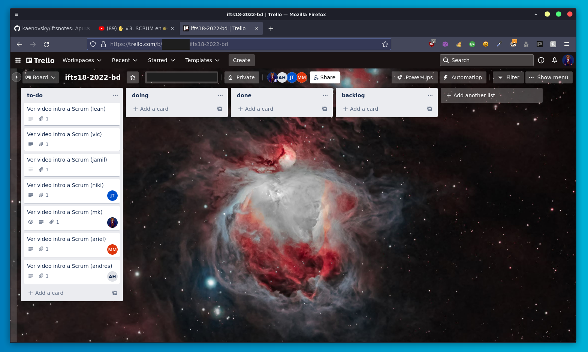

      ### Setup XAMPP (test local)

Antes de usar Docker seteamos entorno localhost en XAMPP

---

### Avances del proyecto

:::: Scrum ::::

w00 - trello

w 01 - trello

w-final - trello

Avanzamos con la info del TP en el [siguiente repositorio](https://github.com/kaenovsky/crispy-fiesta)

La app quedó corriendo en el [siguiente enlace](https://aurorita.bashe.ar:4000)

---

:::: Stack ::::

- HTML, CSS, JS [ front-end ]
- PHP y MySQL [ back-end ]
- Github Actions, Docker, LAMP [ server ] 

---
:::: Docker ::::

Web app corriendo en docker container (LAMP) en un server externo (Digital Ocean)

:::: Integración con Github Actions ::::

[Ver en gh](https://github.com/kaenovsky/crispy-fiesta/blob/main/.github/workflows/github-push.yaml)

---
:::: Diseño web ::::

### Figma

Avanzando en diseño del MVP

w01 - Figma

Diseño web final por:

- [Ariel Marchioni](https://github.com/ArielMarchioni)
- [Andrés Hoyos](https://github.com/andhoyos)

---

Integrantes:

Leandro Raúl Rossetti, Lafiosca Victoria Micaela, Martin Kaen, Jamil Soto Quilez, Thelusma Jean Emmanuel, Gerardo Ariel Marchioni, Andres Fabian Hoyos