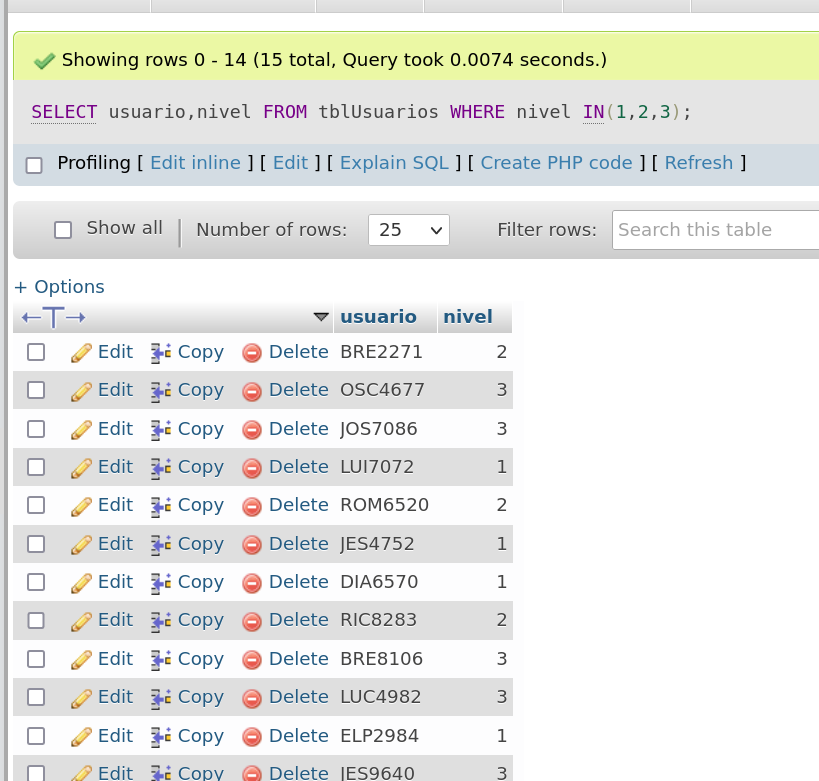

### Clase 12
Repaso de TP BD

```
-- Consigna:

-- 1) Listar los nombres de los usuarios
-- 2) Calcular el saldo máximo de los usuarios de sexo “Mujer”
-- 3) Listar nombre y teléfono de los usuarios con teléfono NOKIA, BLACKBERRY o SONY
-- 4) Contar los usuarios sin saldo o inactivos
-- 5) Listar el login de los usuarios con nivel 1, 2 o 3
-- 6) Listar los números de teléfono con saldo menor o igual a 300
-- 7) Calcular la suma de los saldos de los usuarios de la compañia telefónica NEXTEL
-- 8) Contar el número de usuarios por compañía telefónica
-- 9) Contar el número de usuarios por nivel
-- 10) Listar el login de los usuarios con nivel 2
-- 11) Mostrar el email de los usuarios que usan gmail
-- 12) Listar nombre y teléfono de los usuarios con teléfono LG, SAMSUNG o MOTOROLA

-- Queries del tp:

-- # ejercicio 1)

SELECT nombre FROM `tblUsuarios`; 

-- # ejercicio 2)

SELECT MAX(saldo) FROM `tblUsuarios` WHERE sexo = "M";

-- # ejercicio 3)

SELECT nombre, telefono FROM `tblUsuarios` WHERE marca IN('NOKIA','BLACKBERRY','SONY');

-- # ejercicio 4)

SELECT COUNT(idx) FROM `tblUsuarios` WHERE saldo = 0 OR activo != 1;

-- # ejercicio 5)

SELECT usuario FROM tblUsuarios WHERE nivel IN(1,2,3);

-- # ejercicio 6)

SELECT telefono FROM tblUsuarios WHERE saldo <= 300;

-- # ejercicio 7)

SELECT SUM(saldo) FROM tblUsuarios WHERE compañia = 'NEXTEL';

-- # ejercicio 8)

SELECT COUNT(compañia), compañia FROM tblUsuarios group BY compañia;

-- # ejercicio 9)

SELECT COUNT(usuario), usuario, nivel FROM tblUsuarios GROUP BY nivel;

-- # ejercicio 10)

SELECT usuario, nivel FROM tblUsuarios WHERE nivel = 2;

-- # ejercicio 11)

SELECT usuario, email FROM tblUsuarios WHERE email LIKE '%@gmail.com';

-- # ejercicio 12)

SELECT nombre, telefono, marca FROM `tblUsuarios` WHERE marca IN('LG', 'SAMSUNG', 'MOTOROLA');


```

En mi entorno local:





