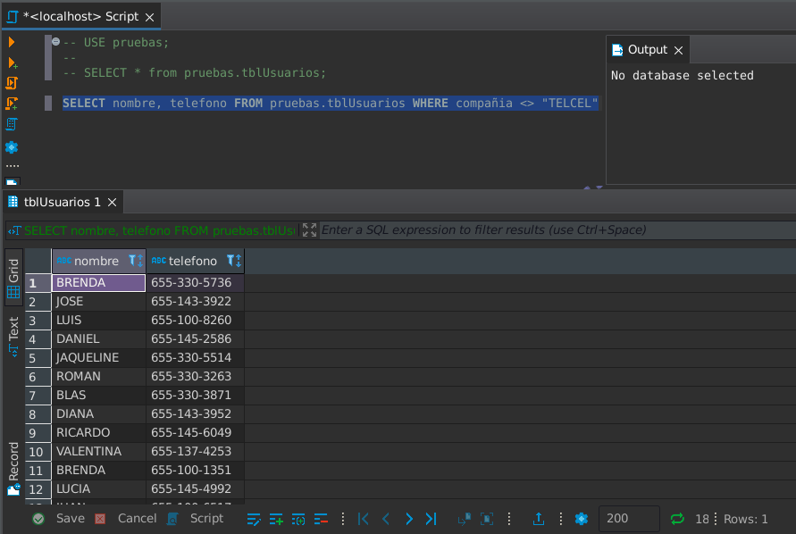
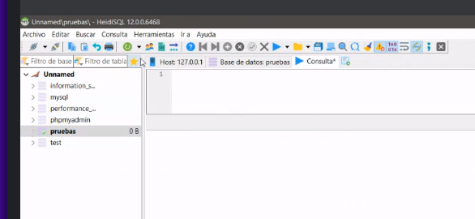

### Clase 13
Clase 100% práctica en base al ejercicio enviado por classroom (usando Heidi en vez de phpmyadmin).

- Listar nombre y teléfono de los usuarios con teléfono que no sea de la marca LG o SAMSUNG
- Listar el login y teléfono de los usuarios con compañia telefónica IUSACELL
- Listar el login y teléfono de los usuarios con compañia telefónica que no sea TELCEL
- Calcular el saldo promedio de los usuarios que tienen teléfono marca NOKIA
- Listar el login y teléfono de los usuarios con compañia telefónica IUSACELL o AXEL
- Mostrar el email de los usuarios que no usan yahoo
- Listar el login y teléfono de los usuarios con compañia telefónica que no sea TELCEL o IUSACELL
- Listar el login y teléfono de los usuarios con compañia telefónica UNEFON
- Listar las diferentes marcas de celular en orden alfabético descendentemente
- Listar las diferentes compañias en orden alfabético aleatorio
- Listar el login de los usuarios con nivel 0 o 2
- Calcular el saldo promedio de los usuarios que tienen teléfono marca LG



en mi caso opté por una alternativa FOSS: [Dbeaver Community](https://dbeaver.io/)

Pruebas en clase:

```
-- SELECT * from pruebas.tblUsuarios;

-- SELECT DISTINCT compañia FROM pruebas.tblUsuarios ORDER BY RAND(); 

-- Calcular la suma de los saldos de los usuarios de la compañia telefónica UNEFON

-- SELECT SUM(saldo) FROM pruebas.tblUsuarios WHERE compañia = "UNEFON";

```



debuggeamos errores de un compañero. Momento intenso. 
Terminó funcionando :')

- Tarea: queda en pasar más ejercicios via classroom.

#### Ejercicio completo:

```
-- SELECT * from pruebas.tblUsuarios;

-- # Listar nombre y teléfono de los usuarios con teléfono que no sea de la marca LG o SAMSUNG

-- SELECT nombre, telefono FROM tblUsuarios WHERE marca NOT IN('LG','SAMSUNG');

-- # Listar el login y teléfono de los usuarios con compañia telefónica IUSACELL

-- SELECT usuario, telefono FROM tblUsuarios WHERE compañia = 'IUSACELL';

-- # Listar el login y teléfono de los usuarios con compañia telefónica que no sea TELCEL

-- SELECT usuario, telefono FROM tblUsuarios WHERE compañia != 'TELCEL';

-- # Calcular el saldo promedio de los usuarios que tienen teléfono marca NOKIA

-- SELECT AVG(saldo) AS "Saldo Promedio" FROM tblUsuarios WHERE marca = 'NOKIA';

-- # Listar el login y teléfono de los usuarios con compañia telefónica IUSACELL o AXEL

-- SELECT usuario, telefono FROM tblUsuarios WHERE compañia IN('IUSACELL','AXEL');

-- # Mostrar el email de los usuarios que no usan yahoo

-- SELECT email FROM tblUsuarios WHERE email NOT LIKE '%@yahoo';

-- # Listar el login y teléfono de los usuarios con compañia telefónica que no sea TELCEL o IUSACELL

-- SELECT usuario, telefono FROM tblUsuarios WHERE compañia NOT IN('TELCEL','IUSACELL');

-- # Listar el login y teléfono de los usuarios con compañia telefónica UNEFON

-- SELECT usuario, telefono FROM tblUsuarios WHERE compañia = 'UNEFON';

-- # Listar las diferentes marcas de celular en orden alfabético descendentemente

-- SELECT DISTINCT marca FROM tblUsuarios ORDER BY marca DESC;

-- # Listar las diferentes compañias en orden alfabético aleatorio

-- SELECT DISTINCT compañia FROM tblUsuarios ORDER BY RAND();

-- # Listar el login de los usuarios con nivel 0 o 2

-- SELECT usuario FROM tblUsuarios WHERE nivel IN(0,2);

-- # Calcular el saldo promedio de los usuarios que tienen teléfono marca LG

-- SELECT AVG(saldo) AS "Saldo Promedio" FROM tblUsuarios WHERE marca = 'LG';

-- 

-- este creo que fue offtopic

-- 

-- # Calcular la suma de los saldos de los usuarios de la compañia telefónica UNEFON

-- SELECT SUM(saldo) FROM pruebas.tblUsuarios WHERE compañia = "UNEFON";

```
