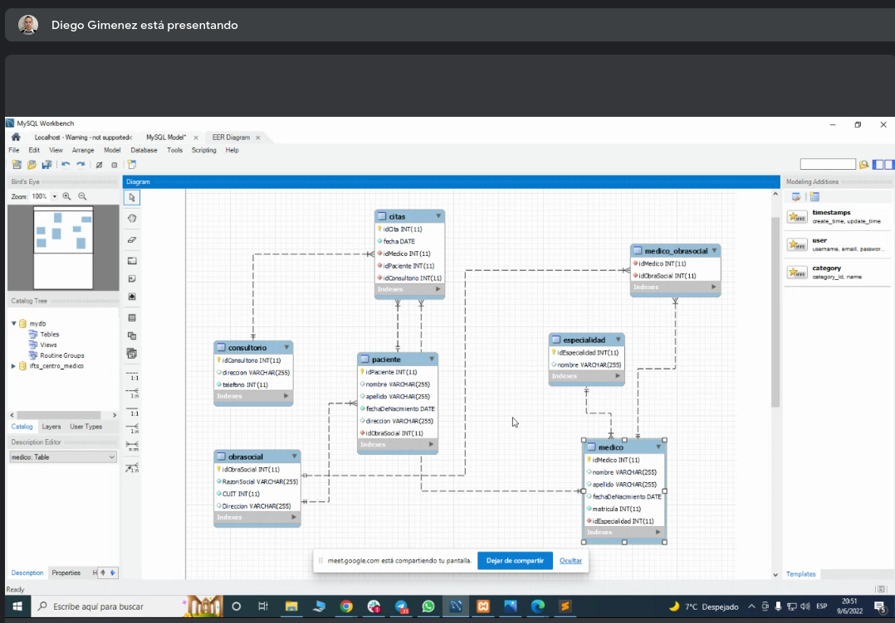
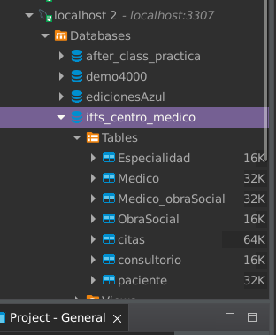

### Clase 18
Repasamos ejercicios de classroom:

1. Muestre los nombre de las categorías de los productos que tengan un stock superior a 5.
2. Cree una consulta para agregar 4 productos que sean de la categoría "Electrónico" y tengan la siguiente descripcion:
   Notebook MacBook Air, cantidad 5, precio $250000  
   Notebook Alienware Air, cantidad 7, precio $570000  
   Celular Samsung galaxy S21FE, cantidad 12, precio $98600  Celular Ipone 13 pro, cantidad 9, precio $365000

1:
```
SELECT categoria.nombre, producto.cantidad
FROM producto
INNER JOIN categoria ON producto.categoria_id = categoria.id
WHERE producto.cantidad > 5;
```

2:
```
INSERT INTO producto 
(categoria_id,nombre,cantidad,precio)
VALUES
(1,'Notebook MacBook Air',5,250000),
(1,'Notebook Alienware Air',7,570000),
(1,'Celular Samsung galaxy S21FE',12,98600),
(1,'Celular Ipone 13 pro',9,365000);
```

Luego repasamos armado de estructura de BD desde cero con Diego. Empieza con el diagrama DER, luego crea toda la BD en formato .sql

Resultado final en DER:




```
CREATE DATABASE IF NOT EXISTS ifts_centro_medico;
USE ifts_centro_medico;

CREATE TABLE if NOT EXISTS ObraSocial(
    idObraSocial INT NOT NULL PRIMARY KEY AUTO_INCREMENT,
    razonSocial VARCHAR (255) NOT NULL,
    cuit INT NOT NULL,
    direccion VARCHAR (255)
);
    
CREATE TABLE if NOT EXISTS paciente(
    idPaciente INT NOT NULL PRIMARY KEY AUTO_INCREMENT,
    nombre VARCHAR (255) NOT NULL,
    apellido VARCHAR (255) NOT NULL,
    fechaDenacimiento DATE NOT NULL,
    direccion VARCHAR (255),
    idObraSocial INT NOT NULL,
    FOREIGN KEY(idObraSocial) REFERENCES ObraSocial (idObraSocial)
);
    
CREATE TABLE if NOT EXISTS Especialidad(
    idEspecialidad INT NOT NULL PRIMARY KEY AUTO_INCREMENT,
    nombre VARCHAR (255)
);

CREATE TABLE if NOT EXISTS Medico(
    idMedico INT NOT NULL PRIMARY KEY AUTO_INCREMENT,
    nombre VARCHAR (255),
    apellido VARCHAR (255),
    FechaDeNacimiento DATE,
    matricula INT NOT NULL,
    idEspecialidad INT NOT NULL,
    FOREIGN KEY (idEspecialidad) REFERENCES Especialidad(idEspecialidad)
);

CREATE TABLE if NOT EXISTS Medico_obraSocial(
    idMedico INT NOT NULL PRIMARY KEY AUTO_INCREMENT,
    idObraSocial INT NOT NULL,
    FOREIGN KEY (idMedico) REFERENCES Medico(idMedico),
    FOREIGN KEY (idObraSocial) REFERENCES ObraSocial(idObraSocial)
);
    
CREATE TABLE if NOT EXISTS consultorio(
    idConsultorio INT NOT NULL PRIMARY KEY AUTO_INCREMENT,
    direccion VARCHAR(255),
    telefono INT NOT NULL
);
    
CREATE TABLE if NOT EXISTS citas(
    idCitas INT NOT NULL PRIMARY KEY AUTO_INCREMENT,
    fecha DATE NOT NULL,
    idmedico INT NOT NULL,
    idPaciente int not NULL,
    idConsultorio INT NOT NULL,
    FOREIGN KEY (idmedico) REFERENCES Medico(idMedico),
    FOREIGN KEY (idPaciente) REFERENCES paciente(idPaciente),
    FOREIGN KEY (idConsultorio) REFERENCES consultorio(idConsultorio)
);

```

Creando en local - ok!

