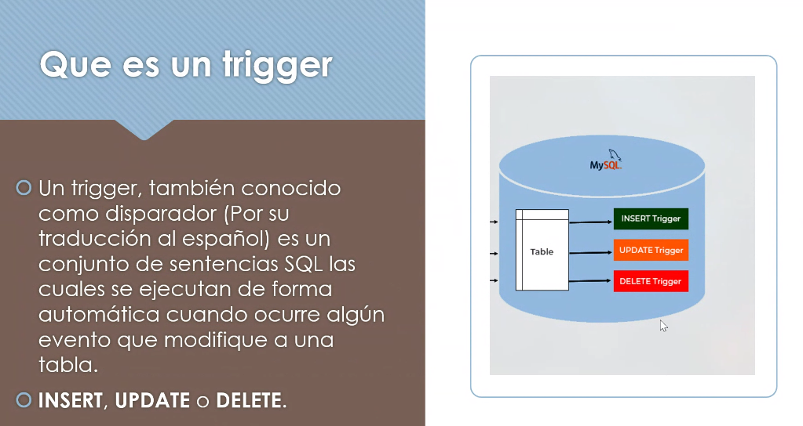
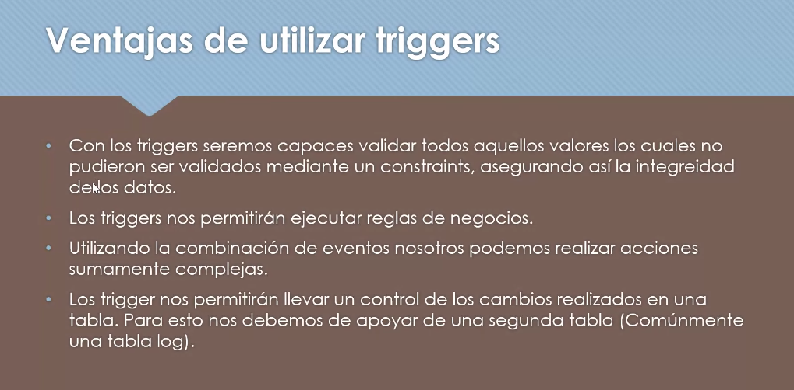
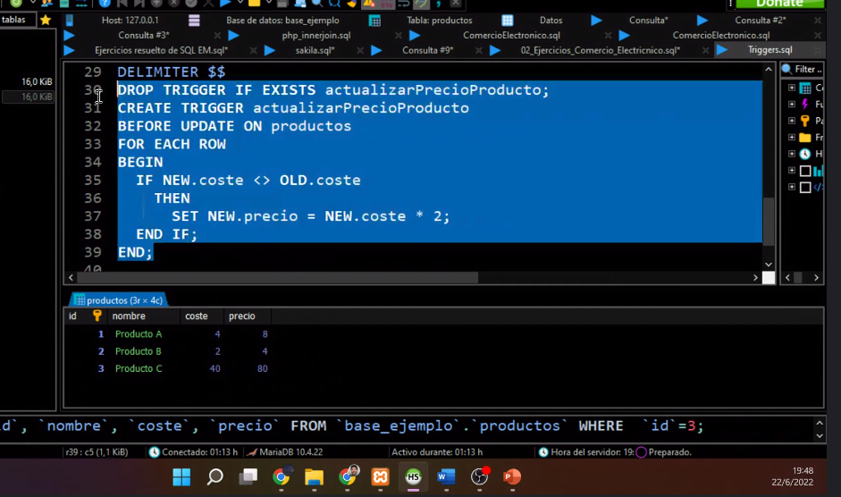
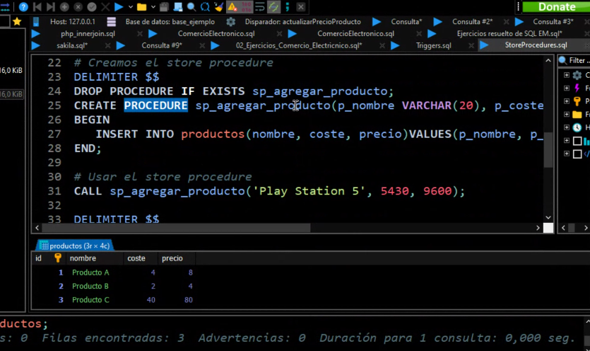
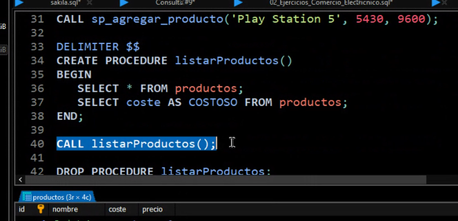

### Clase extra
- Nos comenta muy por encima lo del ministra-gate :|

Después hacemos repaso del parcial

Temas extra:

- Triggers







```
DELIMITER $$ 

DROP TRIGGER IF EXISTS actualizarPrecioProducto; 

CREATE TRIGGER actualizarPrecioProducto 

BEFORE UPDATE ON productos 
FOR EACH ROW 
BEGIN
	IF NEW.coste <> OLD.coste
	THEN SET NEW.precio = NEW.coste * 2;
	END IF;
END; 

UPDATE productos SET coste = 50 WHERE id = 1; 

SELECT * FROM productos;

```

Trigger creado:


#### Store procedure
Primer procedure: actualizar valores



Segundo procedure: listar productos



Eliminar:

`DROP PROCEDURE listarProductos;`