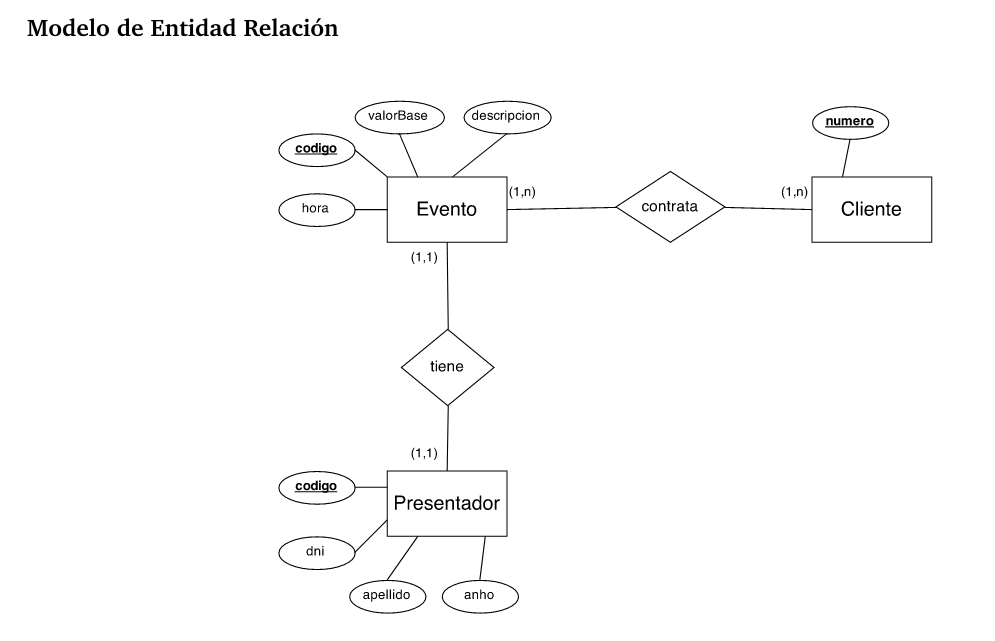

### Repaso parcial 1
Clase de repaso BD, [link a classroom]().

1) Qué es SQL:

**Structured Query Language** o **Lenguaje Estructurado de Consultas**. Un lenguaje que nos permite interactuar con nuestras bases de datos para consultar o modificar registros, obteniendo información de manera optimizada.

Aparece en 1974.

2) Tipos de Comandos:

**DDL:** Data Definition Language. Para definir la estructura de nuestra base de datos (diccionario de BD) creando, borrando y modificando BD y entidades.

ej: CREATE, DROP, TRUNCATE (...)

**DML:** Data Manipulation Language. Para manipular los registros de nuestras BD, nos permite insertar registros, borrarlos, visualizarlos, etc.

ej: SELECT, INSERT, DELETE (...)

**DCL:** Data Control Language. Nos permite controlar el acceso a nuestras BD otorgando o revocando permisos a las distintas personas que interactuan con nuestra BD.

ej: GRANT, REVOKE (...)

**TCL:** Transaction Control Language. Es la parte que se encarga de controlar las transacciones de la BD, chequeando que se cumpla el principio ACID y que todo movimiento quede registrado.

ej: TRANSACTION, COMMIT, ROLLBACK, SAVEPOINT (...)

3) Diferencias entre SQL vs NoSQL

SQL requiere que definamos al inicio nuestra estructura de forma clara y concisa, mientras que NoSQL nos permite ir modificando la estructura en tiempo real, por lo tanto puede usarse en sistemas que requieran una alta demanda de datos antes que una fuerte consistencia. Son complementarios ya que en un mismo sistema puedo utilizar ambos y ambas son utilizadas tanto a pequeña y gran escala por instituciones y empresas, pero se suele recomendar SQL para transacciones que requieran alta trazabilidad de los datos (ecommerce, reportes, bancos) y NoSQL para mayor velocidad (gaming, streaming, IoT).

[Ver explicación IBM](https://www.ibm.com/cloud/blog/sql-vs-nosql)

Ejemplos de motores en cada caso:

SQL: MySQL, MariaDB, Oracle
NoSQL: MongoDB, Redis, Cassandra

4) Datos, información, conocimiento

Por datos nos referimos a valores almacenados que podemos visualizar pero no podemos interpretar de qué se trata. Información son esos mismos datos procesados de forma ordenada que nos permite entender de qué estamos hablando. Y conocimiento nos referimos a las conclusiones que sacamos de esa información procesada.

Ejemplo: 

Dato: 1,83 cm
Información: El promedio de altura en Países Bajos es 1,83 cm
Conocimiento: Países Bajos tiene la altura promedio más alta del mundo

5) Problemas frecuentes al crear BD

- Múltiples valores en la misma columna (ej Direccion: "Peron 3021, 3A, CP1045")
- No utilizar tablas LOOKUP (ej Estado: cancelado, cancelada, activo. En vez de 'Estado = 1'; 1="Activo")
- Guardar información calculable (ej algo que se podría obtener sumando)
- Nombres inconsistentes / no cumplir una convención (ej tbl_usuarios y tblProfesores)

6) Historio BD

Básicamente recordar algunas de las BD que vimos en el timeline

1970: Se crea SQL
1977: Se crea ORACLE 1era SGBD corporativo
1989: SQL Server
1990: Primeros SGBD Open Source
1995: Se crea MySQL
1996: Se crea Postgres
2000: SQLite - SGBD mobile / ligero
2009: MariaDB un fork Open Source de MySQL

7) Entidad

Una entidad es una representación de algo. En BD existen entidades concretas (clientes, alumnos) y abstractas (materia, puesto laboral). 

Las entidades tienen atributos, relaciones y tipos de relaciones.

8) Tareas de un DBA

- Instalar el software necesario (motor BD)
- Definir la estructura de la BD
- Documentar la BD
- Verificar la confiabilidad de los datos
- Otorgar y remover accesos
- Velar por su mantenimiento ordenado (mantener a los devs alineados a la convención que use la organización)
- Hacer backups de las BD
- Auditar el rendimiento
- Establecer la seguridad de la BD

(...)

9) Claves primarias PK

Es un atributo que identifica de forma exclusiva cada registro de una tabla. Debe haber 1 PK por entidad.

Decimos que las PK son:

a) únicas
b) inalterables
c) nunca nulas

10) Ejemplos de tablas 1 a 1 y de 1 a 0 o muchos.

Un ejemplo de 1 a 1 puede ser un usuario que tiene un DNI.

Un ejemplo 1 a 0 o muchos puede ser un ecommerce donde un usuario puede tener 0 o muchos productos en su historial de compra. 

11) Hacer un MER en base a un ejemplo dado:

