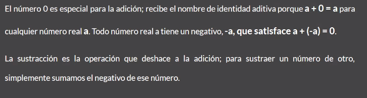
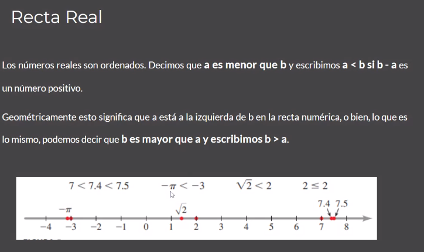

# intro a la materia
Introducción a la modalidad de la materia. Muestra el PDF que envió por mail.

## Evaluaciones:
2 parciales, 1 recuperatorio.
75% de asistencia.
Promoción de la materia >=7

### Clase 01

Clase Numeralbilidad y Cardinalidad.
Cronograma:

Objetivo:

- Conjunto de números
- Valor posicional
- Notación expandida
- Orden de los números cardinales
- Números Reales
- Recta Real
- Conjunto, operaciones entre conjuntos

### Introducción a los números cardinales
En el mundo real usamos números para medir y comparar diferentes cantidades (ej temperatura, longitud, distancia, etc)

#### Valor Posicional
Cuando expresamos un número cardinal con un numeral que contiene los dígitos 0,1,2,3,4,5,6,7,8,9 decimos que le número está escrito en notación estándar.

Unidades, decenas y centenas.

Se separan los dígitos en grupos de tres, llamados periodos. Cada periodo tiene un nombre millones, billones, trillones, etc.

Conforme nos movemos a la izquierda, el valor posicional de cada columna es 10 veces más grande que la columna a su derecha.

Por eso es un sistema de numeración de base 10 (sistema decimal)

notación expandida, cuando mencionamos cada una de las unidades (6 millares, 3 centenas, 5 decenas, etc)

Ej. notación extendida:

a. 63 427
b. 1 251 609

seis decenas de millares tres unidades de millares cuatro centenas veinte decenas y dos unidades

un millon dos centenas de millares, cinco decenas de millares, una unidad de millares, seis centenas y nueve unidades

#### Orden de los números cardinales
Los números cardinales se pueden ilustrar dibujando puntos sobre la recta numérica, para representar números gráficamente.

Empezamos a la izquierda con el número 0 (punto de origen). Luego avanzamos hacia la derecha.

Se puede representar un solo número o un conjunto de números en una recta numérica usando un gráfico.

Números naturales: 1, 2, 3, 4 ...

Los enteros constan de los naturales junto con sus negativos y el 0: ... -23, -22, -21 .. -2 -1, 0, 1, 2, 3 ...

El conjunto de los números reales se denota con el símbolo R.

Recomienda el libro: ÁLGEBRA AUTOR: AURELIO BALDOR

Los números reales son **ordenados**

## Conjuntos: Definiciones
Un conjunto es una colección de objetos. Un conjunto básico en matemáticas es el de los números naturales.

Se escriben usando llaves { } para encerrar a sus miembros.
Esta representación escrita es equivalente a la representación gráfica de diagrama de Venn.

(intervalos)

## Diagramas de Venn
Son esquemas usados en la teoría de conjuntos, tema de interés en matemáticas, lógica de clases y razonamiento diagramático. Estos diagramas muestran colleciones de cosas por medio de líneas cerradas. La línea cerrada exterior abarca a todos los elementos bajo consideración, el conjunto universal U.

3er cuadro: intersección

## Operaciones

No hay ningún elemento de A que sea de B.

Los elementos comprenden el conjunto a - b

A y B son disconjuntos.

A está incluido en B. O A es un subconjunto de B.

## Producto cartesiano

Importante: se respeta la secuencia del producto

- Tarea: Investigar diferencias entre relaciones y funciones
