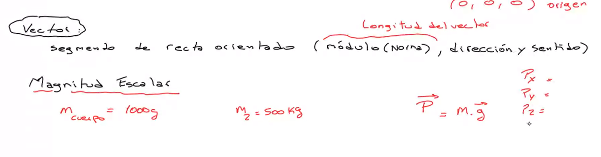

## Clase 01

Empieza con un repaso de unidad 0 y 1.

Repasando división de polinomios

### Ruffini

### Gauss

Comenta algunos temas que suele tomar (ejercicios):

- Factoreo (Ejercicio mostrado en clase)
- Polinomios
- Inecuaciones

Menciona cronograma

Habla de un parcialito el 3/05 si llega a estar en Buenos Aires.

Si sigue en la Antártida hará ejercicios de práctica 

### Empieza con tema unidad 1

Tema Vectores

Plano R2 (x y) & R3 (x y z)

Un vector es todo segmento de recta orientado que tiene módulo (norma, se dice que ves la norma del vector), dirección y sentido.

El módulo nos da la longitud del vector.

El primero de los puntos es el origen. Excepto que digan lo contrario en R2 es 0 0. Y en R3 0 0 0.

Y el segundo dato es el extremo del vector.

#### Magnitud Escalar
Estas son las que quedan determinadas por un número Real y su unidad de medida correspondiente.

Por ejemplo la masa de un cuerpo es escalar. 

Si nos pide producto escalar es un número.

#### Magnitud Vectorial

Estas son magnitudes de las cuales se requieren conocer no solo su valor numérico sino también su dirección y sentido. (Se puede también saber su módulo)

Lo que se obtiene es un vector.

En el ejemplo de la masa, cuando es peso es vectorial. La velocidad, la aceleración, la presión, son vectores.

Características que definen un vector:

**Norma:** la longitud del segmento de la recta (el vector). 

**Dirección:** La recta que lo contiene determina la dirección del vector.

**Sentido:** Es la orientación del segmento desde el origen al extremo.

**Representación:** Cómo se representa un vector? Con una letra minúscula con una flecha arriba.

Origen en 0 y extremo en R3 (x, y, z) o R2 (x, y).

Ejemplo Punto AB:

**Casos particulares:** 

- Vector nulo: cuando el módulo del vector es 0.
- Versor: cuando el módulo del vector es 1.

#### Componentes cartesianos en un vector en R2 y R3 (norma)

Ejemplo:

Halle las componentes cartesianas del vector "u->" con origen en (-2, 5) y extremo en (3, 7)

Para calcular la norma del vector:

Con Pitágoras:

En R3 es similar:

Pasa a comentar otro ejemplo que suele tomar:

Determine el valor de K tal que la norma de u = 9. Si u = (K, -2, 8)

La longitud es siempre positiva. Son los reales positivos.

#### Propiedades de la norma

Siempre es mayor o igual que 0.

Puede pedir que grafiquemos el versor en R2 o en R3. Está poniendo el ejemplo de un gráfico de norma:

Próxima clase da ejercicios. 