## Clase 02 - Funciones
### repaso general
Varios temas para repasar
Se recomienda nuevamente leer álgebra de Aurelio Baldor
#### Propiedades algebraicas
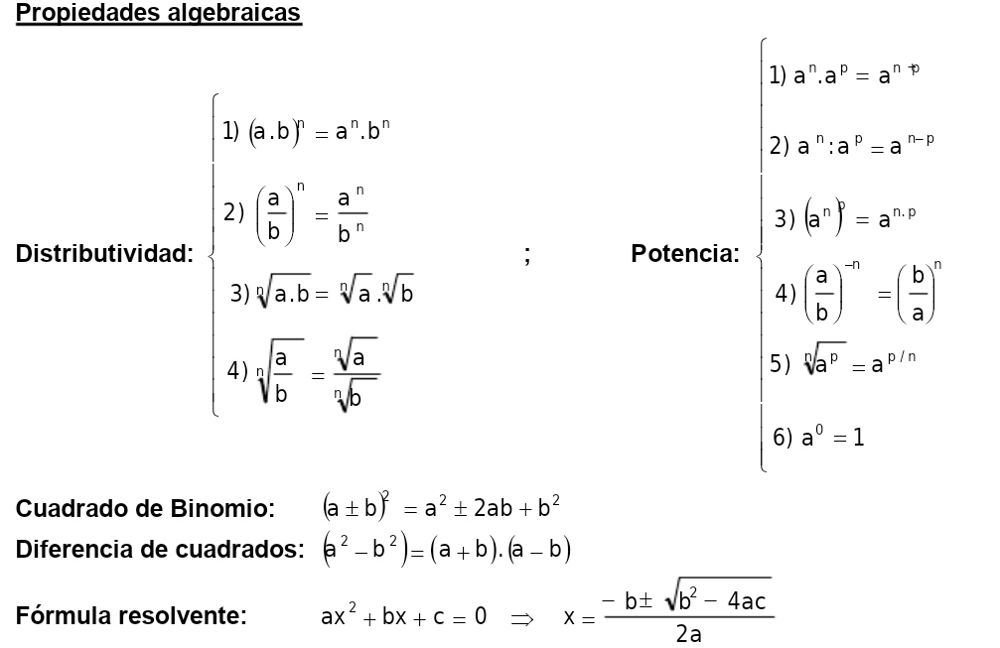

- Imagen que compartió Emi en grupo wpp

#### Temas para buscar

- Regla de signos [youtube / baldor](https://www.youtube.com/watch?v=E-f9OdVBDFA)
- Simplificación de fracciones algebraicas [youtube / baldor](https://www.youtube.com/watch?v=9LrTjho1viM)
- Cuadrado de un binomio [youtube / baldor](https://www.youtube.com/watch?v=XYzlU_aKkuI)
- Propiedades de las funciones [youtube / mateFacil](https://www.youtube.com/watch?v=cqjubdWcWqY)
- **Factorización** [youtube / baldor](https://www.youtube.com/watch?v=tgHrn3Hs66s)
- **Producto notable** [youtube / profe alex](https://www.youtube.com/watch?v=G-ym95yl3Es)

## Notas análisis de función

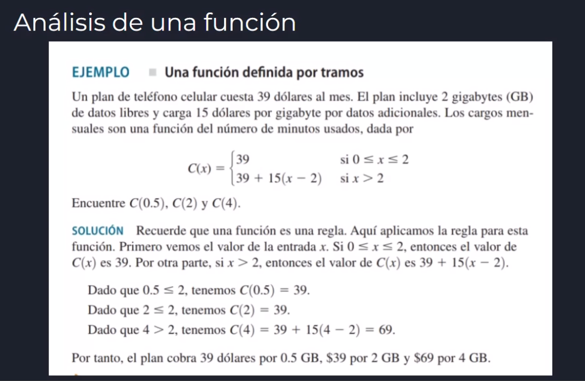

#### Análisis de una función:

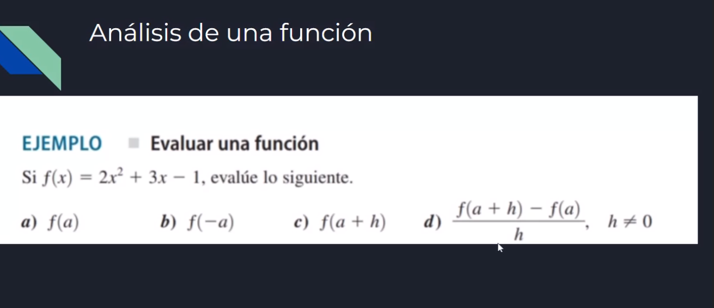

## Ejemplo astronauta

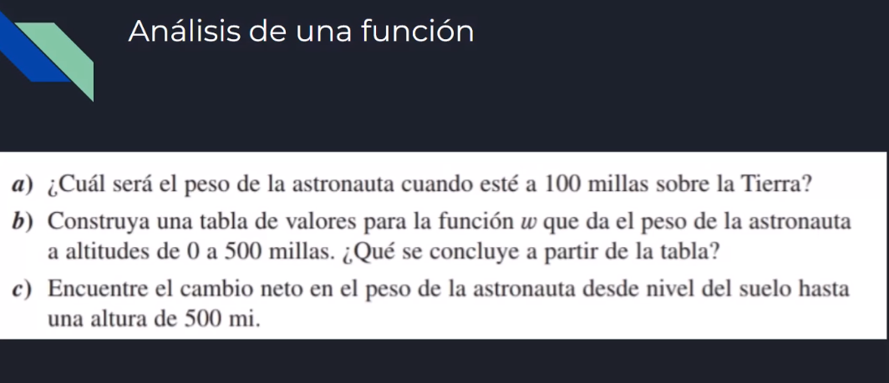

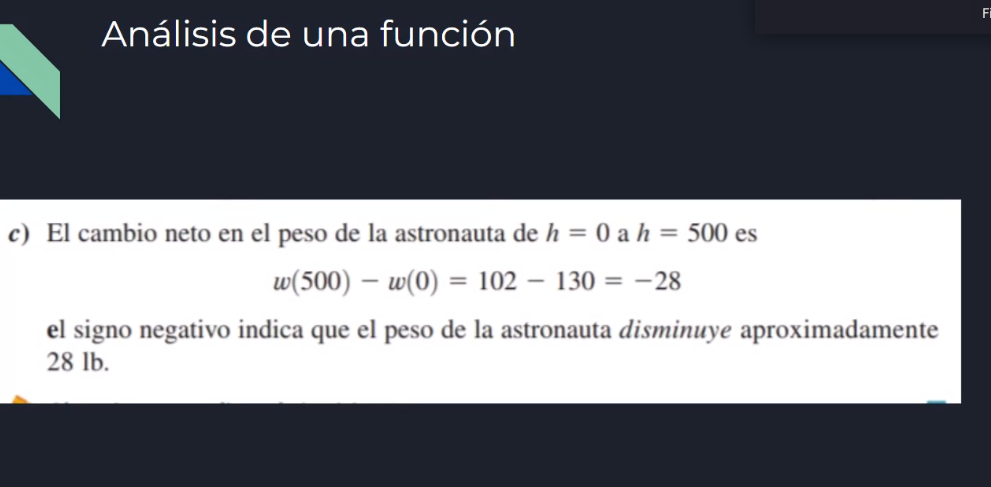

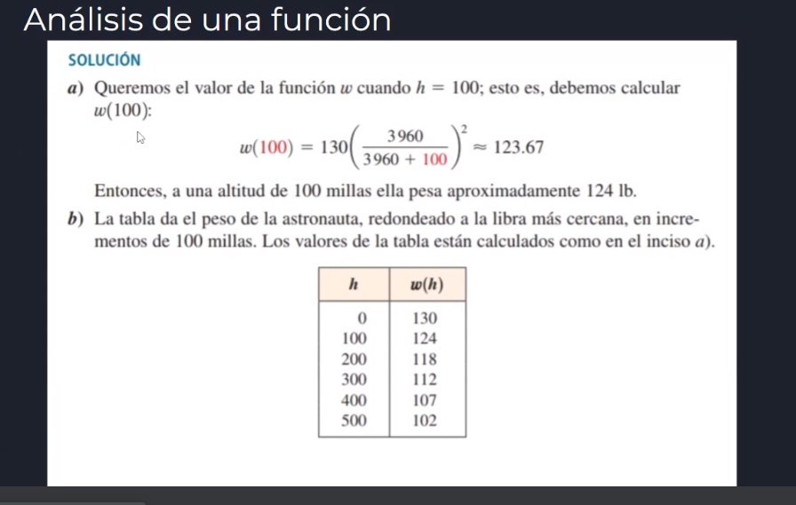

### Funciones comunes

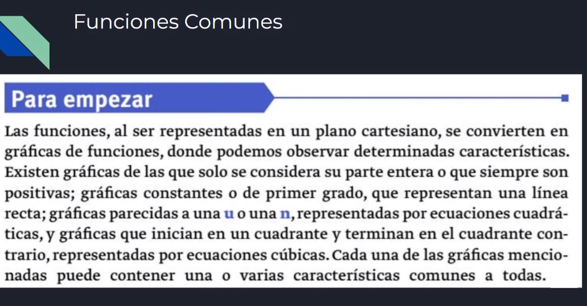

#### Valor absoluto

| x | valor absoluto (también conocido como módulo)

- nota: [ver más](https://www.educ.ar/recursos/15189/funcion-modulo-o-valor-absoluto)
- rango = codomino = imagen. Todo aquello que puede ser aplicado al valor de la recta Y.

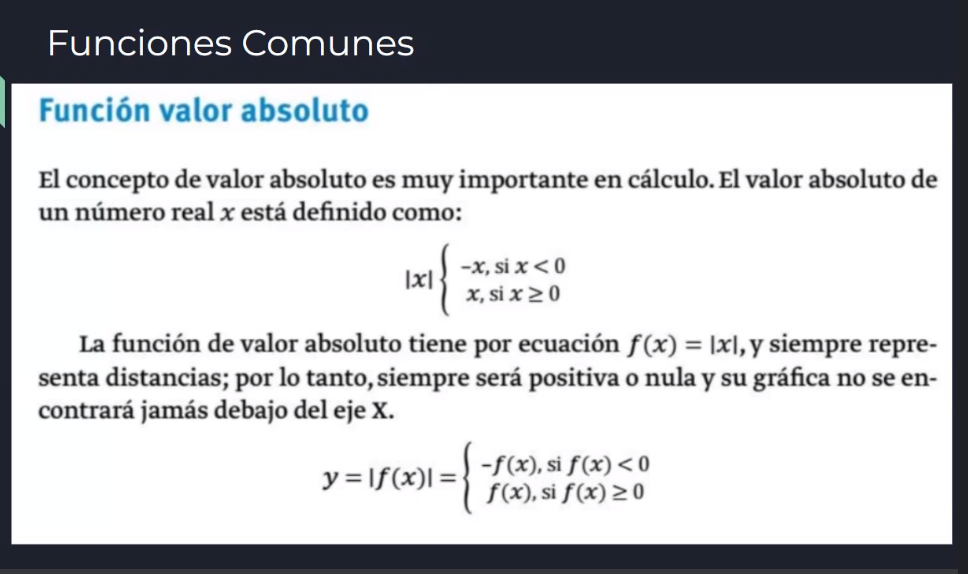
Es útil para calcular y representar distancias. Se usa como ejemplo claro que la distancia de una ciudad a otra no podrían ser km negativos.

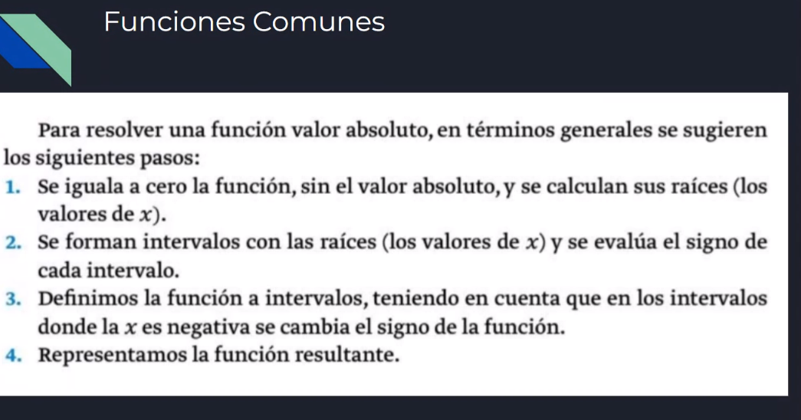

 Paso a paso para resolver una función valor absoluto:

1. Se iguala la función a 0, sin el valor absoluto y se calculan sus raíces (los valores de x).
2. Se forman intervalos, teniendo en cuenta que en los intervalos donde la x  es negativa se cambia el signo de la función (los negativos pasan a ser positivos).
3. Definimos la función a intervalos, teniendo en cuenta que en los intervalos donde la x es negativa se cambia el signo de la función (la función absoluta debe ser positiva).
4. Representamos la función resultante.

### Ejemplo función
 
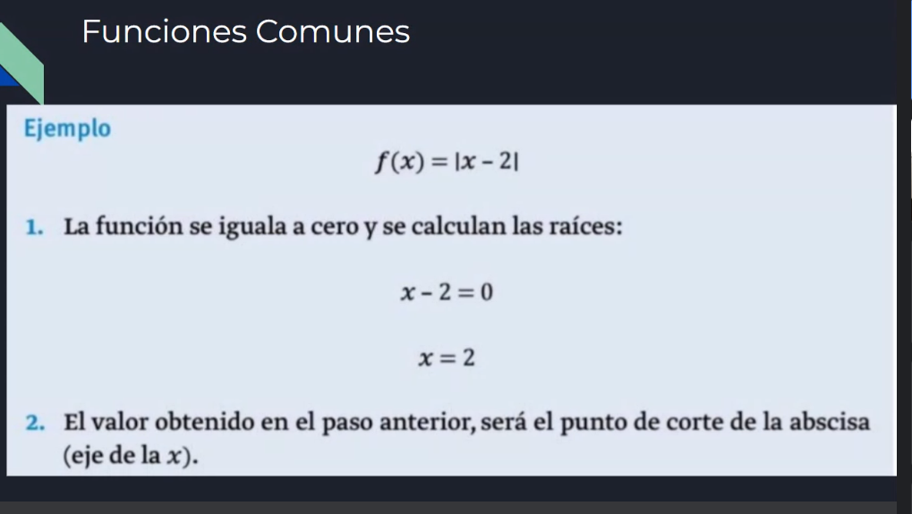

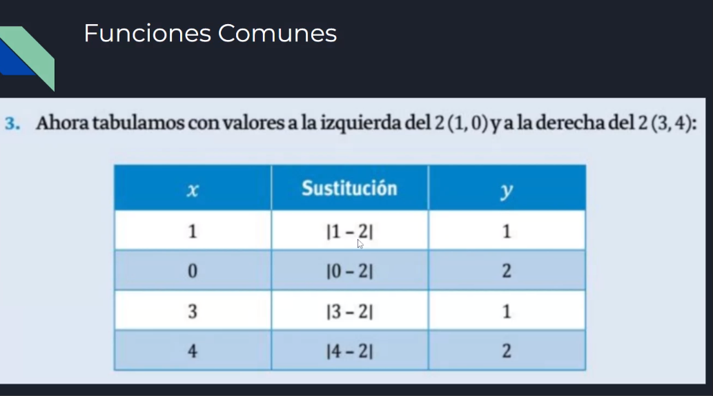

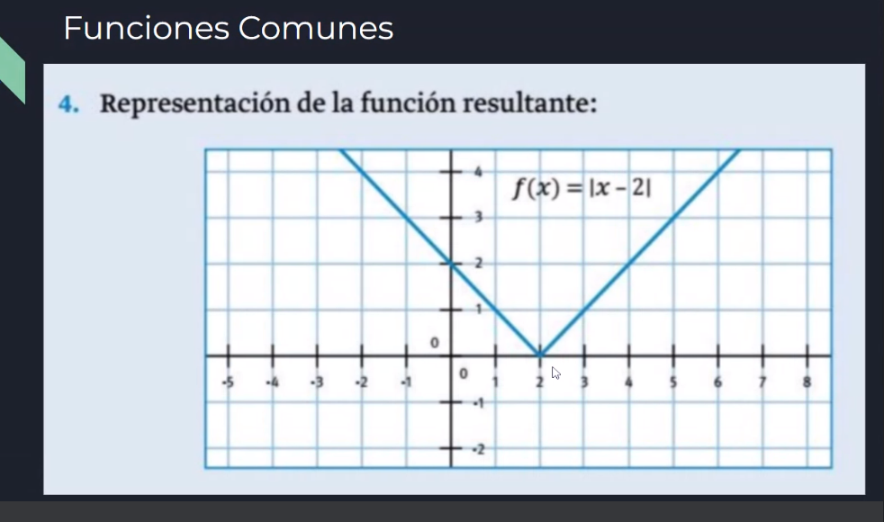

Es el resultado de todos los valores después de 2. El rango del valor absoluto son todos los reales positivos (un compañero comentó "de - infinito a + infinito").

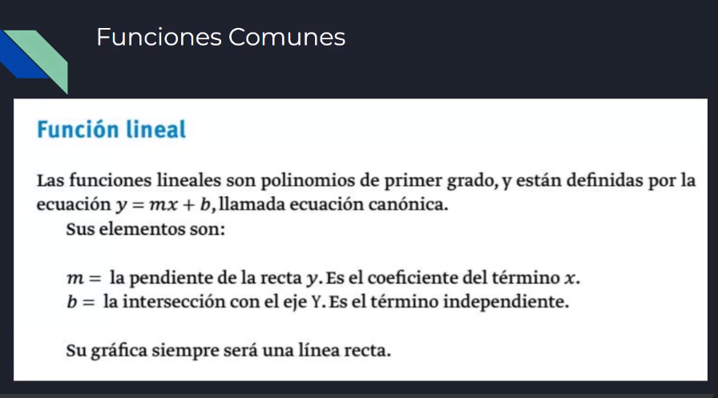

Está dentro de las funciones polinómicas. Ecuación de primer grado.
x solo puede tener exponente 1 (si tiene + no es lineal). 

- nota: función lineal = función afín

### Funciones crecientes y decrecientes

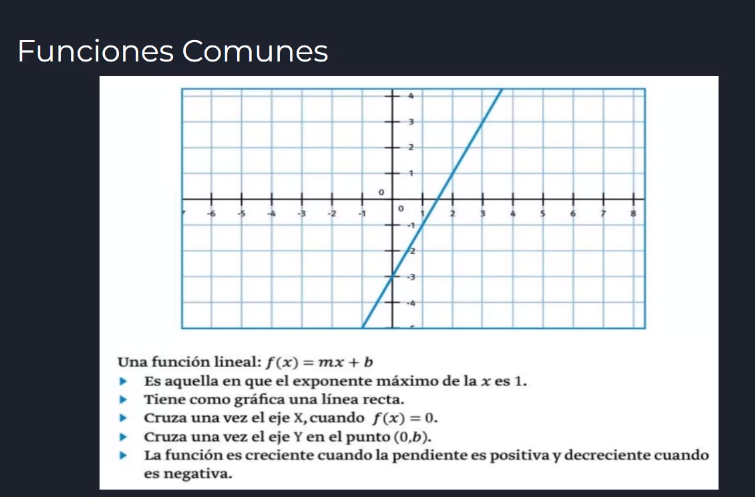

Si X crece mientras que Y también crece: la función es creciente. La pendiente (valor de m, el coeficiente que acompaña a x). Si ambos valores (x, y) van en aumento es creciente.

Si ocurre lo contrario, es decir, si X aumenta e Y decrece: es decreciente.

Si m es positivo es creciente. Si m es negativo es decreciente.

si x vale 0, el valor va a ser el de b.

- nota: Ordenada al origen = eje Y

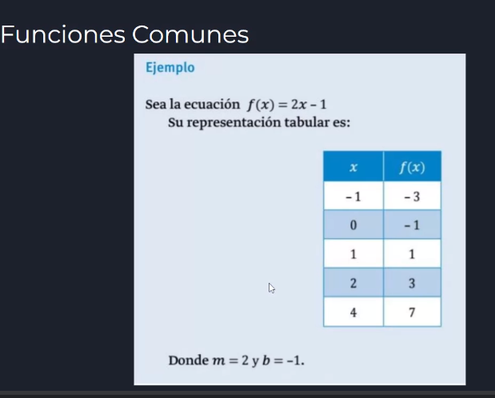

[ notas de alumnos y jamboard ]

-3 = 2.(-1) - 1

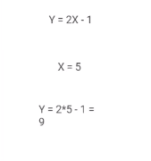

Y = 2x - 1
X = 5

Y = 2 * 5 - 1

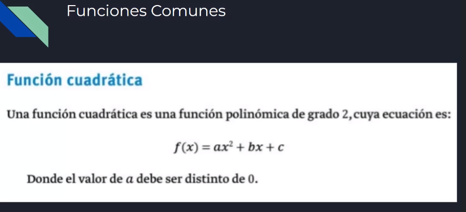

#### Función cuadrática
Función de la parábola, es de grado 2.

f ( x ) = ax ** 2 + bx + c

a no puede ser 0. si es 0 es una función lineal.

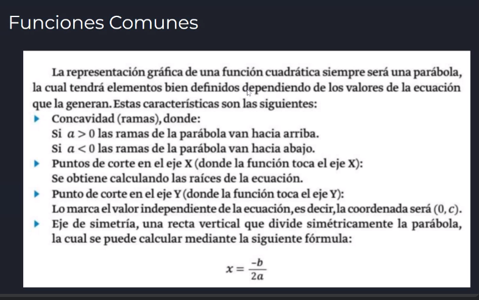

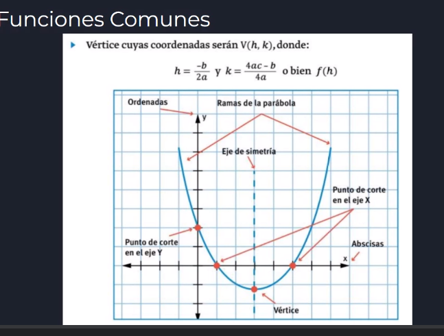

Lo notable de la parábola es corte con y, raices y vértice. Todos se obtienen con el coeficiente.

El vértice es un punto. Tiene coordenadas. En este ejemplo las coordenadas son h y k. a b c los coeficientes de la función cuadrática. Si tenemos el vértice tenemos el eje de cimetría.

El eje de simetría (porque toda parábola es simétrica) el valor de x es el siguiente: ( - b / 2 * a )

^ = simbolo de potencia (copiar y pegar)

Ejemplo en clase:
Y = 2x^2 + 3x - 2

a = 2
b = 3
c = -2

debo encontrar las raíces, el punto de corte y el vértice.

Para encontrar las raices de una parábola utilizamos la ecuación resolvente ([https://sites.google.com/site/borradorecuacioncuadratica/resolvente](https://sites.google.com/site/borradorecuacioncuadratica/resolvente)) 

-2 + - raiz de b

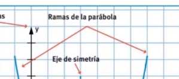

ramas de la parábola marcan si es hacia arriba o hacia abajo. 

Fórmulas de coordenadas del vértice:

h = - b / 2a

h = - 3 / (2 * 2)

h = - 3/4

k = (4 ( 2 * -2) - 3) / 4 * 2

k = -19/8