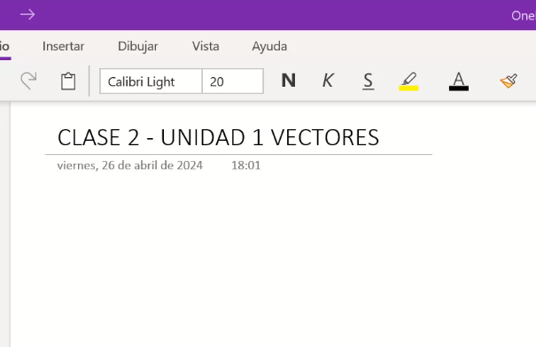
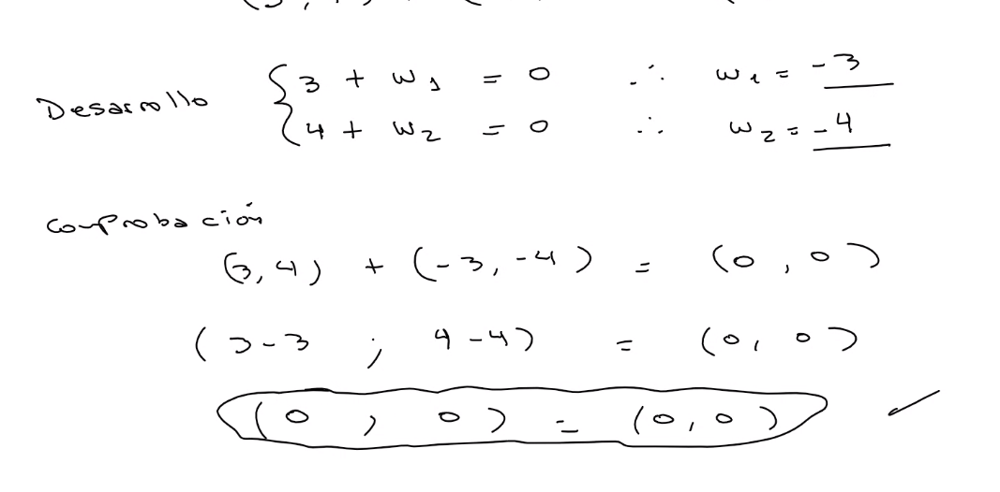
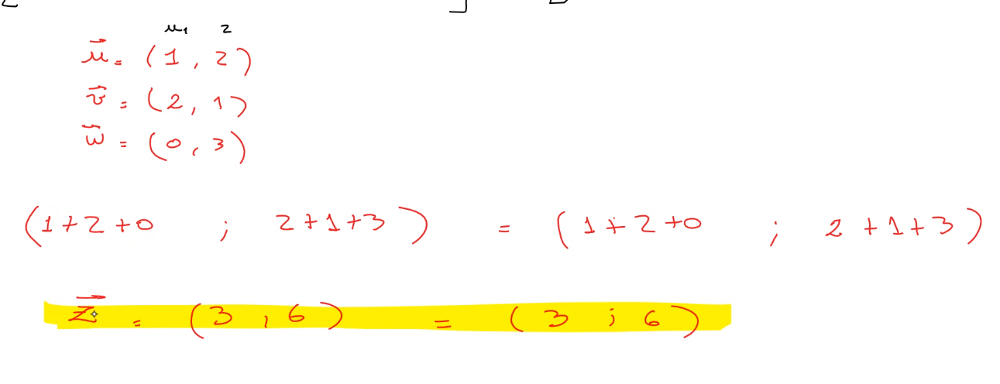

## Clase 02

Seguimos con lo que dejamos la última clase

Entra a primer parcial:

Unidad 0 hasta unidad 1. Hasta lo que vemos hoy.

Ejercicio 8 del TP0 vamos a repasarlo. No va a tomar aplicar factoreo (aunque hay que saberlo).

Propone el miércoles a la mañana juntarnos 2 horas para hacer simulacro de parcial.

---

Seguimos con Vectores. Lo hay que sacar es "operaciones de vectores".

### Suma de vectores

Ejemplo: obtenga el vector w siendo este la suma de vector u + vector v.

u = (6, 2)
v = (-4, 3)

entonces => w = u + v

w => (6, 2) + (-4, 3)
w => (6 - 4 ; 2 + 3)
w => (2; 5) 

La suma y resta de vectores nos da un vector.

---

Nos puede pedir que coprobemos la ley de las propiedades

a. Ley interna

Intersección del paralelogramo es donde tengo el vector suma (W)

b. Ley conmutativa

->u + ->v = ->v + ->u

c. Ley asociativa

(->u + ->v) + ->w =  (->u + ->w) + ->v = (->v + ->w) + ->u

el orden no altera el producto

d. Elemento neutro

->u + ->0 = ->0 + ->u
->u + ->0 = ->0 + ->u = 

e. Inverso aditivo

Se aplica el inverso para encontrar el vector nulo

Comprobación analítica, no incluye números.

Cambiando valores numéricos para comprobar:

### Diferencia de vectores

Dados dos vectores ->u + ->v  donde ->u - ->v = ->w

se obtiene sumando a ->u con el vector opuesto ->v (o sea -v)

por lo tanto ->u - ->v = ->u + (- v)

Comprueba la regla ya que u - v ≠ v - u

### Producto de un vector por un escalar (un número)

Se multiplican y se aplica distributiva

Ejemplo:

Qué pasa con módulo y norma??

Propiedad asociativa respecto del producto de escalares:

Ejemplificando que el paralelo es la extensión de la recta:

Ejemplo: hallar todos los vectores u-> pertenecientes a R2, de módulo = 5 que sea paralelo a

v-> = (2, -1)

Va resolviendo el ejemplo:

### Producto escalar entre vectores

El resultado da un escalar. Esto es MUY IMPORTANTE. Siempre que hay producto escalar entre vectores, me da como resultado un número.

Hasta ahora todos los resultados eran vectores.

Definición 1: El producto escalar de dos vectores es igual a u1 * v1 (serían los valores de x) + u2 * v2 (que serían los valores de y) + u3 * v3 (que serían los valores de z). Esto me da un Real.

El resultado ES UN NÚMERO!

Definición 2: El producto escalar de dos vectores es igual al producto de las normas de dichos vectores por el coseno del ángulo comprendido entre ellos. Ejemplo:

Nos puede llegar a pedir que calculemos el ángulo de tita

---

Próxima semana:

El miércoles hacemos un repaso. 1ro de mayo. El viernes hacemos 

Recomienda:

Hacer resumen de los videos. Aprovechar la clase extra.

