## Clase 03

Retomamos tema vectores.

El producto escalar de dos vectores es un número real que resulta de la multiplicación de las magnitudes de los vectores y el coseno del ángulo entre ellos. Matemáticamente, si tienes dos vectores a y b, su producto escalar se calcula como a · b = |a| · |b| · cos(θ), donde |a| y |b| son las magnitudes de los vectores y θ es el ángulo entre ellos.

### Propiedades del Producto escalar

1. Distributiva respecto de la suma

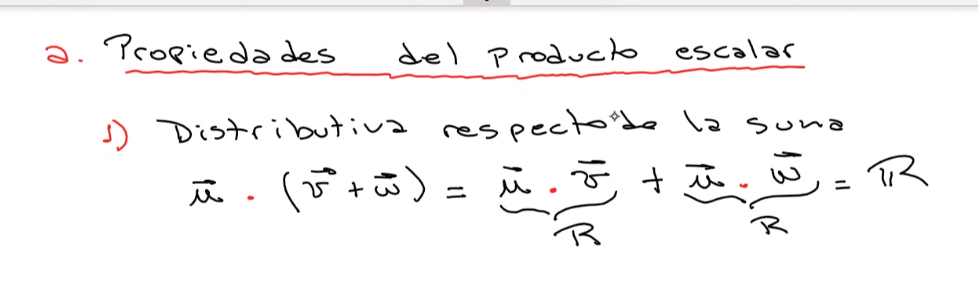

2. Conmutativa

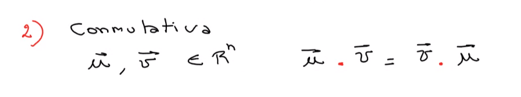

3. 

Comprobación analítica:

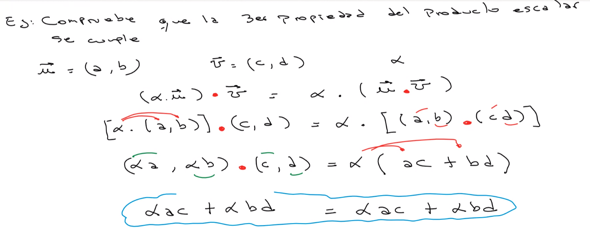

4. Vectores paralelos

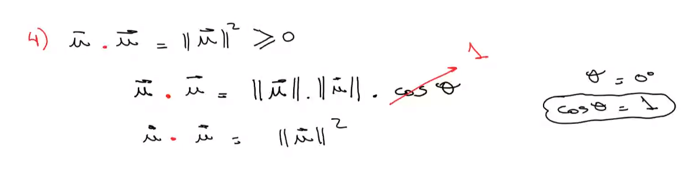

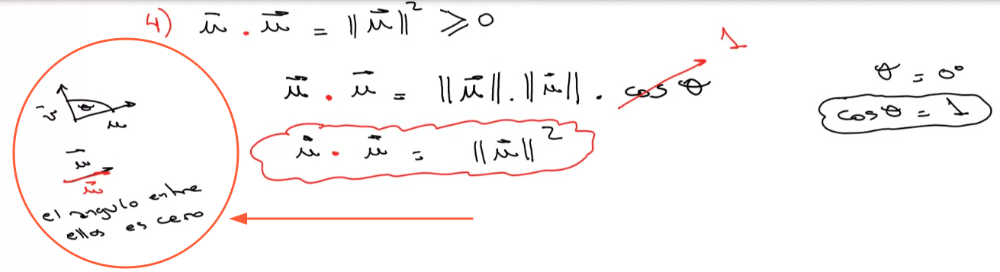

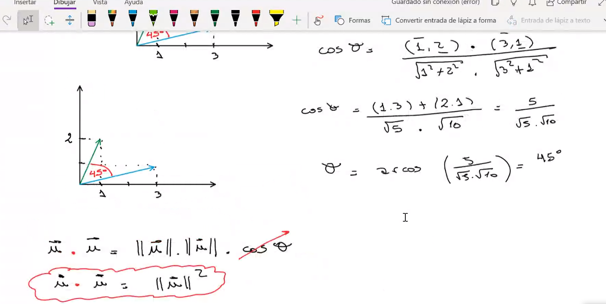

conocidos como colineales

5. Distancia entre dos puntos

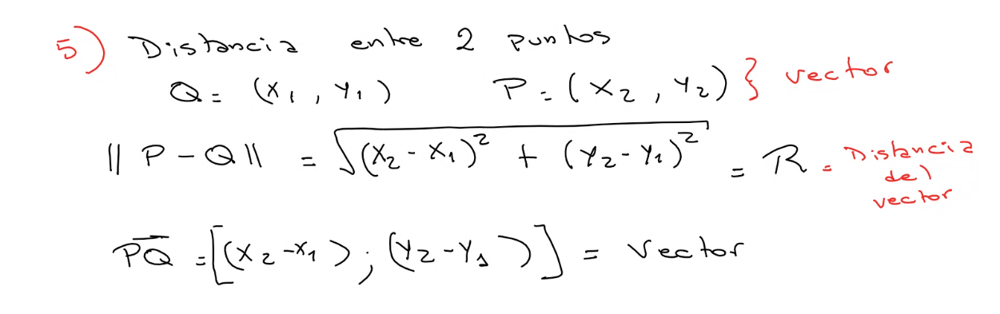

Cuánto mide el vector.

6. Condición de perpendicularidad

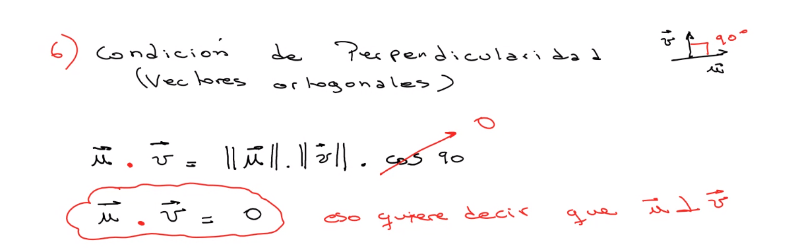

Ejemplo ejercicio 8:

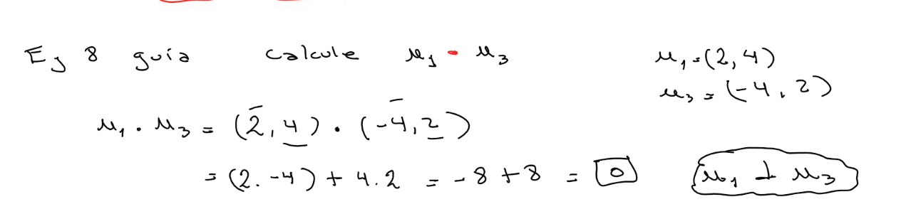

#### Versores Fundamentales

Se llaman a los versores (vectores de norma igual a 1 o vectores unitarios) 

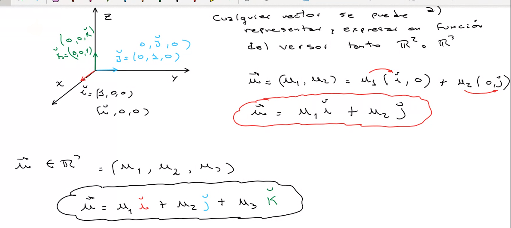

#### Producto Vectorial entre vectores

Nos da un vector.

Vector axiales o pseudovector

.... en los que al definirlos interviene la orientación fijada en el espacio, por lo que si cambia su orientación, cambia el sentido del vector.

Definición de producto vectorial:

Se llama producto vectorial de dos vectores  u y v al pseudovector w, que tiene:

1. Norma igual al producto de las normas de los vectores multiplicado por el seno del ángulo tita, siendo tita el ángulo entre u y v.

2. w perpendicular a u, y w perpendicular a v. O sea que son vectores ortogonales.

##### Propiedades del producto vectorial

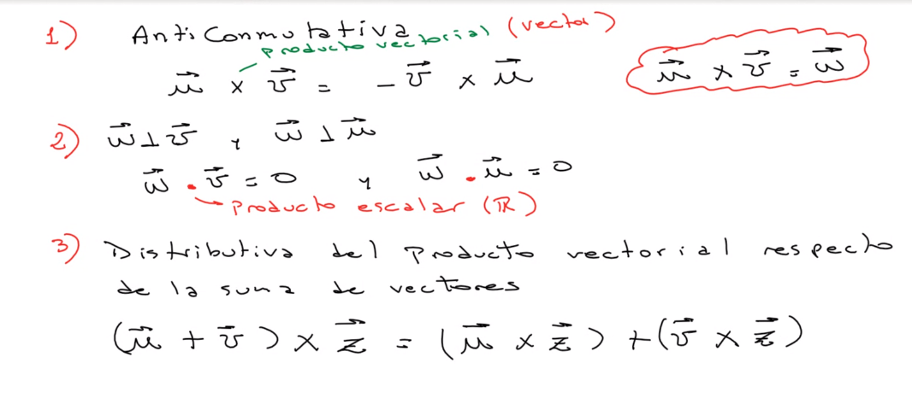

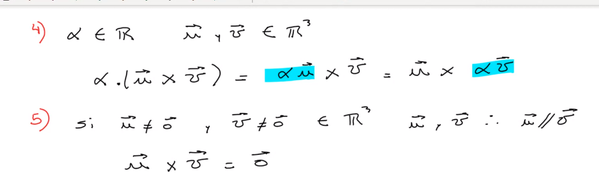

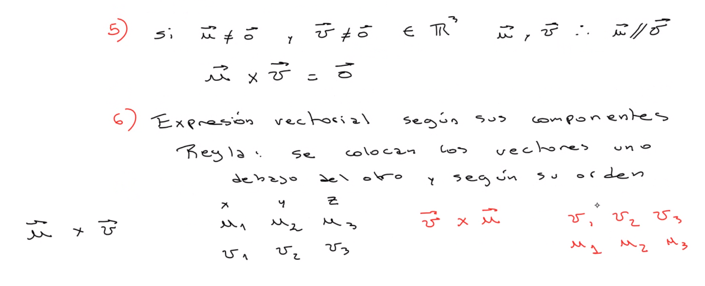

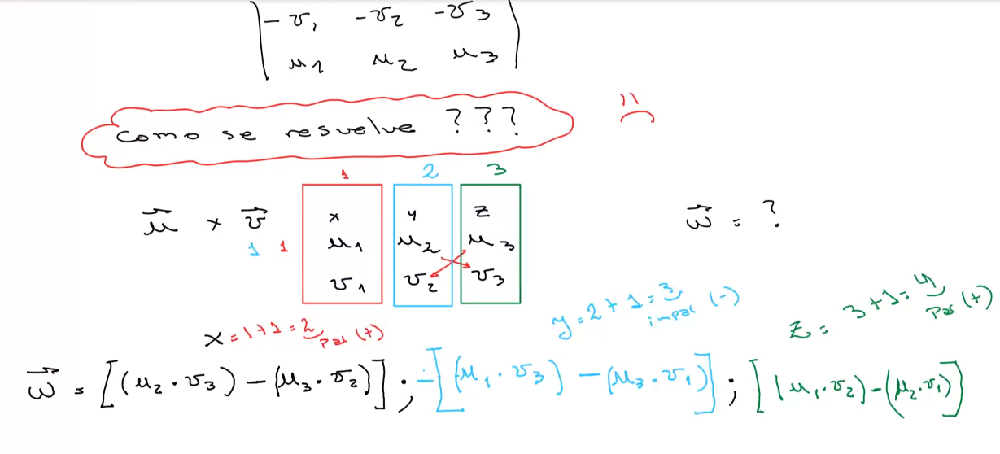

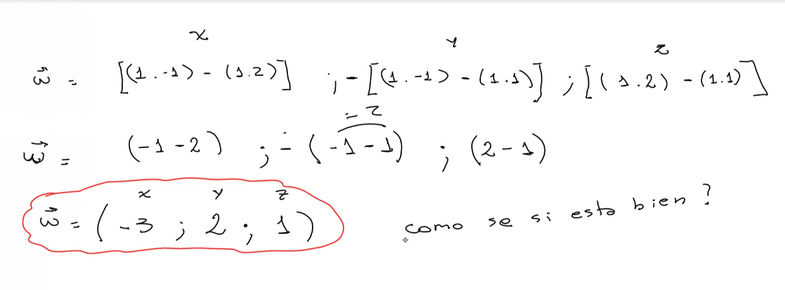

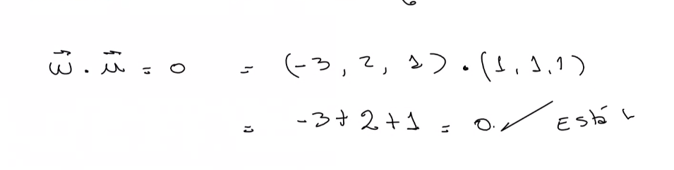

Seguimos con un ejercicio para practicar:

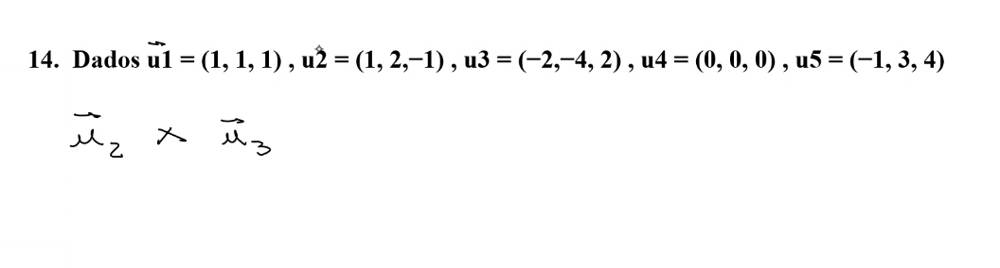

el resultado es (0, 0, 0)