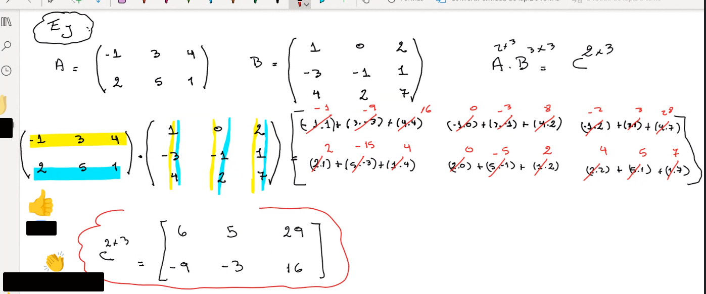

## Clase 04

Llego tarde así que tengo que ver la grabación.

Temas que muestra:

- Matrices
- Suma de matrices
    - Propiedades de la Suma de Matrices
- Producto escalar de matrices
- Diferencia de matrices
- Producto de matrices

Esto podría llegar a tomar en el examen:

comprobar la propiedad conmutativa de la suma de matrices negando el valor de B.

Cierra la clase con **producto entre matrices** (no llega a dar todas las propiedades)

> **Importante** las cantidad de columnas de A tiene que ser la misma cantidad de filas de B:

Da un ejemplo sencillo:

Otro ejemplo:

