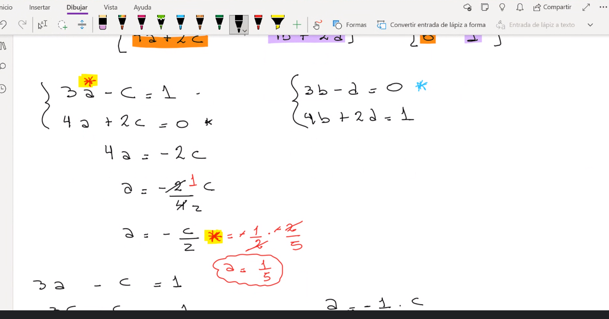

## Clase 05

Parcial 14 de Junio

### Producto entre matrices

La primera propiedad es **distributiva**. 

La cantidad de columnas de A tiene que ser igual a la cantidad de filas B y de C

**Asociativa**:
La propiedad conmutativa del producto de matrices establece que el orden de multiplicación de las matrices no afecta el resultado final. En otras palabras, si tenemos dos matrices A y B, entonces A * B es igual a B * A.

**Propiedad uniforme**:
Uniforme por la derecha / Uniforme por la izquierda

Tarea para la prox clase:

Hacer este mismo ejemplo tomando A y C con el mismo valor

... continua con propiedades:

Solo es posible que nos de 0 si una de las dos es nula:

**Traspuesta de una matriz**:

La matriz traspuesta:

Las filas pasan a ser columnas, las columnas pasan a ser filas

Otras propiedades:

#### Matrices especiales

(...) Todas las básicas que vi con profe alex +
Matriz simétrica y antisimétrica

Matriz inversa:

Resultado final de la matriz inversa de A

#### Determinantes

Ejemplo:

ver en onenote

notas en cuaderno (matriz inversa ejemplo A y B)

Pone ejemplo de ejercicio que tomó en parcial, importante sacar primero la determinante y después continuar con el ejercicio, si el valor es 0, no tiene matriz inversa.

#### Determinantes de orden 3 (una matriz de 3x3)

(solo suele tomar matrices de 2 o 3)

Muestra ejemplo de det(A) según definición de Laplace

Pone como ejemplo para entender el tema de signos:

Hacemos un último ejemplo antes de terminar la clase:

det(A) = -8 (sí o sí nos tiene que dar este valor con las otras filas)

