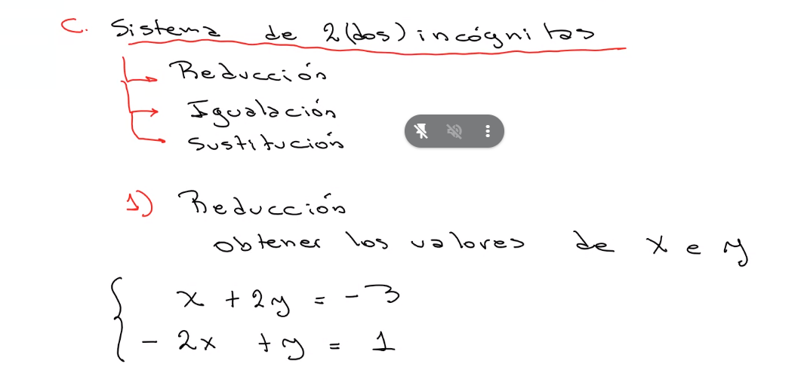
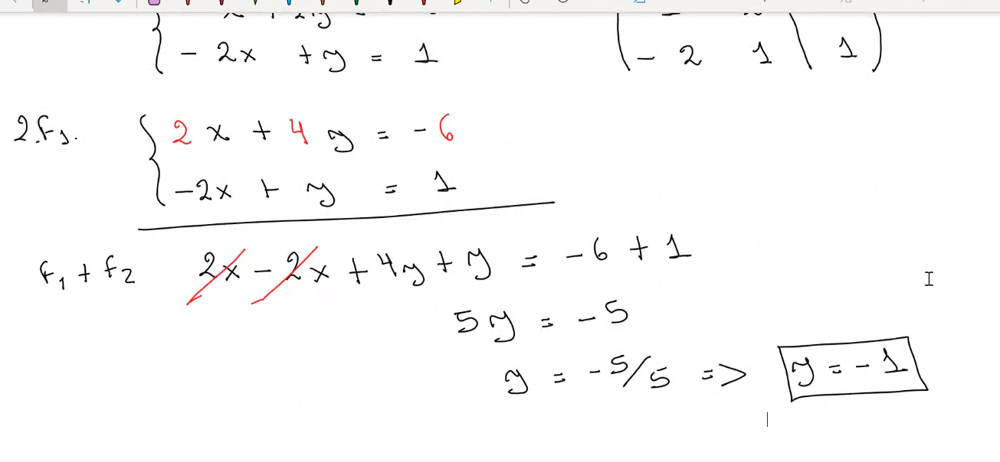
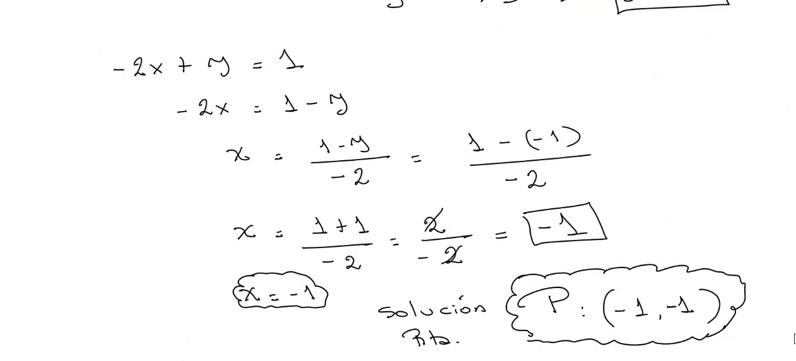
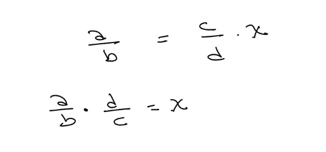

## Clase 06

Llego tarde por evento del laburo :/ tengo que revisar la primera parte de la clase.

Cuando empiezo están viendo sistema de ecuaciones.

Resultado:

Para comprobar reemplazamos una de las ecuaciones.

Muestra otro método para resolver sistema de ecuaciones.

En el medio sale una ecuación donde hay una división de fracciones, nos muestra el método de pasar la fracción al otro término con numerador y denominador invertidos:

Comenta que la próxima clase va a dar dos últimos métodos. Y la siguiente hacemos ejercicios a full para el parcial.