## Clase 07

(continua..)

La intersección entre las dos rectas:

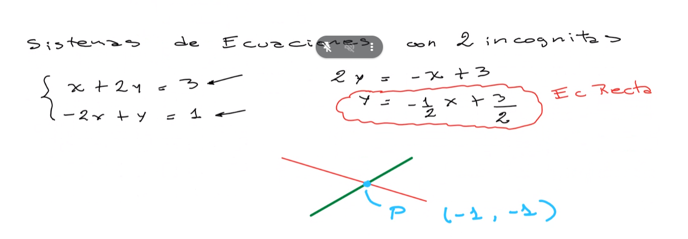

(sistema de ecuaciones con dos incógnitas)

---

Sistema de 2 incógnitas y 3 ecuaciones:

Método de Gauss

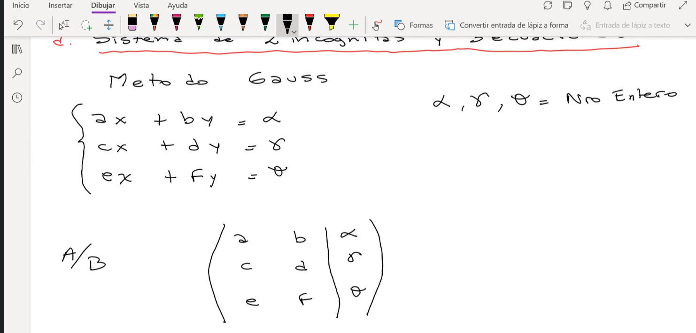

Llevamos la matriz a una Triangular superior. Para a eso tenemos que hacer que c, e y f sean 0:

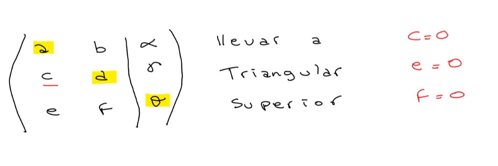

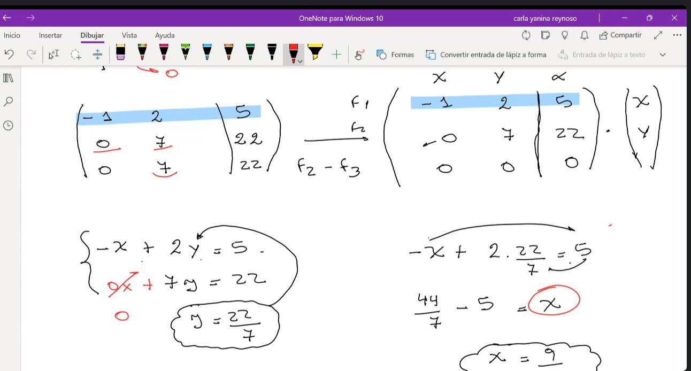

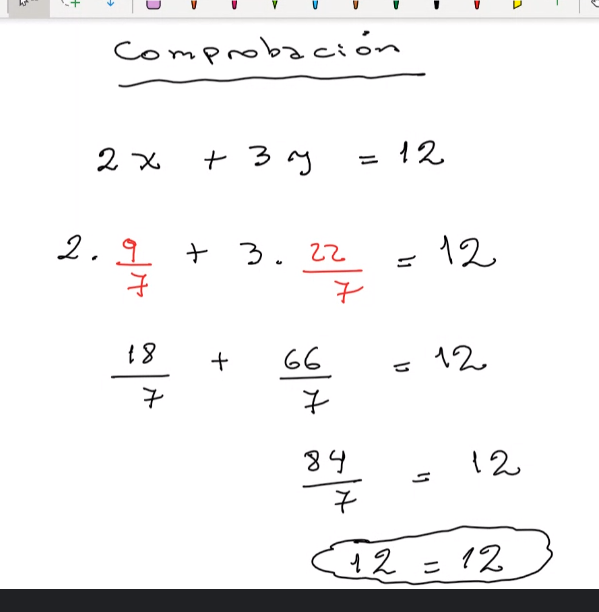

Ejemplo de ejercicio de parcial:

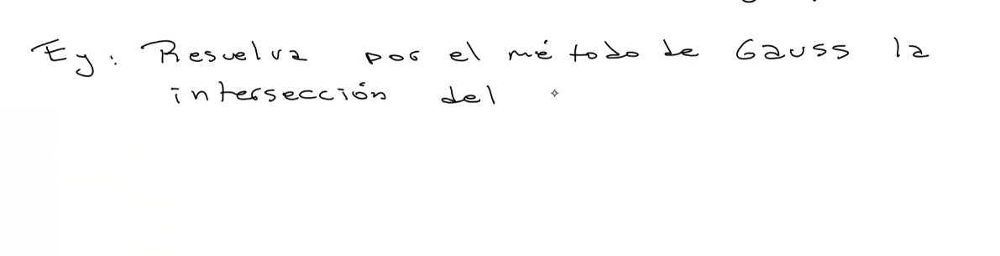

### Regla de Cramer

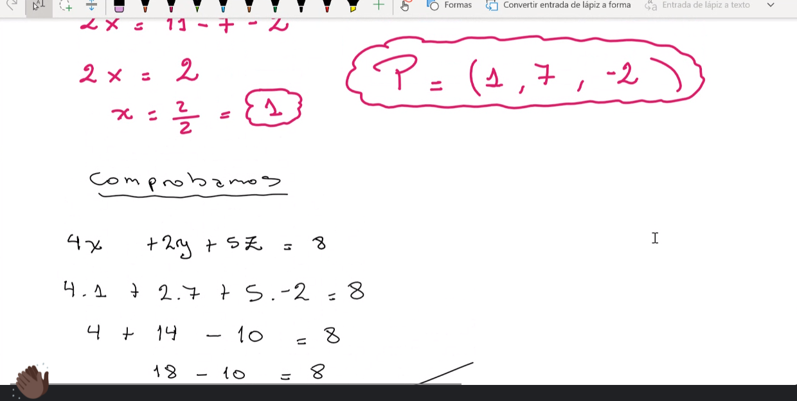

Se verifica que la incógnita se calcula dividiendo el determinante de la matriz con el determinante que resulta de sustituir la columna de los valores escalares correspondiente al lugar que ocupa la incógnita.

Retomamos el mismo ejemplo que vimos con Gauss y lo hacemos con Cramer:

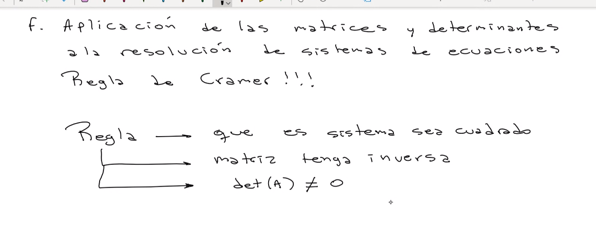

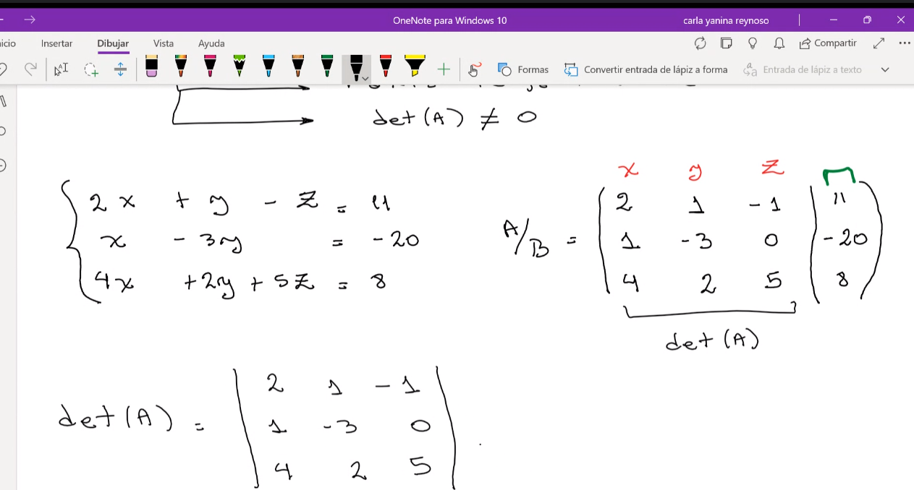

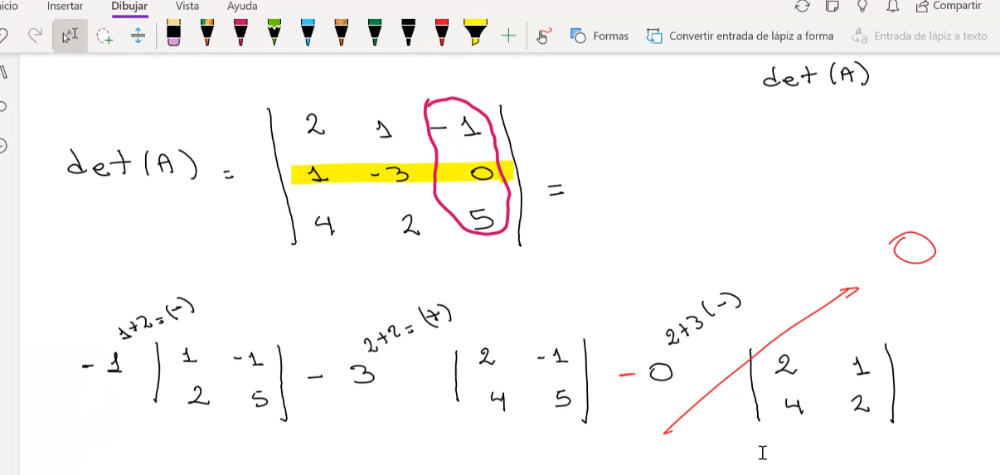

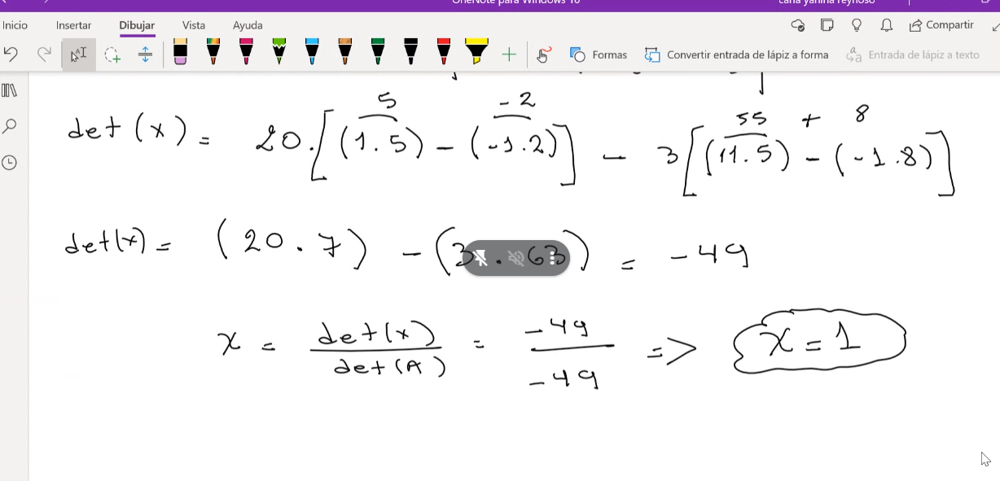

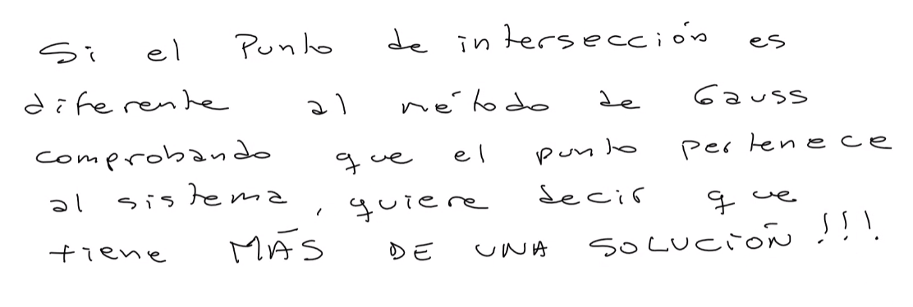