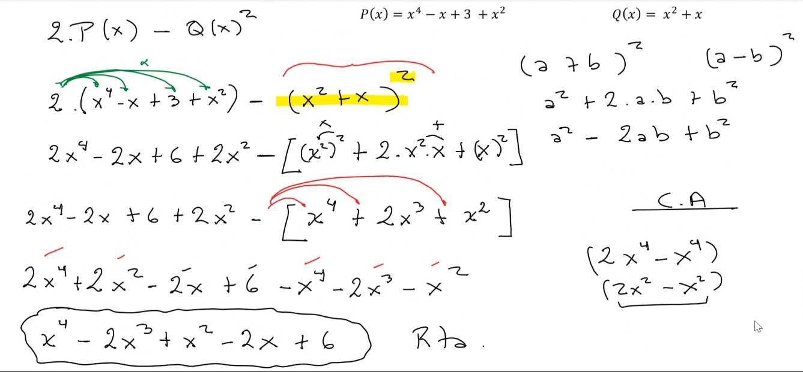

## Clase 09

Repaso recuperatorio:

Primero resolvemos los 2 primeros ejercicios del parcial.

Hacemos uno de división de polinomios. Vemos un ejercicio, pero no va a tomar.

Luego nos da otro ejemplo que sí puede llegar a tomar:

Pasamos a un ejercicio de vectores:

- Ejercicio 6 c de la guía

repasar binomio cuadrado perfecto

- Ejercicio 8 de la guía de matrices

Producto de matrices va a haber seguro en el parcial y en el final.

Traspuestas: la fila pasa a ser columna, y la columna pasa a ser fila

Matriz simétrica: todos los valores fuera de la diagonal se repiten. Por ejemplo:

Matriz antisimétrica: todos los valores fuera de la diagonal se repiten con signo cambiado. Por ejemplo:

Venmos otro ejercicio para obtener la matriz inversa.

Primero revisamos que la determinante de la matriz sea DISTINTA a 0.

Hallamos la determinante primero. Si es 0, no tiene matriz inversa.