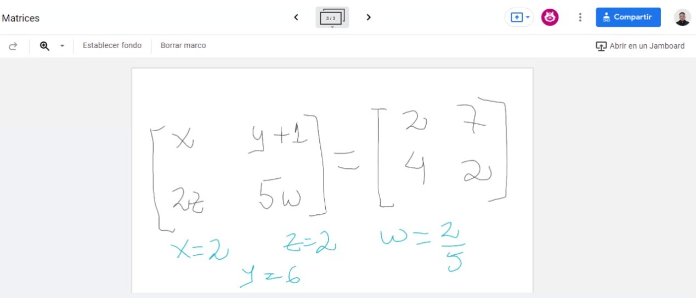

### Segunda parte materia
Post primer parcial:

Temas para anotar y luego buscar:

- Sistema de ecuaciones lineales 

- Sistema sobredeterminado

Cuando los resultados dan ` 0 = 0 ` o  `-4 = -4 `

Rectas coincidentes. Dónde se están encontrando? En todas partes porque son infinitas. Coinciden en todos sus puntos.

---

La igualdad no se cumple, porque es un sistema incompatible. Un sistema incosistente.

#### Matrices

(sistema de 3 por 3 - se vio el ejemplo antes en clase)

Álgebra matricial

m: cantidad de ecuaciones

n: cantidad de variables

'filas' también se refieren a ellas como 'renglones'

Son equidimencionales

ejemplo de matrices

Matriz nula

Cuadrada y rectangular

ambas son matrices diagonales

Todo lo que está por debajo de la diagonal principal son 0

Dentro de las matrices diagonales tenemos las matrices identidad.

ejemplos matriz compuesta

