### Repaso completo
Todos los temas del parcial, recopilados por un compañero (Dami)

- [Conjuntos](https://www.youtube.com/watch?v=YZRRUFG2UOY) 
- [Función Lineal](https://www.youtube.com/watch?v=09kcKGsSEbw)
- [Función Cuadrática](https://www.youtube.com/watch?v=9Qu4fodFQG4)
- [Función Polinomica](https://www.youtube.com/watch?v=co7E4VAHQR8)
- [Función Exponencial](https://www.youtube.com/watch?v=gea1Wz-yMC0)
- [Función Racional](https://www.youtube.com/watch?v=4PWf27vLNQs)
- [Funciones Trigonométricas](https://www.youtube.com/watch?v=4tpi87_Y_y0)
- [Función Inversa](https://www.youtube.com/watch?v=lfM_PBfIkvk)

Vectores:

- [Suma Vectores en R2 y Gráfico](https://www.youtube.com/watch?v=xURTgxvG-3c)
- [Suma Vectores en R3 Y Gráfico](https://www.youtube.com/watch?v=sqkni90xet0)
- [Resta Vectores en R2 Y Gráfico](https://www.youtube.com/watch?v=vL8GIHsantM)
- [Producto Escalar](https://www.youtube.com/watch?v=5Yj9EVLJXBM)
- [Producto Cruz de dos vectores](https://www.youtube.com/watch?v=fmAhi1N-uL8&t=361s)

---
#### Teoría de conjuntos:

[Simbolos a mano p/ copiar y pegar](https://www.disfrutalasmatematicas.com/conjuntos/simbolos.html)

intersección: ∩
unión: ∪

[Ejercicios primer video](https://www.youtube.com/watch?v=YZRRUFG2UOY)

Dado:

A = {1,2,3,4,5,6}

B = {2,4,6,8,10}

C = {5,6,7,8,9}

Encontrar

(A ∩ B) ∪ C 

[se lee A intersección B, unido con C]

(A ∩ B) = {2,4,6}

(A ∩ B) ∪ C = {2,4,5,6,7,8,9}

Encontrar

(A ∩ C) ∩ (B ∪ C)

[se lee A intersección C, intersectado con B unión C]

(A ∩ C) = {5,6}

(B ∪ C) = {2,4,5,6,7,8,9,10}

(A ∩ C) ∩ (B ∪ C)  = {5,6}

2) Teoría de conjuntos / Operaciones combinadas:

[Ejercicios segundo video](https://www.youtube.com/watch?v=nOQ0Y0lfzwM)

Dado:

U = {a,b,c,d,e,f,g}

A = {a,b,c,d}

B = {a,c,e,g}

C = {b,e,f,g}

Aclaración: uso el símbolo ( ' ) para decir **complemento**, es decir los valores que le faltan a ese conjunto para completar el conjunto universal **(U)**. [En este link](https://www.disfrutalasmatematicas.com/conjuntos/venn-diagramas.html) lo llaman, "todo lo que **no** es" .

Encontrar

**Ejemplo 1:**

(B' ∪ C)'

B' = {b,d,f}

B' ∪ C = {b,d,e,f,g}

(B' ∪ C)' = {a,c}

**Ejemplo 2:**

(A ∪ B) ∩ (C' - A')

A' = {e,f,g}

C' = {a,c,d}

A ∪ B = {a,b,c,d,e,g}

C' - A' = {a,c,d}

(A ∪ B) ∩ (C' - A') = {a,c,d}

---

#### Función Lineal:
[Clase Mat CBC - Funciones](https://www.youtube.com/watch?v=09kcKGsSEbw)

`f(x) = m x + b`

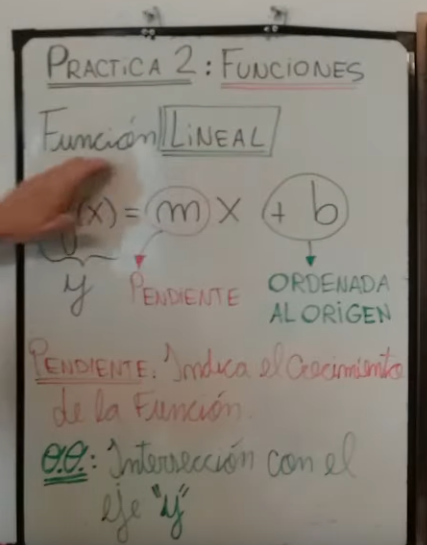

- Definición de función
- Definición de variable dependiente (y) e independiente (x)
- Pendiente (m)
- Ordenada al origen (b)

Pendiente me marca si la función es creciente, decreciente o constante (0)

m > 0 ---> Creciente
m < 0 ---> Decreciente
m = 0 ---> Constante

Graficar en el plano cartesiano una función lineal:

ejemplo con

`f(x) = 3/2 x - 1`

**Paso 1:** marco la ordenada al origen
**Paso 2:** me muevo con la  pendiente

La ordenada al origen me indica que la función va a cortar al eje Y en -1

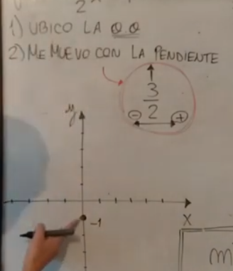

Con el método de este profe lo piensa así: me muevo 3 lugares hacia arriba y 2 hacia la derecha (porque la fracción es positiva, si fuera negativa, me muevo hacia la izquierda). El numerador me indica siempre ir hacia arriba y el denominador hacia los costados de acuerdo al signo de la pendiente.

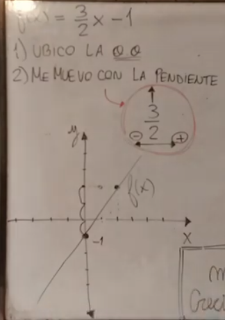

Explica los conceptos de Dominio, Imagen y Raices que aplica a todas las funciones:

- **Dominio:** Todos los valores que puede tomar X
En f(x) el dominio es R (todos los Números Reales)
- **Imagen:** Todos los valores de Y que tienen asociada a la función
- **Raíces:** (también llamado conjunto de 0) Intersección entre f(x) y el eje X

Cómo obtener la raíz de forma analítica? 
Llevando la función a 0 --> `f(x) = 0`

```
3/2 x - 1 = 0 
3/2 x = 1
x = 1 : 3/2

# dividir una fracción es lo mismo
# que multiplicar por su inverso
# entonces:

x = 1 . 2/3 

x = 2/3 (x es igual a 2 tercios)
```

En este caso "encontré el conjunto de ceros":
C 0 = { 2/3 }

##### Paralelismo
Dos f(x) lineales son  paralelas (no hay intersección) cuando tienen la misma pendiente.

##### Perpendicularidad
Dos f(x) lineales son perpendiculares (se cortan formando un ángulo de 90°) cuando sus pendientes son **opuestas** e **inversas**.

ejemplo:

` f(x) = - 2x + 1 `
` g(x) = 1/2x - 5 `

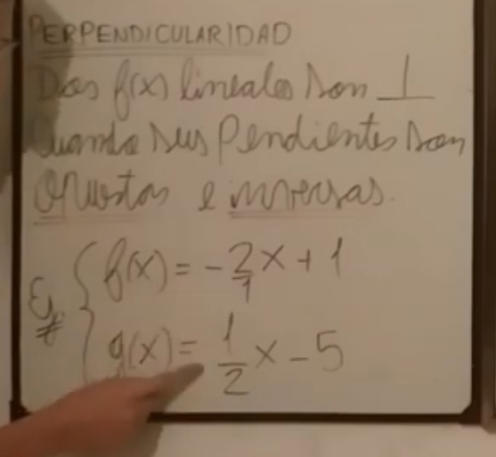

Ejercicio de práctica: hallar una función lineal a partir de 2 puntos

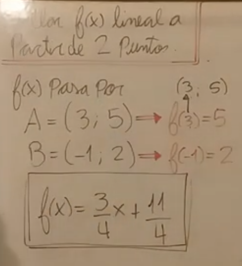

Pasos para encontrar la función:

1) Encontrar la pendiente
2) Encontrar la ordenada al origen

La pendiente es: y2 - y1 sobre x2 - x1

Para b (ordenada al origen): Reemplazar los puntos de la función X, Y


(...)

#### Función cuadrática
X tiene exponente 2.

Dominio: pertenecen al conjunto de los números R

a > 0 : parábola de concavidad positiva
a < 0 : parábola de concavidad negativa

Se puede expresar de 3 formas:

1) Polinómica

- Nos viene dada la ordenada al origen (buscamos raices)

f(x) = a x² + b x + c 

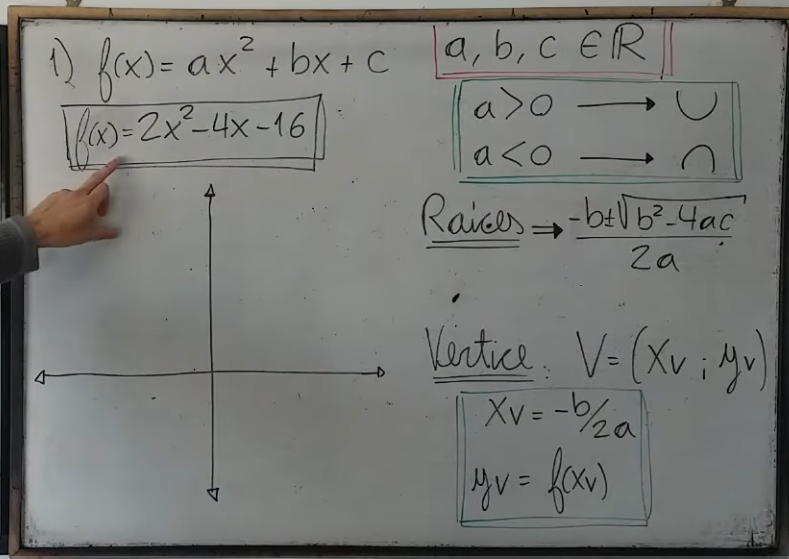

2) Canónica

- Nos vienen dado el vértice (buscamos )

f(x) = a ( x - xv )² + yv 

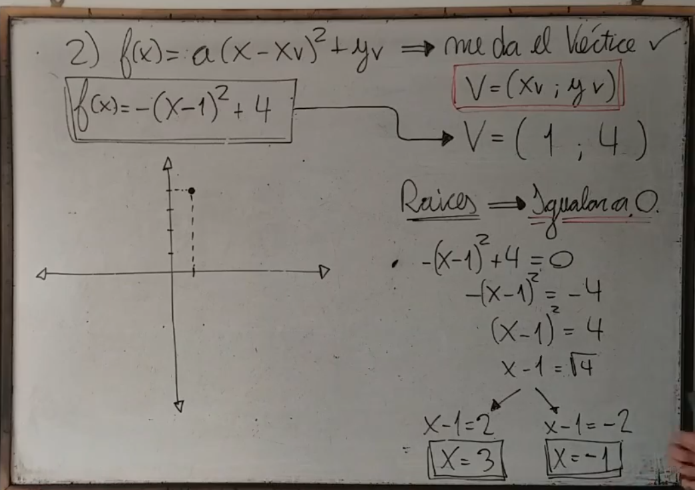

3) Factorizada

- Nos vienen dadas las raices

f(x) = a (x - x0) . (x - x1)

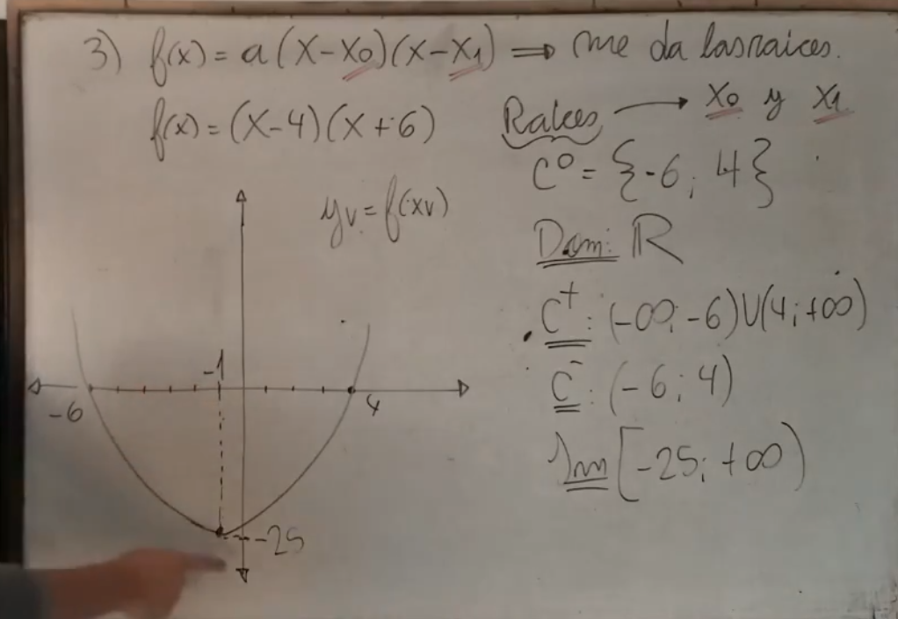


---


#### Vectores
[Suma Vectores en R2 y Gráfico](https://www.youtube.com/watch?v=xURTgxvG-3c)

Graficando vectores en GG

Consigna: hallar ` r→ + s→ ` 

r→ = (3,2)
s→ = (-2,5)

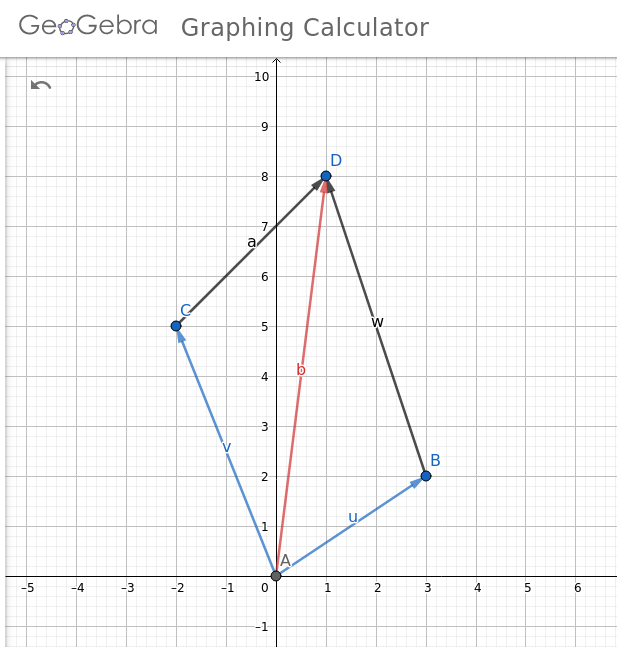

[Resta Vectores en R2 Y Gráfico](https://www.youtube.com/watch?v=vL8GIHsantM)

Consigna: hallar ` r→ - s→ ` 

r→ = (3,2)
s→ = (-2,5)

`r→ - S→ = (3,2) - (-2,5) `

// Lo que hacemos es restar por cada componente:

` 3 - (-2) = 5 `
` 2 - 5 = -3 `

Entonces:

` r→ - S→ = (3,2) - (-2,5) = (5,-3) `

El opuesto sería:

` -S→ = (2,-5) `

Restar vectores es igual a sumar el opuesto del segundo

Vector diferencia en rojo:

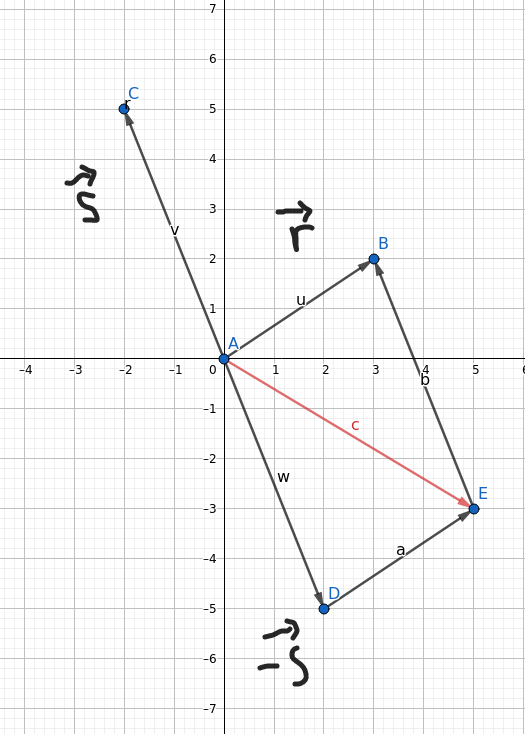

vector rojo:
` r→ - s→ `

Ejemplo en video haciendo traslado de vectores, da el mismo resultado:

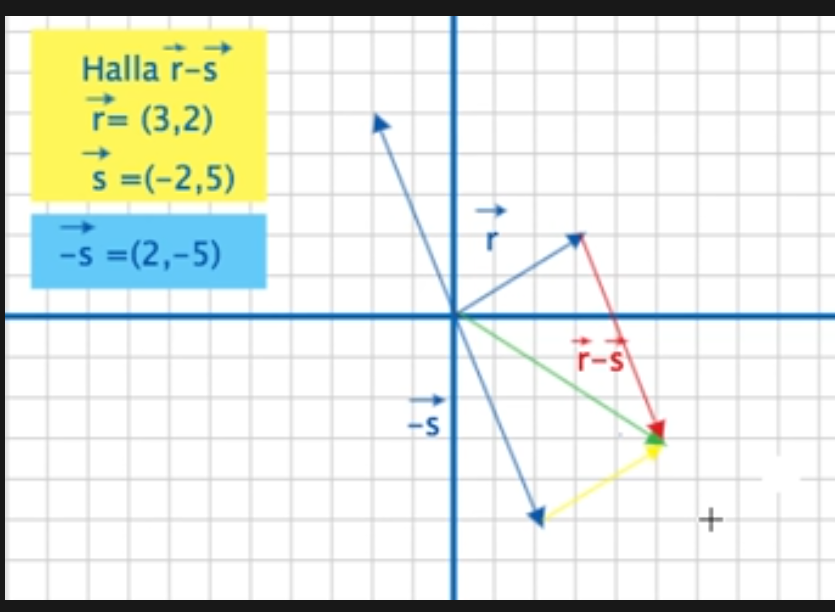

#### Suma de vectores en R3
Analíticamente se suman sus componentes, en el gráfico se ubican een las rectas los puntos del vector, para obtener la suma hacemos la regla del paralelogramo.

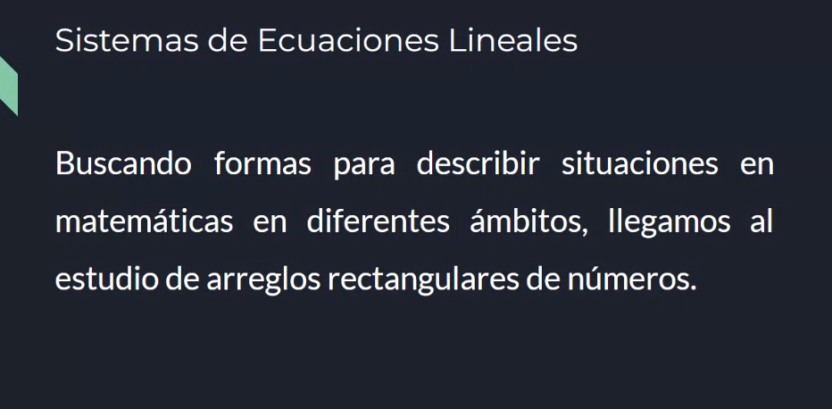


#### notas post parcial

[De esta forma se resolvía el punto 9](https://www.youtube.com/watch?v=FgCp7Y1Kkdo) --> data de Dami en grupo wpp

Cuarto vértice de un paralelogramo en r3 | Área de un paralelogramo 