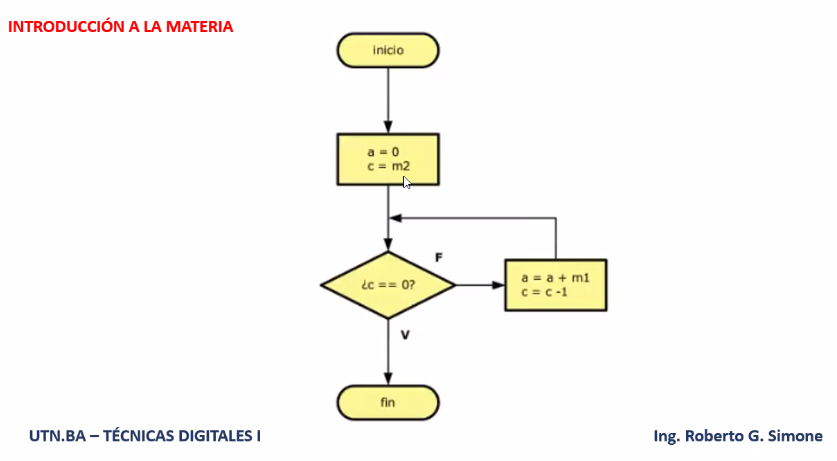
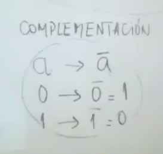

# Lógica clase 2
Repasamos calendario de clases presenciales y virtuales.

Repaso clase 01:

Dos bloques de la materia:

- Lógica
- Aritmética

## Álgebra de conmutación
Leyes del pensamiento de George Boole. Contribuye a desarrollar teoría lógica. Shannon utiliza en álgebra booleana llevándola al área de conmutación y circuitos digitales.

### Álgebra de Boole
Es una estructura algebráica que consta de:

- Un conjunto de dos elementos
	B = { 0, 1 }
- Dos operaciones binarias y cerradas en B
	 - Suma lógica ( + ) 
	 - Producto lógico ( * )

Complementación:

a -> a negado

## Postulados de Huntington
Propiedades 

(...)

Ejercicio en clase:

0 + 1 = 1 ----> 1 . 0 = 0
1 + 1 = 1 ----> 0 . 0 = 0
0 . 0 = 0 ----> 1 + 1 = 1