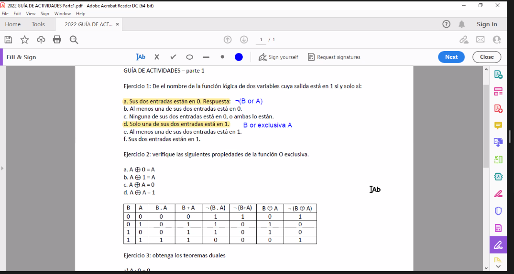
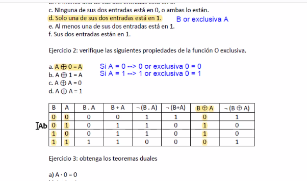
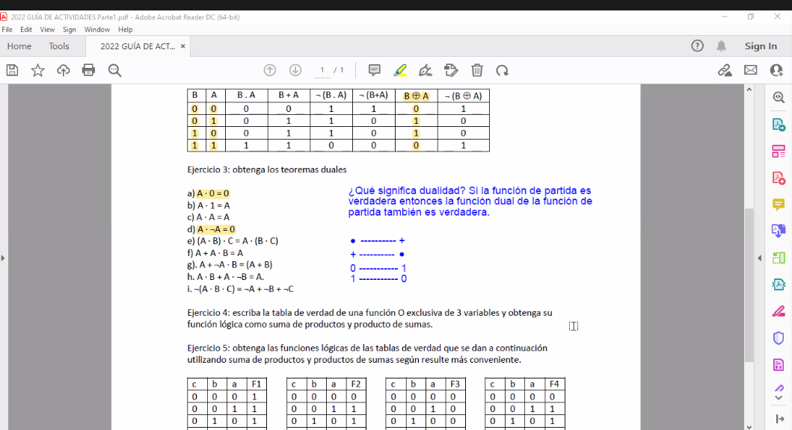
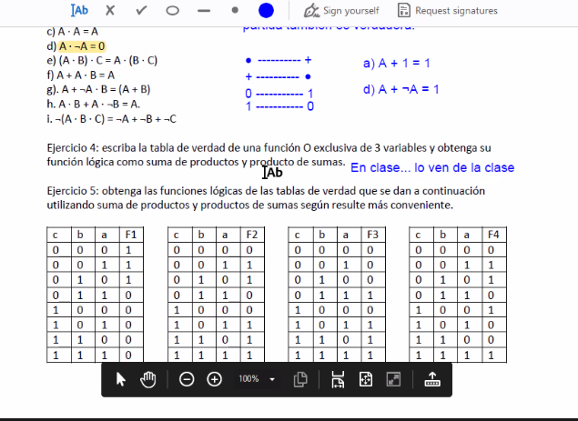
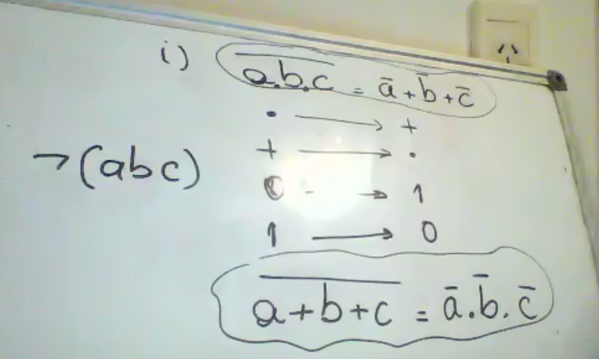
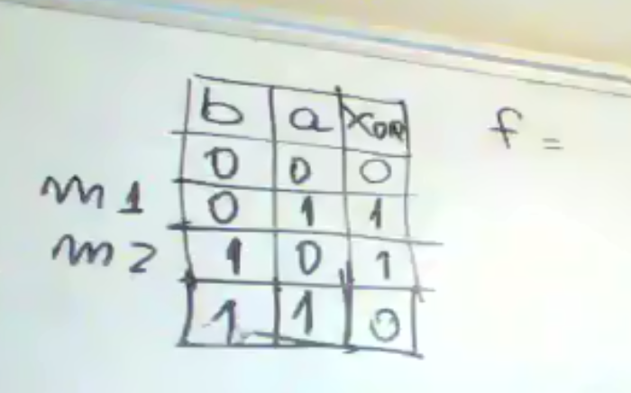
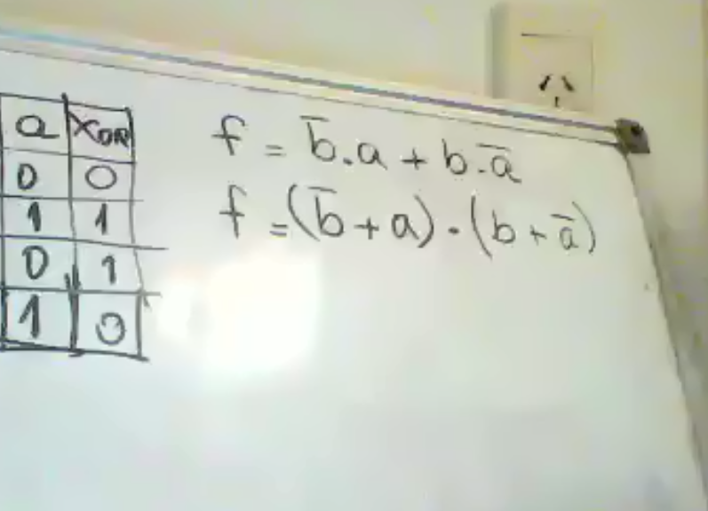
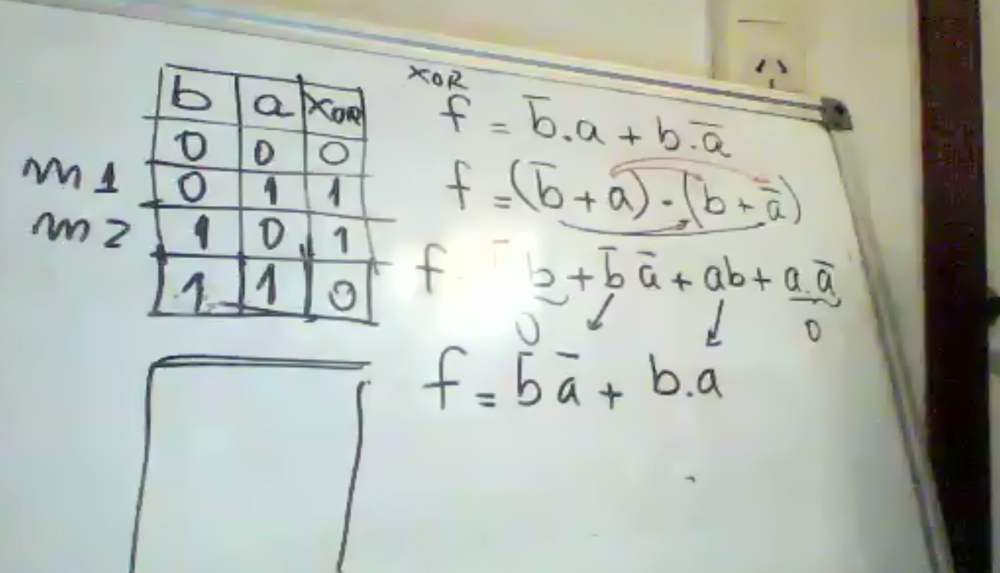
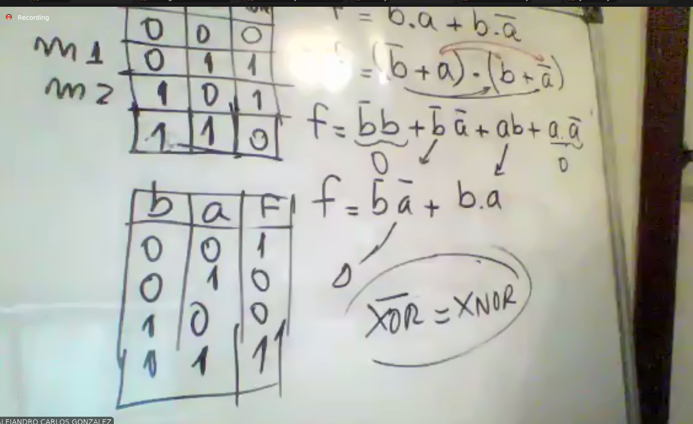
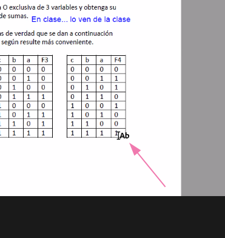

## clase via zoom
Repaso de tabla de verdad y nueva guía de ejercicios

XOR = o exclusivo = or exclussive = ⊕

miniterminos

función dual de una función

La dual de la or exclusiva es la or exclusiva negada 

¬XOR = XNOR

Cuando son pares es 0

(...)
