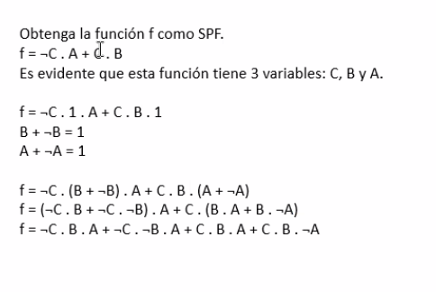
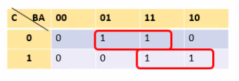

### Repaso temas anteriores

Obteniendo el valor de la función  a partir de sus términos

función dual - off topic
si la función de origen es cierta, lo mismo va a ocurrir con la dualidad

Son duales, una función convertida a otra que también es válida.

#### Mapa de Karnaugh

Primero dibujo el mapa y luego vuelco estos valores de la tabla en el mapa:

[Ver más mapas de K](https://www.youtube.com/watch?v=TFiY6DqjBwQ)

Coordenadas en el mapa k

En la columna ponemos los valores de C ( 0 | 1)
En las columnas de BA, 4 valores:

Agrupo de a 1, 2 o 4

Con el mapa de K podemos agrupar con 0 si trabajo con maxTer y 1 si trabajo con minTer.

Agrupamos los 1

¬C . ¬B . A + ¬C . B . A
¬C . A (¬B + B)
¬C . A
Sacamos factor común de ¬C y A, y simplificamos la función

segundo término (marcados con rojo)

C . B

la función completa va a ser:

f = ¬C . A + C . B

Tarea para repasar (sin deadline)

