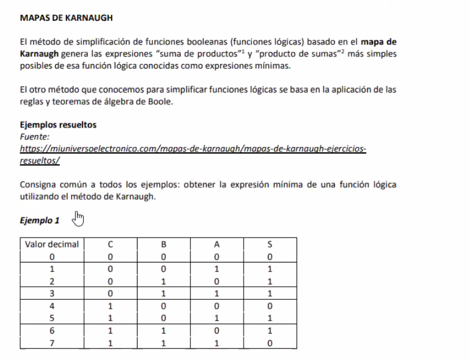
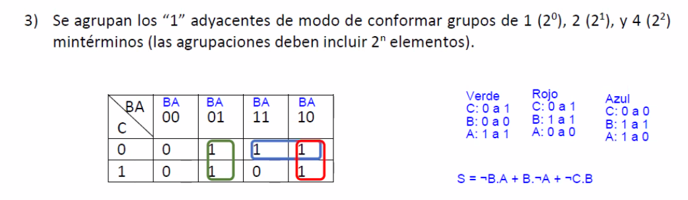
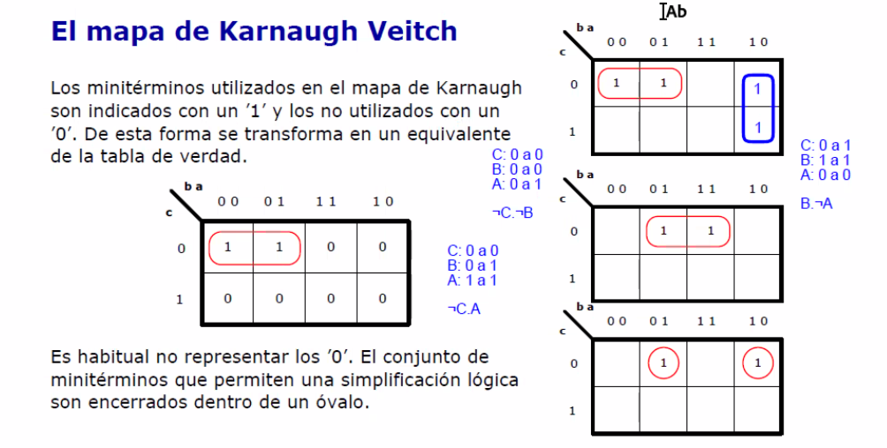

### Clase 09
Repaso de temas que entran en parcial

Tabla de verdad de una función


Repasamos OR & XOR 


Repasamos:

- Mapa de Karnaugh
- Agrupación por 1
- Simplificación

Vemos un documento que luego adjuntará el profe:







Hago un ejemplo de agrupación:

| c\ba | 00 | 01 | 11 | 10 |  
|------|----|----|----|----| 
| **0**    | 1  | 1  | 0  | 0  |
| **1**    | 0  | 0  | 0  | 0  | 

```
c: 0 a 0
b: 0 a 0
a: 0 a 1   # a cambia, por eso se elimina

# la función queda como:

¬c . ¬b

```

