### Clase 11
Código complemento a2 (cca2)

Para 4 bits:

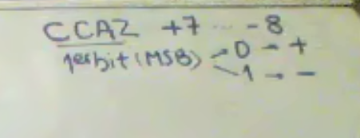

primer bit -> Bit más significativo

Hacemos tabla de 16 combinaciones con números signados.
El primer bit marca si es positivo (0) o negativo (1)

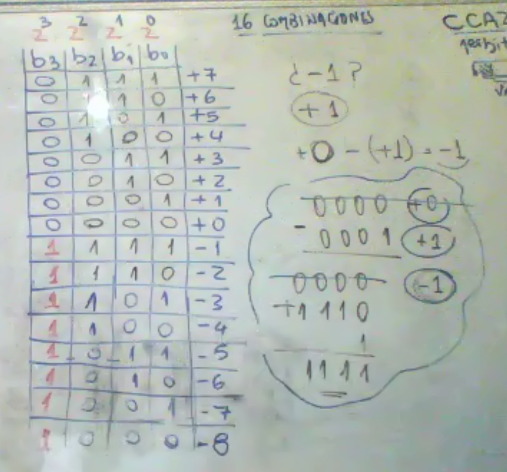

Cada una de estas combinaciones corresponden al código de complemento a2

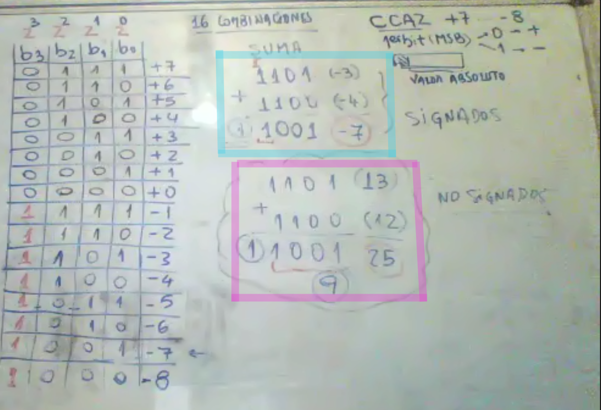

Celeste: resta de números signados
Rosa: suma de números no-signados (13+12=25, pero da error por el carry)

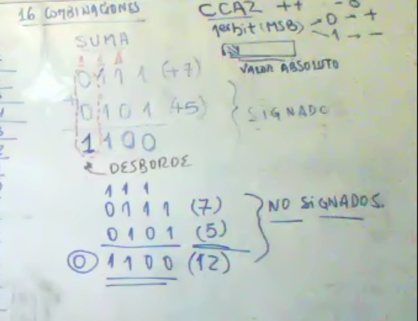

Ejemplo signado (overflow) y no signado (ok)

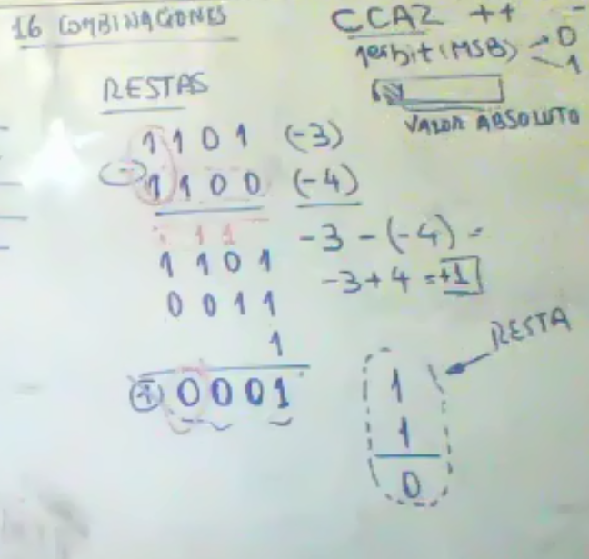

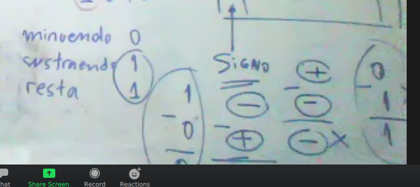

Si el minuendo y el sustraendo son de distintos signos y el resultado es de signo distinto al sustraendo, hay un error en la resta

---
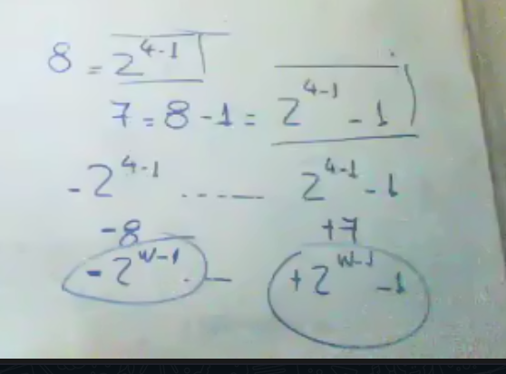

Determinamos el mínimo negativo y el máximo positivo en función de la longitud de palabra (w)

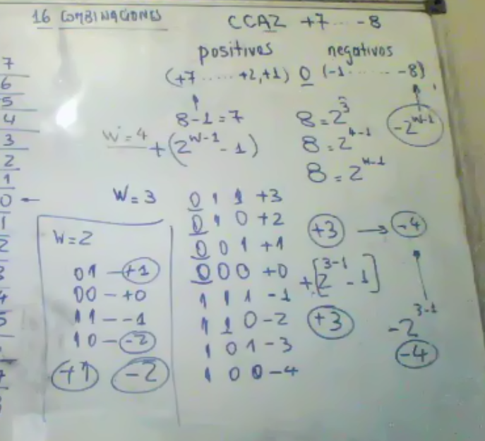

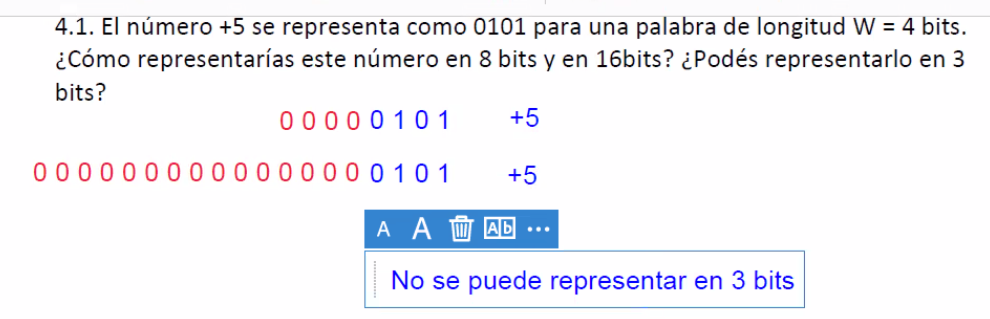

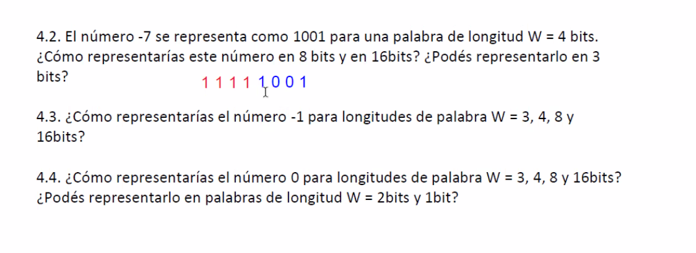

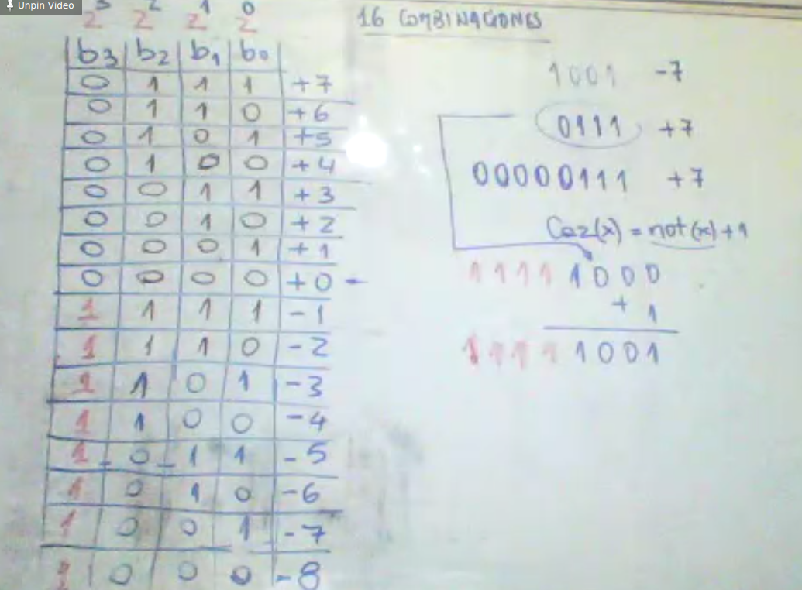

Para extender la longitud del número completamos hacia la izquierda con el mismo bit de signo

