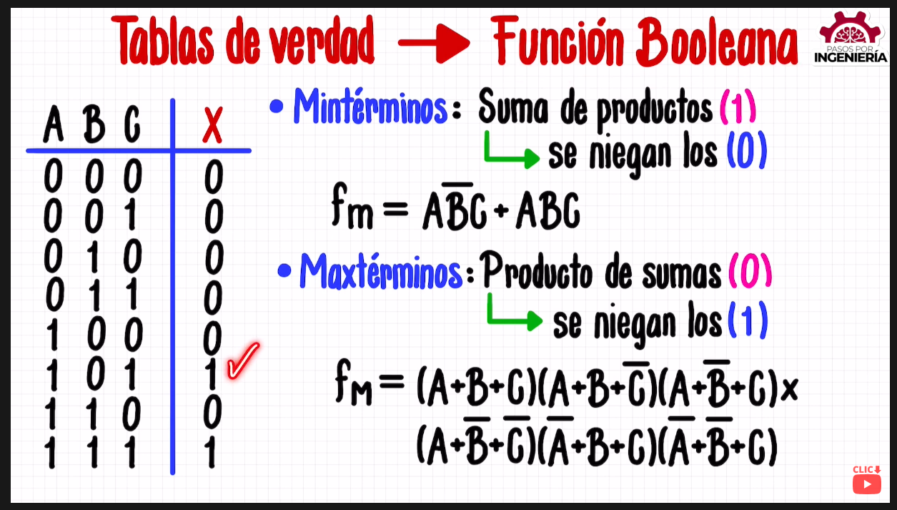
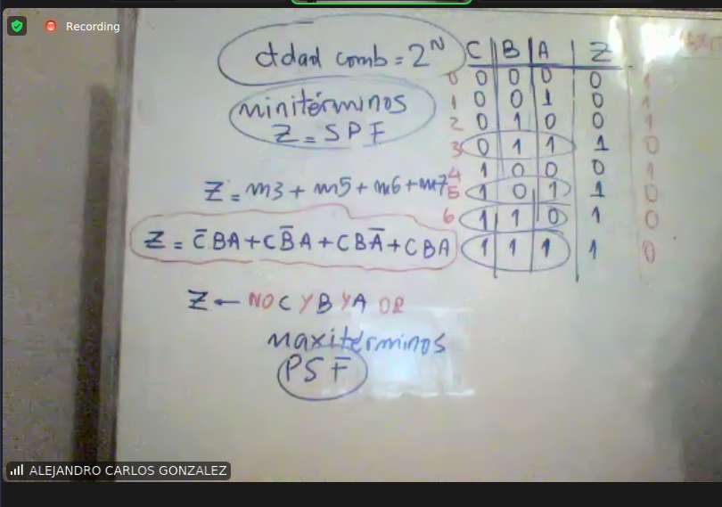

### Repaso minter maxter

Mintérminos: suma de productos con resultado 1. Se niegan los 0.
Maxtérminos: producto de sumas con resultado 0. Se niegan los 1.

https://youtu.be/-CvjcwWYMCc

Con una tabla de función dada, encontramos su función booleana

