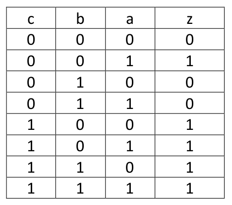
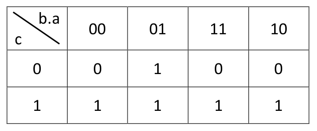
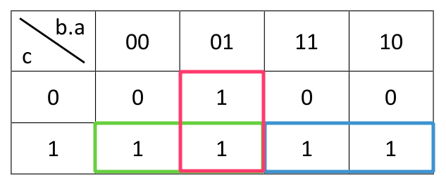

## Guia autoevaluación
### Consignas:

**Ejercicio 1:** escriba la tabla de verdad de la función ` z = c ⊕ ¬b ⊕ a `

**Ejercicio 2:** dibuje el mapa de Karnaugh de z (obtenida en 2).

**Ejercicio 3:** obtenga la expresión lógica de la función, cuya tabla de verdad se muestra a continuación, utilizando Suma de Productos y Producto de Sumas.

**Ejercicio 4:** simplifique la función analizada en 3 utilizando su mapa de Karnaugh (ya se lo damos dibujado).

---

#### Ejercicio 1:

` z = c ⊕ ¬b ⊕ a `

` y = c ⊕ ¬b `

| c  | b  | a  | ¬b | y  | z  |  
|----|----|----|----|----|----| 
| 0  | 0  | 0  | 1  | 1  | 1  |
| 0  | 0  | 1  | 1  | 1  | 0  | 
| 0  | 1  | 0  | 0  | 0  | 0  |
| 0  | 1  | 1  | 0  | 0  | 1  |
| 1  | 0  | 0  | 1  | 0  | 0  |
| 1  | 0  | 1  | 1  | 0  | 1  |
| 1  | 1  | 0  | 0  | 1  | 1  |
| 1  | 1  | 1  | 0  | 1  | 0  |

---

#### Ejercicio 2:

Mapa de Karnaugh de la función z

| C \ BA  | 00 | 01 | 11 | 10 |  
|---------|----|----|----|----| 
| **0**       | 1  | 0  | 1  | 0  |
| **1**       | 0  | 1  | 0  | 1  | 

---

#### Ejercicio 3:

Encontrar expresión lógica con Suma de Productos y Producto de Suma.

**Suma de Productos:** 
(minter, se evaluan los 1, se niegan los 0)

( ¬C . ¬B . A ) + ( C . ¬B . ¬A ) + ( C . ¬B . A ) + ( C . B . ¬A ) + ( C . B . A )

**Producto de Sumas:** 
(maxter, se evaluan los 0, se niegan los 1)

( C + B + A ) . ( C + ¬B + A ) . ( C + ¬B + ¬A )

---

#### Ejercicio 4:

Agrupo los 1:

Busco cambios de valor en los términos:

- Rojo

C: 0 a 1 ---> cambia, se va
B: 0 a 0
A: 1 a 1

- Verde
C: 1 a 1
B: 0 a 0
A: 0 a 1 ---> cambia, se va

- Azul
C: 1 a 1
B: 1 a 1
A: 1 a 0 ---> cambia, se va

Resultado:

(¬B . A ) + ( C . ¬B ) + ( C . B ) 

se elimina ¬B y B porque es lo mismo que decir 1.

C + ¬B . A