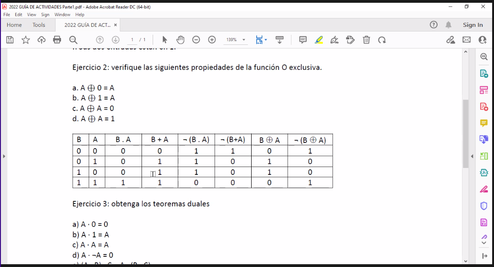
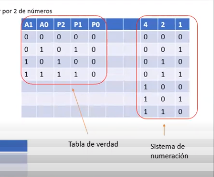
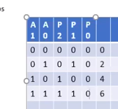
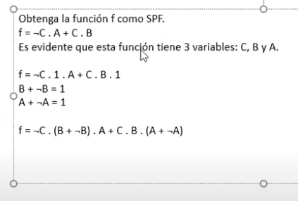
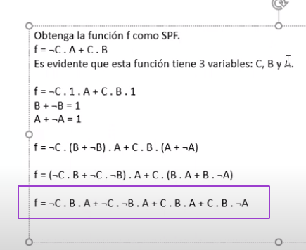

## tabla de verdad

operadores lógicos (compartieron en grupo wpp)

---

#### Guia actividades parte 2
Ejercicio 1

a) Complete la tabla de verdad de un multiplicador por 2 de números enteros positivos de 2 bits. 

b) Obtenga las funciones lógicas de P2, P1 y P0.

Resolviendo en clase con el profe:
[Ver en clase grabada](https://classroom.google.com/c/NDcxNzIwNTQ4MzY2/m/NDg2NzA2OTAwNjc2/details)

Resolvemos todos los números enteros (en sistema decimal) necesarios para la operación. Luego hace una explicación de cómo pasarlos a sistema binario.

| A1 | A0 | P2 | P1 | P0 |  
|----|----|----|----|----| 
| 0  | 0  | 0  | 0  | 0  |
| 0  | 1  | 0  | 1  | 0  | 
| 1  | 0  | 1  | 0  | 0  |
| 1  | 1  | 1  | 1  | 0  |

Estaba ok :D

#### Tabla de Karnaugh

(...)

#### Ejercicio 5
` f = ¬C . A + C . B `

Necesitamos aplicar la propiedad distributiva, por eso usamos los 1 en forma de ` A + ¬A  ` y  ` B + ¬B `

Propiedad distributiva:

f = (¬C . B + ¬C . ¬B) . A + C . (B . A + B ¬A)

Finalmente tiene que quedar:

` f = ¬C . B . A + ¬C . ¬B . A + C . B . A + C . B . ¬A `

