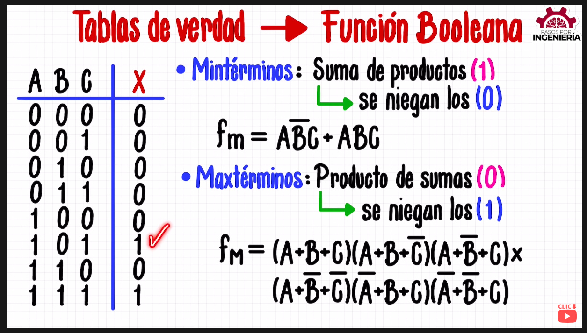

### Repaso minter maxter

Mintérminos: suma de productos con resultado 1. Se niegan los 0.
Maxtérminos: producto de sumas con resultado 0. Se niegan los 1.

[Ver toda la playlist de Pasos por Ingeniería](https://youtu.be/-CvjcwWYMCc)

Con una tabla de función dada, encontramos su función booleana

[Mapa de Karnaugh explicado por Pasos por Ingeniería](https://youtu.be/TFiY6DqjBwQ)
