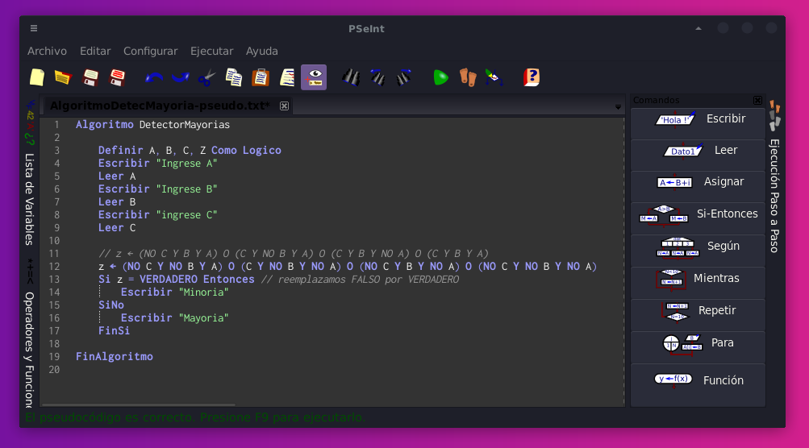
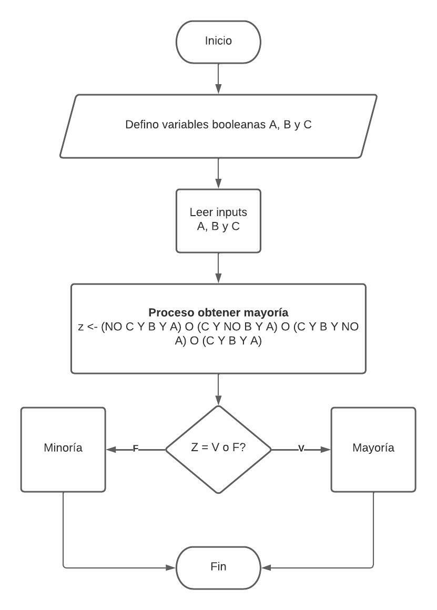

### Detector mayorías
TP3 individual:

1) Escriban las respuestas de este algoritmo en función de sus entradas “C”, “B” y “A”. Son dos posibles: Mayoría o Minoría. La mayoría se refiere a mayor cantidad de 1s.

Solución:

| A | B | C | Rta |
|---|---|---|-----|
| 0 | 0 | 0 | Min |
| 0 | 0 | 1 | Min |
| 0 | 1 | 0 | Min |
| 0 | 1 | 1 | May |
| 1 | 0 | 0 | Min |
| 1 | 0 | 1 | May |
| 1 | 1 | 0 | May |
| 1 | 1 | 1 | May |

2) Qué modificarían para que funcione con Maxitérminos. Fíjense que el algoritmo está hecho con minitérminos.

Solución:

Dado que el minitérmino es la suma del producto (de los resultados que dan 1) y se niegan los 0. Y dado que el maxitérmino es el producto de la suma (de los resultados que dan 0) y se niegan los 1:  

Para que funcione con Maxitérminos modificaría lo siguiente. Utilizamos las operaciones donde el resultado de la función fue 0. Las variables C B y A pasan de estar multiplicando a **sumando**. También cambiamos los operadores **OR** por **AND,** para obtener el **producto de la suma**. De forma tal que quede el siguiente algoritmo:

- Algoritmo detector mayoría (pseudo):



- tipeado para copiar y pegar:

```
Algoritmo DetectorMayorias
	
	Definir A, B, C, Z Como Logico
	Escribir "Ingrese A"
	Leer A
	Escribir "Ingrese B"
	Leer B
	Escribir "ingrese C"
	Leer C
	
	z <- (C o B o A) Y (C o B o NO A) Y (C o NO B o A) Y (NO C o B o A)
	Si z = FALSO Entonces
		Escribir "Minoria"
	SiNo
		Escribir "Mayoria"
	FinSi
	
FinAlgoritmo

```

3) Hacer un diagrama de flujo que muestre de manera gráfica el algoritmo.

Solución:

*Nota: Diagrama diseñado teniendo en cuenta el algoritmo original de la consigna original) 


